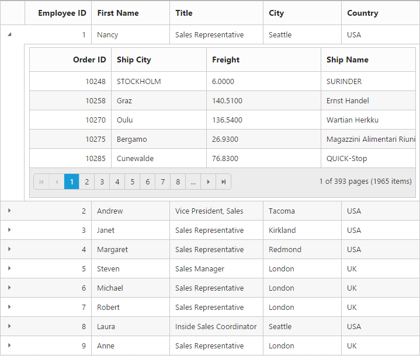

# Hierarchical Bindings

Hierarchical binding can be used to create the Grid with parent and child relation, this facilitate you to view the child records for a particular row by clicking on the Expander button present in first column of each grid row. This can be enabled by defining [`childGrid`](https://help.syncfusion.com/api/angular/ejgrid#members:childgrid "childGrid") and `childGrid.queryString`. [`childGrid`](https://help.syncfusion.com/api/angular/ejgrid#members:childgrid "childGrid") is to define options of child and `childGrid.queryString` is to define the relation between parent and child grid.

If the foreign key column name differs for parent and child grid then use `childGrid.foreignKeyField` property of child grid. Refer [here](https://help.syncfusion.com/angular/grid/how-to#hierarchy-grid-with-different-foreignkeyfield-in-parent-and-child-table "here") for more information.

N> The Grid's responsive and exporting support is not applicable for Hierarchical binding.



<ej-grid id="Grid"  [allowPaging]="true"  [dataSource]="gridData"  [childGrid]="childData"  >
    <e-columns>
        <e-column field="EmployeeID" headerText="Employee ID"  width="85" textAlign="right"></e-column>
        <e-column field="FirstName" headerText="First Name" textAlign="left"  width="100"></e-column>
        <e-column field="Title" headerText="Title " width="120" textAlign="left"></e-column>        
        <e-column field="City" headerText="City" textAlign="left" width="10"></e-column> 
        <e-column field="Country" headerText="Country" textAlign="left" width="100"></e-column>        
    </e-columns>
</ej-grid>





import { Component } from '@angular/core';

@Component({
    selector: 'ej-app',
    templateUrl: 'src/grid/grid.component.html',
})
export class GridComponent {
    public gridData: any;
    public childData: any;    
    constructor() {

        //The datasource "window.employeeView" is referred from 'http://js.syncfusion.com/demos/web/scripts/jsondata.min.js'
        this.gridData = (window as any).employeeView;
        this.childData = {

            dataSource: ej.DataManager({ url: " http://js.syncfusion.com/demos/ejServices/Wcf/Northwind.svc/Orders", crossDomain: true }),
            queryString: "EmployeeID",
            allowPaging: true,
            pageSettings: {
                pageSize: 5
            }, columns: [
                { field: "OrderID", headerText: 'Order ID', textAlign: ej.TextAlign.Right, width: 75 },
                { field: "ShipCity", headerText: 'Ship City', textAlign: ej.TextAlign.Left, width: 100 },
                { field: "Freight", headerText: 'Freight', textAlign: ej.TextAlign.Left, width: 120 },
                { field: "ShipName", headerText: 'Ship Name', textAlign: ej.TextAlign.Left, width: 100 }
            ],

        }
    }
}



## Expand or Collapse All Child

The Grid can able to expand and collapse all the [`childGrid`](https://help.syncfusion.com/api/angular/ejgrid#members:childgrid "childGrid") through programmatically using [`expandAll`](https://help.syncfusion.com/api/angular/ejgrid#methods:expandall "expandAll") and [`collapseAll`](https://help.syncfusion.com/api/angular/ejgrid#methods:collapseall "collapseAll") method.


<input type="button" ej-button id="button" value="expandAll"  (ejclick)= "onClick($event)" /> 
     <input type="button" ej-button id="button" value="collapseAll"  (ejclick)= "onClick($event)" />         
      
<ej-grid id="Grid" [allowPaging]="true" [dataSource]="gridData"  [childGrid]="childData">
    <e-columns>
        <e-column field="EmployeeID" headerText="Employee ID"  width="85" textAlign="right"></e-column>
        <e-column field="FirstName" headerText="First Name" textAlign="left"  width="100"></e-column>
        <e-column field="Title" headerText="Title " width="120" textAlign="left"></e-column>        
        <e-column field="City" headerText="City" textAlign="left" width="10"></e-column> 
        <e-column field="Country" headerText="Country" textAlign="left" width="100"></e-column>        
    </e-columns>
</ej-grid>
 


import { Component } from '@angular/core';

@Component({
    selector: 'ej-app',
    templateUrl: 'src/grid/grid.component.html',
})
export class GridComponent {
    public gridData: any;
    public childData: any;
    
    constructor() {

        //The datasource "window.employeeView" is referred from 'http://js.syncfusion.com/demos/web/scripts/jsondata.min.js'
        this.gridData = (window as any).employeeView;
        this.childData = {
            dataSource: ej.DataManager({ url: " http://js.syncfusion.com/demos/ejServices/Wcf/Northwind.svc/Orders", crossDomain: true }),
            queryString: "EmployeeID",
            allowPaging: true,
            pageSettings: {
                pageSize: 5
            }, columns: [
                { field: "OrderID", headerText: 'Order ID', textAlign: ej.TextAlign.Right, width: 75 },
                { field: "ShipCity", headerText: 'Ship City', textAlign: ej.TextAlign.Left, width: 100 },
                { field: "Freight", headerText: 'Freight', textAlign: ej.TextAlign.Left, width: 120 },
                { field: "ShipName", headerText: 'Ship Name', textAlign: ej.TextAlign.Left, width: 100 }
            ],

        }

    }

    onClick(e: any) {         
        $("#Grid").ejGrid(e.model.text); //invokes expandAll & collapseAll method based on button name
    }
}

 