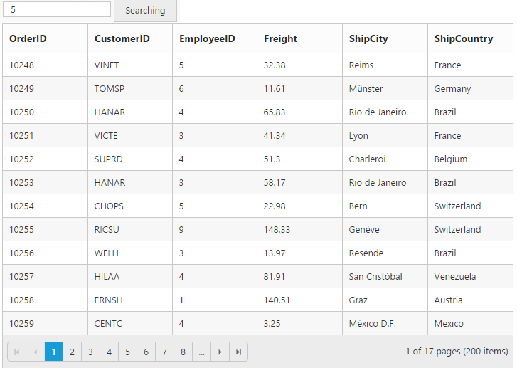
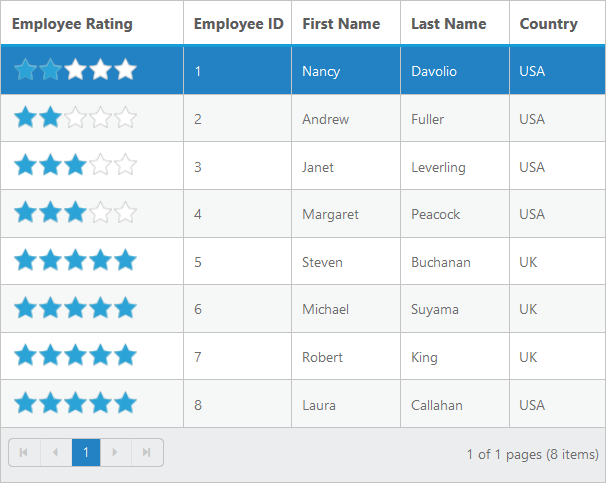

# How to

## Binding SignalR endpoint

Grid  supports SignalR features for live updates in record. Please find the below option to configure signalR with Grid. 

1) Before configure SignalR with ejGrid. You need to Setup SignalR configuration in Visual Studio project. For reference, please find the link.

N> Getting started with [SignalR](http://www.asp.net/signalr/overview/getting-started/tutorial-getting-started-with-signalr#setup "signalr") 

2) After configuration of SignalR, you have to create Hub for communication between different actions of grid. 


public class SignalHub: Hub

{

	public void modify(string action, string details)

	{

		Clients.All.modify(action, details);

	}

}



3) Implementation of SignalR communication with Grid through Hub.

<ej-grid id="Grid" #grid [dataSource]="gridData" [editSettings]="editSettings" [toolbarSettings]="toolbarSettings" [allowPaging]=true [allowSorting]=true (actionComplete)="actionComplete($event)">
    <e-columns>
        <e-column field="OrderID" [isPrimaryKey]="true" headerText="Order ID" width="75" textAlign="right"></e-column>
        <e-column field="CustomerID" headerText= 'Customer ID' width= "80"></e-column>
        <e-column field="EmployeeID" headerText='Employee ID' textAlign="right" width="75"></e-column>
        <e-column field="Freight" textAlign="right" width="75" format= "{0:C}" ></e-column>
        <e-column field="ShipCity" headerText='Ship City' width="110"  ></e-column>
    </e-columns>
</ej-grid>




    import {Component, ViewEncapsulation, ViewChild } from '@angular/core';
    @Component({
      selector: 'ej-app',
      templateUrl: 'app/app.component.html',  //give the path file for Grid control html file.
    })
    export class AppComponent {
        public gridData;
        public editSettings;
        public toolbarSettings;
        @ViewChild("grid") gridIns: EJComponents<any, any>;  
    	constructor()
        {
            //The datasource "(window as any).gridData" is referred from 'http://js.syncfusion.com/demos/web/scripts/jsondata.min.js'
            this.gridData = ej.DataManager((window as any).gridData).executeLocal(ej.Query().take(50));
            this.editSettings={allowAdding: true, allowEditing: true, allowDeleting: true };
            this.toolbarSettings={showToolbar: true, toolbarItems: [ej.Grid.ToolBarItems.Add, ej.Grid.ToolBarItems.Edit, ej.Grid.ToolBarItems.Delete, ej.Grid.ToolBarItems.Update, ej.Grid.ToolBarItems.Cancel]};
        }
        
     }



        window.signal = $.connection.signalHub;
        window.signal.client.modify = function (action, details) {
          details = JSON.parse(details);
          if (action == "add") this.gridIns.widget.addRecord(details);
          else if (action == "beginedit") this.gridIns.widget.updateRecord("OrderID", details);
          else this.gridIns.widget.deleteRecord("OrderID", details);
        };
        $.connection.hub.start().done(function () {
          window.actionComplete = function (args) {
              if (args.requestType == "save" || args.requestType == "delete") window.signal.server.modify(args.requestType == "delete" ? args.requestType : window.previousAction, JSON.stringify(args.rowData));
              if (args.requestType != "delete") window.previousAction = args.requestType;
          }
        });


## Copy data from Excel to Grid

Copy data from Excel to Grid is possible by converting Excel data to JSON data and then binding it to the Grid. Details are covered in this [blog](https://www.syncfusion.com/blogs/post/Copying-and-Pasting-Excel-Sheet-Data-to-Grid-ASPNET-MVC.aspx) post. 

## Prevent/Maintain persistence of properties

Grid actions can be persisted throughout by enabling the enablePersistence property of the Grid. However, we can maintain/prevent a grid action explicitly with the help of `addToPersist` and `ignoreOnPersist` methods respectively.


    <a href="http://www.syncfusion.com">Navigate to another Page</a>
    <ej-button id="Button" (click)="onClick($event)" text="Prevent/Maintain persistence"></ej-button>
    <ej-grid id="Grid" #grid [dataSource]="gridData" [allowFiltering]="true" [filterSettings]="filterSettings" [allowPaging]=true [allowGrouping]=true [enablePersistence]=true>
        <e-columns>
            <e-column field="OrderID" headerText="Order ID" width="75" textAlign="right"></e-column>
            <e-column field="CustomerID" headerText= 'Customer ID' width= "80"></e-column>
            <e-column field="EmployeeID" headerText='Employee ID' textAlign="right" width="75"></e-column>
            <e-column field="Freight" textAlign="right" width="75" format= "{0:C}" ></e-column>
        </e-columns>
    </ej-grid>
   


    import {Component, ViewEncapsulation, ViewChild } from '@angular/core';
    @Component({
      selector: 'ej-app',
      templateUrl: 'app/app.component.html',  //give the path file for Grid control html file.
    })
    export class AppComponent {
        public gridData;
        public filterSettings;
        @ViewChild("grid") gridIns: EJComponents<any, any>;  
    	constructor()
        {
            //The datasource "(window as any).gridData" is referred from 'http://js.syncfusion.com/demos/web/scripts/jsondata.min.js'
            this.gridData = (window as any).gridData;
            this.filterSettings={filterType: "menu"};
        }
        onClick(e:any){
            var gridObj = this.gridIns.widget;//get the gridObject
            // by default the enableAltRow property of the grid is true.
            gridObj.option("model.enableAltRow", false);   //set the enableAltRow property of the grid as false 
            //by default the filterSettings and groupSettings will be persisted upon navigating to another page.
            gridObj.ignoreOnPersist(["filterSettings", "groupSettings"]);// set the properties that are to be prevented from being persisted
            //by default the enableAltRow property of the grid will not be persisted
            gridObj.addToPersist("enableAltRow");// set the properties that are to be maintained for persistence.
            var toolbarObject = $(e.target),
            grid = this.gridIns.widget;
            if (toolbarObject.hasClass("Collapse")) grid.collapseAll(); //collapse Grid using grid instance, `this` is grid instance
            else grid.refreshContent(); //refresh content using grid instance
        }
     }


  So on navigating to another page by clicking on the link, by default the filterSettings and groupSettings will be persisted. But upon clicking the button and navigating, the persist state of the Grid actions are modified.
   
## External Search in Grid

Using [`search`](https://help.syncfusion.com/api/angular/ejgrid#methods:search “search”) method of Grid, you can search the string in Grid externally without using in-built toolbar search support. While using [`search`](https://help.syncfusion.com/api/angular/ejgrid#methods:search “search”) method it is necessary to set [`allowSearching`](https://help.syncfusion.com/api/angular/ejgrid#members:allowsearching “allowSearching”) property as `true`. The following code example explains the above behavior.


    <input type="text" id="searchString" class="e-ejinputtext" />
    <ej-button id="Button" (click)="onClick($event)" text="Searching"></ej-button>
    <ej-grid id="Grid" #grid [dataSource]="gridData" [allowSearching]="true" [filterSettings]="filterSettings" [allowPaging]=true [allowGrouping]=true [enablePersistence]=true>
        <e-columns>
            <e-column field="OrderID"></e-column>
            <e-column field="CustomerID"></e-column>
            <e-column field="EmployeeID"></e-column>
            <e-column field="Freight"></e-column>
            <e-column field="ShipCity"></e-column>
            <e-column field="ShipCountry"></e-column>
        </e-columns>
    </ej-grid>
   


import {Component, ViewEncapsulation, ViewChild } from '@angular/core';
    @Component({
      selector: 'ej-app',
      templateUrl: 'app/app.component.html',  //give the path file for Grid control html file.
    })
    export class AppComponent {
        public gridData;
        @ViewChild("grid") gridIns: EJComponents<any, any>;  
    	constructor()
        {
            //The datasource "(window as any).gridData" is referred from 'http://js.syncfusion.com/demos/web/scripts/jsondata.min.js'
            this.gridData = (window as any).gridData;
            
        }
        onClick(e:any){
            var obj = this.gridIns.widget;//get the gridObject
            var val = $("#searchString").val();
            obj.search(val);
        }
     }



The following output is displayed as a result of the above code example.

## Hierarchy Grid with different foreignKeyField in parent and child table

The `queryString` property is used to filter the childGrid data based on value in parent Grid data. But when the field name provided in `queryString` does not exists in Child Grid, then `foreignKeyField` property is used to filter the childGrid data. If the foreign key column name differs for parent and child grid then use `foreignKeyField` property of Grid.

The following code example explains the above behavior.



<ej-grid id="Grid"  [allowPaging]="true"  [dataSource]="gridData"  [childGrid]="childData"  >
    <e-columns>
        <e-column field="EmployeeID" headerText="Employee ID"  width="85" textAlign="right"></e-column>
        <e-column field="FirstName" headerText="First Name" textAlign="left"  width="100"></e-column>    
        <e-column field="City" headerText="City" textAlign="left" width="10"></e-column> 
        <e-column field="Country" headerText="Country" textAlign="left" width="100"></e-column>        
    </e-columns>
</ej-grid>





import { Component } from '@angular/core';

@Component({
    selector: 'ej-app',
    templateUrl: 'src/grid/grid.component.html',
})
export class GridComponent {
    public gridData: any;
    public childData: any;    
    constructor() {

        //The datasource "window.employeeView" is referred from 'http://js.syncfusion.com/demos/web/scripts/jsondata.min.js'
        this.gridData = (window as any).employeeView;
        this.childData = {

            dataSource: ej.DataManager({ url: " http://js.syncfusion.com/demos/ejServices/Wcf/Northwind.svc/Orders", crossDomain: true }),
            queryString: "FirstName",
            foreignKeyField : "CustomerName",
            allowPaging: true,
            pageSettings: {
                pageSize: 5
            }, columns: [
                { field: "OrderID", headerText: 'Order ID', textAlign: ej.TextAlign.Right, width: 75 },
                { field: "ShipCity", headerText: 'Ship City', textAlign: ej.TextAlign.Left, width: 100 },
                { field: "CustomerName", headerText: 'First Name', textAlign: ej.TextAlign.Left, width: 100 },
                { field: "CustomerID", headerText: 'Customer ID', textAlign: ej.TextAlign.Left, width: 120 },
                { field: "ShipName", headerText: 'Ship Name', textAlign: ej.TextAlign.Left, width: 100 }
            ],

        }
    }
}



The following output is displayed as a result of the above code example.

## Perform Grid Actions on External button click

### CRUD operations

Using [`addRecord`](https://help.syncfusion.com/api/angular/ejgrid#methods:addRecord “addRecord”) method of Grid, you can add a record to a Grid externally without using in-built toolbar add support. While using [`addRecord`](https://help.syncfusion.com/api/angular/ejgrid#methods:addRecord “addRecord”) method it is necessary to set [`allowAdding`](https://help.syncfusion.com/api/angular/ejgrid#members:allowAdding “allowAdding”) property as `true`.
Using [`deleteRecord`](https://help.syncfusion.com/api/angular/ejgrid#methods:deleteRecord “deleteRecord”) method of Grid, you can delete a record to a Grid externally without using in-built toolbar delete support. While using [`deleteRecord`](https://help.syncfusion.com/api/angular/ejgrid#methods:deleteRecord “deleteRecord”) method it is necessary to set [`allowDeleting`](https://help.syncfusion.com/api/angular/ejgrid#members:allowDeleting “allowDeleting”) property as `true`.
Using [`updateRecord`](https://help.syncfusion.com/api/angular/ejgrid#methods:updateRecord “updateRecord”) method of Grid, you can update a record to a Grid externally without using in-built toolbar update support. While using [`updateRecord`](https://help.syncfusion.com/api/angular/ejgrid#methods:updateRecord “updateRecord”) method it is necessary to set [`allowEditing`](https://help.syncfusion.com/api/angular/ejgrid#members:allowEditing “allowEditing”) property as `true`.

### Filtering

Using [`filterColumn`](https://help.syncfusion.com/api/angular/ejgrid#methods:filterColumn “filterColumn”) method of Grid, you can filter the data in the Grid externally without using in-built filter support. While using [`filterColumn`](https://help.syncfusion.com/api/angular/ejgrid#methods:filterColumn “filterColumn”) method it is necessary to set [`allowFiltering`](https://help.syncfusion.com/api/angular/ejgrid#members:allowFiltering “allowFiltering”) property as `true`.

### Grouping

Using [`groupColumn`](https://help.syncfusion.com/api/angular/ejgrid#methods:groupColumn “groupColumn”) and [`ungroupColumn`](https://help.syncfusion.com/api/angular/ejgrid#methods:ungroupColumn “ungroupColumn”) method of Grid, you can group/ungroup the Grid externally without using in-built grouping support. While using [`groupColumn`](https://help.syncfusion.com/api/angular/ejgrid#methods:groupcolumn “groupColumn”) and [`ungroupColumn`](https://help.syncfusion.com/api/angular/ejgrid#methods:ungroupcolumn “ungroupColumn”) method it is necessary to set [`allowGrouping`](https://help.syncfusion.com/api/angular/ejgrid#members:allowgrouping “allowGrouping”) property as `true`.

### Sorting

Using [`sortColumn`](https://help.syncfusion.com/api/angular/ejgrid#methods:sortcolumn “sortColumn”) method of Grid, you can sort the Grid externally without using in-built sorting support. While using [`sortColumn`](https://help.syncfusion.com/api/angular/ejgrid#methods:sortcolumn “sortColumn”) method it is necessary to set [`allowSorting`](https://help.syncfusion.com/api/angular/ejgrid#members:allowsorting “allowSorting”) property as `true`.

The following code example explains the above behavior.



<table>
    <tr>
        <td><b>CRUD</b> <input type="button" ej-button id="Addrecord" text="Addrecord" (click)="addRecord($event)"/>
                            <input type="button" ej-button id="Updaterecord" text="Updaterecord" (click)="updateRecord($event)"/>
                            <input type="button" ej-button id="DeleteRecord" text="DeleteRecord" (click)="deleteRecord($event)"/></td>
        <td><b>Filtering</b>  <input type="text" id="filterone" /><input type="text" id="filtertwo" /><input type="button" ej-button id="filteri" text="Filter" (click)="FilterFunction($event)"/><input type="button" ej-button id="ClearFilter" text="Clear" (click)="clearfilterfn($event)"/></td>
        <input id="filterColumnOne" ej-dropdownlist [watermarkText]="waterMarkOne" [targetID]="OrderList"/>
<ul><li>10248</li><li>10249</li><li>10250</li><li>10251</li><li>10252</li></ul>

        <input id="filterColumnTwo" ej-dropdownlist [watermarkText]="waterMarkTwo" [targetID]="EmployeeList"/>
<ul><li>1</li><li>2</li><li>3</li><li>4</li><li>5</li></ul>

        <td><b>Grouping</b>  
            <input id="groupColumnName" ej-dropdownlist [targetID]="columnNameList" [selectedIndex]="index"/>
<ul><li>OrderID</li><li>CustomerID</li><li>Freight</li><li>Verified</li><li>ShipName</li></ul>
 
            <input type="button" ej-button id="groupColumn" text="GroupColumn" (click)="clickToGroup($event)"/>
            <input type="button" ej-button id="unGroupColumn" text="UnGroupColumn" (click)="clickToGroup($event)"/>
        </td>
        <td><b>Sorting</b>  
            <input id="SortColumnName" ej-dropdownlist [targetID]="sortcolumnNameList" [selectedIndex]="index"/>
<ul><li>Order ID</li><li>Customer ID</li><li>Employee ID</li><li>Freight</li><li>Ship City</li></ul>

            <input id="Directions" ej-dropdownlist [targetID]="directionsList" [selectedIndex]="index"/>
<ul><li>Ascending</li><li>Descending</li></ul>

            <input type="button" ej-button id="doSorting" text="Sort" (click)="SortFunction($event)"/>
            <input type="button" ej-button id="clearSort" text="Clear" (click)="clearSortFunction($event)"/>
        </td>
    </tr>
</table>
<ej-grid #Grid [dataSource]="gridData" [allowPaging]="true" [allowSorting]="true" [allowFiltering]="true" [allowGrouping]="true" [editSettings]="editSettings" [toolbarSettings]="toolbarSettings">
    <e-columns>
        <e-column field= "OrderID" [isPrimaryKey]="true" headerText="Order ID"></e-column>
        <e-column field= "CustomerID" headerText="Customer ID"></e-column>
        <e-column field= "EmployeeID" headerText="Employee ID"></e-column>
        <e-column field= "Freight"></e-column>
        <e-column field= "OrderDate" headerText="Order Date"></e-column>
    </e-columns>
</ej-grid> 





import {Component, ViewEncapsulation, ViewChild } from '@angular/core';
    @Component({
      selector: 'ej-app',
      templateUrl: 'app/app.component.html',  //give the path file for Grid control html file.
    })
    export class AppComponent {
        public gridData;
        @ViewChild("grid") gridIns: EJComponents<any, any>;  
        editSettings:any;
        directionsList:any;
        sortColumnNameList:any;
        columnNameList:any;
        waterMarkOne:string;
        waterMarkTwo:string;
        EmployeeList:any;
        index:number;
        OrderList:any;
        toolbarSettings:any;
    	constructor()
        {
            //The datasource "(window as any).gridData" is referred from 'http://js.syncfusion.com/demos/web/scripts/jsondata.min.js'
            this.gridData = (window as any).gridData;
            this.editSettings={allowEditing:true,allowAdding:true,allowDeleting:true };
            this.toolbarSettings={ showToolbar: true,toolbarItems: ["add","edit","update","cancel"]};
            this.directionsList="directions";
            this.sortColumnNameList="sortColumnName";
            this.columnNameList="columnName";
            this.EmployeeList="Employee";
            this.OrderList="Order";
            this.waterMarkOne="Select filter value one";
            this.waterMarkTwo="Select filter value two";
            this.index=0;
         }
         addRecord() {
            this.Grid.widget.addRecord({"OrderID":12333});
         }
         updateRecord() {
            this.Grid.widget.updateRecord("OrderID", { OrderID: 10248, EmployeeID: 1});
         }
         deleteRecord() {
            this.Grid.widget.deleteRecord("OrderID", { OrderID: this.Grid.widget.model.dataSource_two[this.Grid.widget.model.selectedRowIndex].OrderID });
         }
         FilterFunction(args) {
            var obj = $('#FlatGrid').data("ejGrid");
            var one = $('#filterColumnOne').data("ejDropDownList");
            var two = $('#filterColumnTwo').data("ejDropDownList");
            var One = one.getValue();
            var Two = two.getValue();
            this.Grid.widget.filterColumn([{field:"OrderID",operator:"equal",value:One,predicate:"and", matchcase:true},{field:"EmployeeID",operator:"equal",value:Two,predicate:"and", matchcase:true}]);
         }
         clearFilterFunction(args) {
            this.Grid.widget.clearFiltering();
         }
         clearSortFunction(args) {
                        this.Grid.widget.clearSorting();
         }
         SortFunction(args) {
                var sortDo = $('#doSorting').data("ejButton");
                if (sortDo._id == "doSorting") {
                    var name = $('#SortColumnName').data("ejDropDownList");
                var direction = $('#Directions').data("ejDropDownList");
                var columnName = name.getValue().replace(/\s*/g, "");
                var sortDirection = direction.getValue().toLowerCase();
                this.Grid.widget.sortColumn(columnName, sortDirection);
            }
         }
         clickToGroup(args) {
            var columnName = $("#groupColumnName").ejDropDownList("getSelectedValue");
            if (args.srcElement.id == "groupColumn") {
                this.Grid.widget.groupColumn(columnName);
                    $("#groupColumn").ejButton("disable");
                    $("#unGroupColumn").ejButton("enable");
                
            }
            else {
                this.Grid.widget.ungroupColumn(columnName);
                $("#unGroupColumn").ejButton("disable");
                $("#groupColumn").ejButton("enable");
            }
         }
         OnChange() {
            var columnName = $("#groupColumnName").ejDropDownList("getSelectedValue");
            if ($.inArray(columnName, this.Grid.widget.model.groupSettings.groupedColumns) != -1) {
                $("#unGroupColumn").ejButton("enable");
                $("#groupColumn").ejButton("disable");
            }
            else {
                $("#groupColumn").ejButton("enable");
                $("#unGroupColumn").ejButton("disable");
            }
         }
    }



The following output is displayed as a result of the above code example.

## Display other Syncfusion controls in Grid columns

We can display the other Syncfusion controls using `ng-template` with `e-template` attribute directive in Grid columns.



<ej-grid #grid [(dataSource)]="gridData" [allowPaging]="true" >
    <e-columns>
        <e-column headerText="Employee Rating" width="150">
            <ng-template e-template let-data>
                <ej-rating id="rating" [value]="data.EmployeeID" [allowReset]="true"></ej-rating>
            </ng-template>
        </e-column>
        <e-column field="EmployeeID" [isPrimaryKey]="true" headerText="Employee ID"  width="90"></e-column>
        <e-column field="FirstName"  headerText="First Name" width="90"></e-column>
        <e-column field="LastName" headerText="Last Name" width="90" ></e-column>
        <e-column field="Country" headerText="Country" width="80" ></e-column>
    </e-columns>     
</ej-grid>

   


import {Component, ViewEncapsulation, ViewChild } from '@angular/core';
    @Component({
      selector: 'ej-app',
      templateUrl: 'app/app.component.html',  //give the path file for Grid control html file.
    })
    export class AppComponent {
        public gridData;
        @ViewChild("grid") gridIns: EJComponents<any, any>;  
    	constructor()
        {
            //The datasource "(window as any).gridData" is referred from 'http://js.syncfusion.com/demos/web/scripts/jsondata.min.js'
            this.gridData = (window as any).employeeView;
            
        }
     }



The following output is displayed as a result of the above code example.

## Getting Datasource of Grid in Sorted Order

Grid column can be sorted and after sorting, the datasource can be obtained in the same order using `sortBy` query and `executeLocal` method of DataManager.

The following code example describes the above behavior.





<input type="button" ej-button id="button1" value="GetSortedData" (ejclick)="GetSortedData($event)" />

<ej-grid #grid  [dataSource]="gridData" [allowPaging]="true" [allowSorting]="true" [allowMultiSorting]="true">
      
  <e-columns>     
      <e-column field="OrderID" headerText="OrderID" width="75" textAlign="right"></e-column>
      <e-column field="EmployeeID" headerText="EmployeeID" width="90" textAlign="right"></e-column>
      <e-column field="CustomerID" headerText="CustomerID" width="90" textAlign="right"></e-column>
  </e-columns>  

</ej-grid>
  

  


import {Component, ViewEncapsulation,ViewChild} from '@angular/core';

import {CommonModule} from "@angular/common";

@Component({
    selector: 'ej-app',
    templateUrl: 'src/grid/grid.component.html',
})
export class GridComponent {
    public gridData;
    constructor()
    {
       //The datasource "window.gridData" is referred from 'http://js.syncfusion.com/demos/web/scripts/jsondata.min.js'
       this.gridData = window.gridData;
            
    }

    GetSortedData(e: any){
            var obj = $(".e-grid").ejGrid("instance");   
            var Sort = obj.model.sortSettings.sortedColumns;  
            var query = ej.Query();               
            if(obj.model.sortSettings.sortedColumns.length){
                for(var i=Sort.length-1;i>=0;i--){        
                  query.sortBy(Sort[i].field, Sort[i].direction); 
                }
            var SortedDatasource = ej.DataManager(obj.model.dataSource()).executeLocal(query); 
                  console.log(SortedDatasource); 
            }
        }
}
	




N>  This solution will work only for local data.