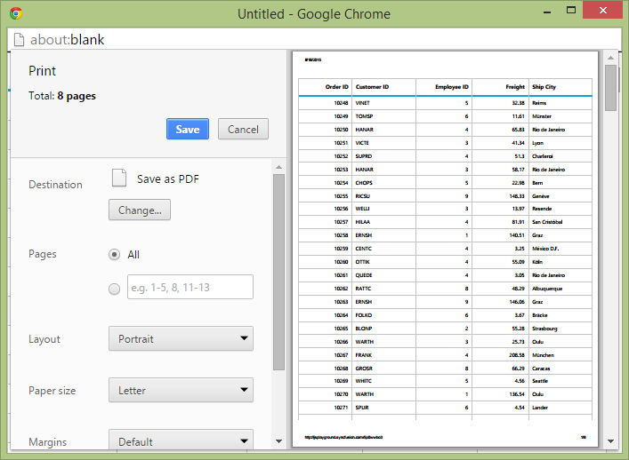

# Print

You need to use [`print()`](https://help.syncfusion.com/api/angular/ejgrid#methods:print) method from Grid instance to print the Grid. You can add Print option in Toolbar item by adding `ej.Grid.ToolBarItems.PrintGrid` in [`toolbarItems`](https://help.syncfusion.com/api/angular/grid#members:toolbarsettings-toolbaritems).



<ej-grid  id="Grid"  [allowPaging]="true"  [dataSource]="gridData" [toolbarSettings.showToolbar]="true" [toolbarSettings.toolbarItems]="tools">
    <e-columns>
        <e-column field="OrderID" [isPrimaryKey]="true"  width="85" textAlign="right" headerText="Order ID"></e-column>
        <e-column field="CustomerID" headerText="Customer ID" width="85" ></e-column>        
        <e-column field="EmployeeID" headerText="Employee ID"  width="85" textAlign="right"></e-column>
        <e-column field="Freight" headerText="Freight" format="{0:C}"  width="85" textAlign="right"></e-column>
        <e-column field="ShipCity" width="90"  headerText="Ship Name"></e-column>     
    </e-columns>
</ej-grid>

	




import { Component } from '@angular/core';

@Component({
    selector: 'ej-app',
    templateUrl: 'src/grid/grid.component.html',
})
export class GridComponent {
    public gridData: any;
    public tools;

    constructor() {

         this.tools = ["printGrid"];
        //The datasource "window.gridData" is referred from 'http://js.syncfusion.com/demos/web/scripts/jsondata.min.js'
        this.gridData = (window as any).gridData;

    }
}



## Page Setup

Some of print options are not configurable through JavaScript code. You need to customize layout, paper size, margins options through browser's page setup dialog. Please find the following guidelines link to browser page setup.

* [Chrome](https://support.google.com/chrome/answer/1379552?hl=en)
* [Firefox](https://support.mozilla.org/en-US/kb/how-print-web-pages-firefox)
* [Safari](http://www.mintprintables.com/print-tips/adjust-margins-osx/)
* [IE](http://www.helpteaching.com/help/print/index.htm) 

## Print on external Button Click

By default, the Grid can be print from toolbar. To print from external button action, you need to call the grid's [`print()`](https://help.syncfusion.com/api/angular/ejgrid#methods:print) method from required button event.


<input type="button" ej-button id="button1" value="Button" (click)="onClick($event)" />
<ej-grid  id="Grid" #grid [allowPaging]="true"  [dataSource]="gridData">
    <e-columns>
        <e-column field="OrderID" [isPrimaryKey]="true"  width="85" textAlign="right" headerText="Order ID"></e-column>
        <e-column field="CustomerID" headerText="Customer ID" width="85" ></e-column>        
        <e-column field="EmployeeID" headerText="Employee ID"  width="85" textAlign="right"></e-column>
        <e-column field="Freight" headerText="Freight" format="{0:C}"  width="85" textAlign="right"></e-column>
        <e-column field="ShipCity" width="90"  headerText="Ship Name"></e-column>     
    </e-columns>
</ej-grid>





import { Component } from '@angular/core';

@Component({
    selector: 'ej-app',
    templateUrl: 'src/grid/grid.component.html',
})
export class GridComponent {
    public gridData: any;
     @ViewChild('grid') Grid: EJComponents<any, any>;
    constructor() {

        //The datasource "window.gridData" is referred from 'http://js.syncfusion.com/demos/web/scripts/jsondata.min.js'
        this.gridData = (window as any).gridData;

    }
     onClick(e: any) {
         this.Grid.widget.print();
    }
}



{:caption}
Grid with external button for Print

{:caption}

Print dialog in Chrome browser

## Print Visible Page

By default, the Grid will print all records. To print current page, you need to set `pageSettings.printMode` as `ej.Grid.PrintMode.CurrentPage`.



<ej-grid  id="Grid" [allowPaging]="true" [dataSource]="gridData" [pageSettings]="pageSettings" [toolbarSettings.showToolbar]="true" [toolbarSettings.toolbarItems]="tools">
    <e-columns>
        <e-column field="OrderID" [isPrimaryKey]="true"  width="85" textAlign="right" headerText="Order ID"></e-column>
        <e-column field="CustomerID" headerText="Customer ID" width="85" ></e-column>        
        <e-column field="EmployeeID" headerText="Employee ID"  width="85" textAlign="right"></e-column>
        <e-column field="Freight" headerText="Freight" format="{0:C}"  width="85" textAlign="right"></e-column>
        <e-column field="ShipCity" width="90"  headerText="Ship Name"></e-column>     
    </e-columns>
</ej-grid>

		





import { Component } from '@angular/core';

@Component({
    selector: 'ej-app',
    templateUrl: 'src/grid/grid.component.html',
})
export class GridComponent {
    public gridData: any;
    public pageSettings;
    public tools;
    constructor() {
        this.tools = ["printGrid"];
        this.pageSettings = { printMode: ej.Grid.PrintMode.CurrentPage};
        //The datasource "window.gridData" is referred from 'http://js.syncfusion.com/demos/web/scripts/jsondata.min.js'
        this.gridData = (window as any).gridData;

    }
}

