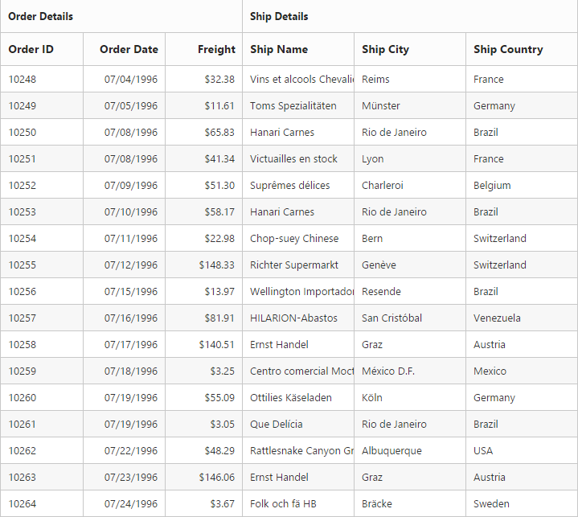

# Stacked Headers

The stacked headers helps you to group the logical columns in grid. It can be shown by setting [`showStackedHeader`](https://help.syncfusion.com/api/angular/ejgrid#members:showstackedheader "showStackedHeader") as `true` and by defining [`stackedHeaderRows`](https://help.syncfusion.com/api/angular/ejgrid#members:stackedheaderrows "stackedHeaderRows").

## Adding Stacked header columns

To stack columns in stacked header, you need to define [`column`](https://help.syncfusion.com/api/angular/ejgrid#members:stackedheaderrows-stackedheadercolumns-column "column") property in [`stackedHeaderColumns`](https://help.syncfusion.com/api/angular/ejgrid#members:stackedheaderrows-stackedheadercolumns "stackedHeaderColumns") with field names of visible columns.



<ej-grid id="Grid" [allowPaging]="true" [dataSource]="gridData" [showStackedHeader]="true" [stackedHeaderRows]="stackedHeaderRows">
    <e-columns>
        <e-column field="OrderID" headerText="Order ID" width="80"></e-column>
        <e-column field="OrderDate" headerText="Order Date" width="80" format="{0:MM/dd/yyyy}" textAlign="right"></e-column>
        <e-column field="Freight" headerText="Freight" width="75" format="{0:C}" textAlign="right"></e-column>
        <e-column field="ShipName" headerText="Ship Name" width="110"></e-column>
        <e-column field="ShipCity" headerText="Ship City" width="110"></e-column>
        <e-column field="ShipCountry" headerText="Ship Country" width="110"></e-column>
        
    </e-columns>
</ej-grid>





import { Component } from '@angular/core';

@Component({
    selector: 'ej-app',
    templateUrl: 'src/grid/grid.component.html',
})
export class GridComponent {
    public gridData: any;
    public stackedHeaderRows: any;

    constructor() {
        //The datasource "window.gridData" is referred from 'http://js.syncfusion.com/demos/web/scripts/jsondata.min.js'
        this.gridData = (window as any).gridData;
        this.stackedHeaderRows = [{
            stackedHeaderColumns:
            [
                { headerText: "Order Details", column: "OrderID,OrderDate,Freight" },
                { headerText: "Ship Details", column: "ShipName,ShipCity,ShipCountry" }
            ]
        }];
    }
}



