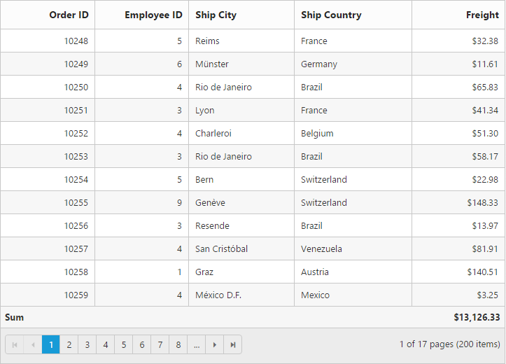
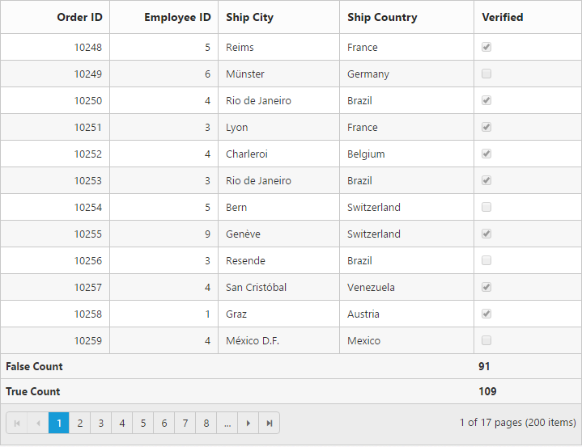
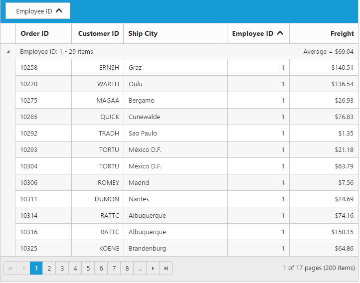

# Summary

Summary rows visibility can be controlled by [`showSummary`](https://help.syncfusion.com/api/angular/ejgrid#members:showsummary "showSummary") property and it can be added to grid by using [`summaryRows`](https://help.syncfusion.com/api/angular/ejgrid#members:summaryrows "summaryRows") array property. The following code example describes the above behavior.



<ej-grid [allowPaging]="true" [allowSorting]="true" [dataSource]="gridData" [showSummary]="true" [summaryRows]="summaryrows">

    <e-columns>
        <e-column field="OrderID" headertext="OrderID" width="80" textalign="right"></e-column>
        <e-column field="EmployeeID" headertext="EmployeeID" edittype="numericedit" width="30" width="80" textalign="right"></e-column>
        <e-column field="ShipCity" headertext="ShipCity" width="90"></e-column>
        <e-column field="ShipCountry" headertext="Ship Country" width="100"></e-column>
        <e-column field="Freight" headertext="Freight" width="80" format="{0:C}" textalign="right"></e-column>
    </e-columns>

</ej-grid>





    import {Component, ViewEncapsulation} from '@angular/core';
    @Component({
      selector: 'ej-app',
      templateUrl: 'app/app.component.html',  //give the path file for Grid control html file.
    })
    export class AppComponent {
        public gridData;
        public summaryrows;
        constructor()
        {
           //The datasource "window.gridData" is referred from 'http://js.syncfusion.com/demos/web/scripts/jsondata.min.js'
           this.gridData = (window as any).gridData;
		   this.summaryrows = [{ 
                 title: "Sum", 
                 summaryColumns: [{ 
                   summaryType: ej.Grid.SummaryType.Sum, 
                   displayColumn: "Freight", 
                   dataMember: "Freight", 
                   format: "{0:C2}" 
                }] 
             }]
         }
     }



## Supported Aggregates

Following are the supported list of aggregates

* Sum
* Average
* Maximum
* Minimum
* False Count
* True Count

### Sum, Average, Maximum and minimum

Summaries with Sum, Average, Maximum and Minimum aggregate can be defined by using [`summaryType`](https://help.syncfusion.com/api/angular/ejgrid#members:summaryrows-summarycolumns-summarytype "summaryType") in [`summaryColumns`](https://help.syncfusion.com/api/angular/ejgrid#members:summaryrows-summarycolumns "summaryColumns") collections. These aggregate are used in `Number` column.



<ej-grid [allowPaging]="true" [allowSorting]="true" [dataSource]="gridData" [showSummary]="true" [summaryRows]="summaryrows">

    <e-columns>
        <e-column field="OrderID" headertext="OrderID" [isprimarykey]="true" width="80" textalign="right"></e-column>
        <e-column field="EmployeeID" headertext="EmployeeID" edittype="numericedit" width="30" width="80" textalign="right"></e-column>
        <e-column field="ShipCity" headertext="ShipCity" width="90"></e-column>
        <e-column field="ShipCountry" headertext="Ship Country" width="100"></e-column>
        <e-column field="Freight" headertext="Freight" width="80" format="{0:C}" textalign="right"></e-column>
    </e-columns>

</ej-grid>





    import {Component, ViewEncapsulation} from '@angular/core';
    @Component({
      selector: 'ej-app',
      templateUrl: 'app/app.component.html',  //give the path file for Grid control html file.
    })
    export class AppComponent {
        public gridData;
        public summaryrows;
        constructor()
        {
           //The datasource "window.gridData" is referred from 'http://js.syncfusion.com/demos/web/scripts/jsondata.min.js'
           this.gridData = (window as any).gridData;
		   this.summaryrows = [{ 
               title: "Sum", 
               summaryColumns: [{ 
                  summaryType: ej.Grid.SummaryType.Sum, 
                  displayColumn: "Freight", 
                  dataMember: "Freight", 
                  format: "{0:C2}" 
               }] 
            }, { 
                title: "Average", 
                summaryColumns: [{ 
                  summaryType: ej.Grid.SummaryType.Average, 
                  displayColumn: "Freight", 
                  dataMember: "Freight", 
                  format: "{0:C2}" 
               }] 
           }, { 
               title: "Maximum", 
               summaryColumns: [{ 
                 summaryType: ej.Grid.SummaryType.Maximum, 
                 displayColumn: "Freight", 
                 dataMember: "Freight", 
                 format: "{0:C2}" 
              }] 
           }, { 
               title: "Minimum", 
               summaryColumns: [{ 
                 summaryType: ej.Grid.SummaryType.Minimum, 
                 displayColumn: "Freight", 
                 dataMember: "Freight", 
                 format: "{0:C2}" 
              }] 
           }]
        }
     }



### True and False Count

Summaries with `True` and `False` count aggregate can be defined by using [`summaryType`](https://help.syncfusion.com/api/angular/ejgrid#members:summaryrows-summarycolumns-summarytype "summaryType") [`summaryColumns`](https://help.syncfusion.com/api/angular/ejgrid#members:summaryrows-summarycolumns "summaryColumns") collections. `True` and `False` count aggregates are used for Boolean columns.



<ej-grid [allowPaging]="true" [allowSorting]="true" [dataSource]="gridData" [showSummary]="true" [summaryRows]="summaryrows">

    <e-columns>
        <e-column field="OrderID" headertext="OrderID" [isprimarykey]="true" width="80" textalign="right"></e-column>
        <e-column field="EmployeeID" headertext="EmployeeID" edittype="numericedit" width="30" width="80" textalign="right"></e-column>
        <e-column field="ShipCity" headertext="ShipCity" width="90"></e-column>
        <e-column field="ShipCountry" headertext="Ship Country" width="100"></e-column>
        <e-column field="Verified" headertext="Verified" width="80"></e-column>
    </e-columns>

</ej-grid>





    import {Component, ViewEncapsulation} from '@angular/core';
    @Component({
      selector: 'ej-app',
      templateUrl: 'app/app.component.html',  //give the path file for Grid control html file.
    })
    export class AppComponent {
        public gridData;
        public summaryrows;
        constructor()
        {
           //The datasource "window.gridData" is referred from 'http://js.syncfusion.com/demos/web/scripts/jsondata.min.js'
           this.gridData = (window as any).gridData;
		   this.summaryrows = [{ 
               title: "False Count", 
               summaryColumns: [{ 
                  summaryType: ej.Grid.SummaryType.FalseCount, 
                  displayColumn: "Verified", 
                  dataMember: "Verified" 
               }] 
           }, {
                title: "True Count", 
                summaryColumns: [{ 
                  summaryType: ej.Grid.SummaryType.TrueCount, 
                  displayColumn: "Verified", 
                  dataMember: "Verified" 
              }] 
            }]
         }
     }



## Custom Summary

Custom Summary can be used to create summary values based on your required custom logic and calculations. To enable Custom Summary, [`summaryType`](https://help.syncfusion.com/api/angular/ejgrid#members:summaryrows-summarycolumns-summarytype "summaryType") should be `custom` and `value` property need to define as function. In this property `value` function, you need to use Grid instance to access `model.dataSource` and `model.currentViewData`. After the custom calculation, the returned value will be displayed in corresponding Summary cell.



    <ej-grid [allowPaging]="true" [dataSource]="gridData" [showSummary]="true" [summaryRows]="summaryrows">

     <e-columns>
        <e-column field="OrderID" headertext="OrderID" width="70" textalign="right"></e-column>
        <e-column field="CustomerID" headertext="Customer ID" width="70" textalign="left"></e-column>
        <e-column field="EmployeeID" headertext="Employee ID" width="70" textalign="left"></e-column>
        <e-column field="ShipCity" headertext="Ship City" idth="70" textalign="left"></e-column>
        <e-column field="Freight" headertext="Freight" width="80" format="{0:C}" textalign="right"></e-column>
     </e-columns>

  </ej-grid>





    import {Component, ViewEncapsulation} from '@angular/core';
    @Component({
        selector: 'ej-app',
        templateUrl: 'app/app.component.html',  //give the path file for Grid control html file.
    })
    export class AppComponent {
        public gridData;
        public summaryrows;
        constructor()
        {
            //The datasource "window.gridData" is referred from 'http://js.syncfusion.com/demos/web/scripts/jsondata.min.js'
            this.gridData = (window as any).gridData;
            this.summaryrows = [{ 
                title: "Currency", 
                summaryColumns: [{ 
                  summaryType: ej.Grid.SummaryType.Custom, 
                  displayColumn: "Freight", 
                  customSummaryValue: function currency(args,data) {
                      return ej.sum(data, "Freight");
                  }, 
                  format: "{0:C2}" }] 
            }, { 
                title: "True Count", 
                summaryColumns: [{ 
                  summaryType: ej.Grid.SummaryType.TrueCount, 
                  displayColumn: "Verified", 
                  dataMember: "Verified"
               }] 
           }]
        }
    }



## Group Summary

    Group Summary is used to summarize values of a particular column based on group and it shows at bottom of each Group. To enable Group Summary for particular Group, you need to define [`showTotalSummary`](https://help.syncfusion.com/api/angular/ejgrid#members:summaryrows-showtotalsummary "showTotalSummary") as false.



    <ej-grid [allowPaging]="true" [dataSource]="gridData" [showSummary]="true" [summaryRows]="summaryrows" [allowSorting]="true" [allowGrouping]="true" [groupSettings]="groupsettings">

    <e-columns>
        <e-column field="OrderID" headertext="OrderID" width="70" textalign="right"></e-column>
        <e-column field="CustomerID" headertext="Customer ID" width="75" textalign="right"></e-column>
        <e-column field="ShipCity" headertext="Ship City" width="150"></e-column>
        <e-column field="EmployeeID" headertext="Employee ID" width="75" textalign="right"></e-column>
        <e-column field="Freight" headertext="Freight" width="75" format="{0:C}" textalign="right"></e-column>
    </e-columns>
</ej-grid>





    import {Component, ViewEncapsulation} from '@angular/core';
    @Component({
        selector: 'ej-app',
        templateUrl: 'app/app.component.html',  //give the path file for Grid control html file.
    })
    export class AppComponent {
        public gridData;
        public summaryrows;
        constructor()
        {
            //The datasource "window.gridData" is referred from 'http://js.syncfusion.com/demos/web/scripts/jsondata.min.js'
            this.gridData = (window as any).gridData;
            this.summaryrows = [{
                summaryColumns: [{
                   summaryType: ej.Grid.SummaryType.Sum,
                   displayColumn: "Freight",
                   dataMember: "Freight",
                   format: "{0:C2}",
                   prefix: "Sum = "
                }],
              showTotalSummary: false
           }]
	      this.groupsettings = { groupedColumns: ["CustomerID"] },
        }
    }



W> Minimum one column should be grouped to show summary details.

## Group Caption Summary

To show summaries in each Group's Caption row, particular [summary row](https://help.syncfusion.com/api/angular/ejgrid#members:summaryrows) should have [`showTotalSummary`](https://help.syncfusion.com/api/angular/ejgrid#members:summaryrows-showtotalsummary "showtotalsummary") as `false` and [`showCaptionSummary`](https://help.syncfusion.com/api/angular/ejgrid#members:summaryrows-showcaptionsummary "showCaptionSummary") as `true`.


<ej-grid [allowPaging]="true" [dataSource]="gridData" [showSummary]="true" [summaryRows]="summaryrows" [allowSorting]="true" [allowGrouping]="true" [groupSettings]="groupsettings">

    <e-columns>
        <e-column field="OrderID" headertext="OrderID" width="80" textalign="right"></e-column>
        <e-column field="CustomerID" headertext="Customer ID" width="75" textalign="right"></e-column>
        <e-column field="ShipCity" headertext="Ship City" width="150"></e-column>
        <e-column field="EmployeeID" headertext="Employee ID" width="75" textalign="right"></e-column>
        <e-column field="Freight" headertext="Freight" width="75" format="{0:C}" textalign="right"></e-column>
    </e-columns>

</ej-grid>





    import {Component, ViewEncapsulation} from '@angular/core';
    @Component({
        selector: 'ej-app',
        templateUrl: 'app/app.component.html',  //give the path file for Grid control html file.
    })
    export class AppComponent {
        public gridData;
        public summaryrows;
        constructor()
        {
            //The datasource "window.gridData" is referred from 'http://js.syncfusion.com/demos/web/scripts/jsondata.min.js'
            this.gridData = (window as any).gridData;
            this.summaryrows = [{
              showCaptionSummary: true,
              summaryColumns: [{
                 summaryType: ej.Grid.SummaryType.Average,
                 displayColumn: "Freight",
                 dataMember: "Freight",
                 format: "{0:C2}",
                 prefix: "Average = "
              }],
           showTotalSummary: false
        }],
	    this.groupsettings = { groupedColumns: ["EmployeeID"] },
        }
    }



W> Minimum one column should be grouped to show summary details.

## Summary Template

Using `template` property of [`summaryColumns`](https://help.syncfusion.com/api/angular/ejgrid#members:summaryrows-summarycolumns) you can render any type of JsRender templates or customizing the summary value.

The following code example describes the above behavior.



<ej-grid [dataSource]="gridData" [showSummary]="true" [summaryRows]="summaryrows">

    <e-columns>
        <e-column field="OrderID"></e-column>
        <e-column field="EmployeeID"></e-column>
        <e-column field="Freight" format="{0:C}"></e-column>
    </e-columns>
    <ng-template e-summary-template let-data>
        

            "'Freight has Average of ' + data.summaryValue + 'in  dollars  '"
        

    </ng-template>

</ej-grid>





import {Component, ViewEncapsulation} from '@angular/core';
    @Component({
        selector: 'ej-app',
        templateUrl: 'app/app.component.html',  //give the path file for Grid control html file.
    })
    export class AppComponent {
        public gridData;
        public summaryrows;
        constructor()
        {
            this.gridData = [{
               OrderID: 10248, EmployeeID: 5, Freight: 32.38
            },
            {
              OrderID: 10249, EmployeeID: 6, Freight: 11.61
            },
            {
              OrderID: 10250, EmployeeID: 4, Freight: 65.83
            },
            {
              OrderID: 10251, EmployeeID: 3, Freight: 41.34
            },
            {
              OrderID: 10252, EmployeeID: 4,  Freight: 51.3
           }];
           this.summaryrows = [{
             title: "Average",
             summaryColumns: [{
                 summaryType: ej.Grid.SummaryType.Average,
                 displayColumn: "Freight",
                 dataMember: "Freight",
                 template: "#templateData",
                 format: "{0:C2}"
             }]
          }],
        }
    }



The following output is displayed as a result of the above code example.

## Format

To format Summary values, [`format`](https://help.syncfusion.com/api/angular/ejgrid#members:summaryrows-summarycolumns-format "format") property needs to be assigned in [`summaryColumns`](https://help.syncfusion.com/api/angular/ejgrid#members:summaryrows-summarycolumns "summaryColumns") collection object.  To know more about formatting options. Please refer [**globalize.js**](https://github.com/jquery/globalize/tree/v0.1.1#)



<ej-grid [allowPaging]="true" [dataSource]="gridData" [showSummary]="true" [summaryRows]="summaryrows">

    <e-columns>
        <e-column field="OrderID" headertext="OrderID" width="80" textalign="right"></e-column>
        <e-column field="EmployeeID" headertext="Employee ID" width="80" textalign="left"></e-column>
        <e-column field="ShipCity" headertext="Ship City" width="90"></e-column>
        <e-column field="ShipCountry" headertext="Ship Country" width="100"></e-column>
        <e-column field="Freight" headertext="Freight" width="80" format="{0:C}" textalign="right"></e-column>
    </e-columns>

</ej-grid>





    import {Component, ViewEncapsulation} from '@angular/core';
    @Component({
        selector: 'ej-app',
        templateUrl: 'app/app.component.html',  //give the path file for Grid control html file.
    })
    export class AppComponent {
        public gridData;
        public summaryrows;
        constructor()
        {
            //The datasource "window.gridData" is referred from 'http://js.syncfusion.com/demos/web/scripts/jsondata.min.js'
            this.gridData = (window as any).gridData;
            this.summaryrows =  [{
                 title: "Sum",
                 summaryColumns: [{
                   summaryType: ej.Grid.SummaryType.Sum,
                   displayColumn: "Freight",
                   dataMember: "Freight",
                   format: "{0:C2}"
               }]
            }],
        }
    }



