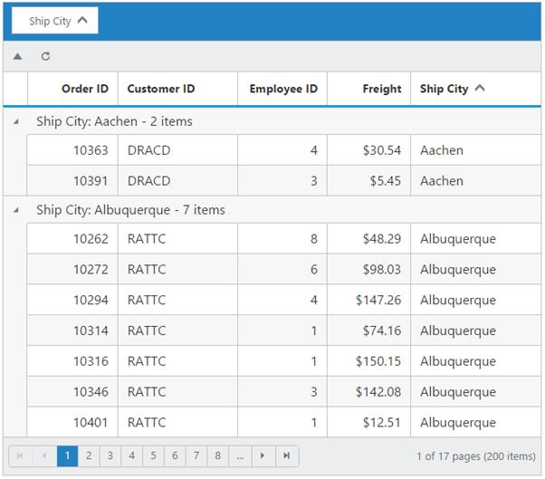

# Toolbar

Toolbar can be shown by defining [`toolbarSettings.showToolbar`](https://help.syncfusion.com/api/angular/ejgrid#members:toolbarsettings-showtoolbar "showToolbar") should be true. Toolbar has option to add default items in [`toolbarSettings.toolbarItems`](https://help.syncfusion.com/api/angular/ejgrid#members:toolbarsettings-toolbaritems "toolbarItems") and customized items in [`toolbarSettings.customToolbarItems`](https://help.syncfusion.com/api/angular/ejgrid#members:toolbarsettings-customtoolbaritems "customToolbarItems").

## Default Toolbar items

The following table shows default toolbar items and its action. 

<table>
<tr>
<th>
Default toolbar items</th><th>
Action</th></tr>
<tr>
<td>
Add</td><td>
Add a new row</td></tr>
<tr>
<td>
Edit</td><td>
Edit an existing</td></tr>
<tr>
<td>
Delete</td><td>
Delete a row</td></tr>
<tr>
<td>
Update</td><td>
Update edited or added row</td></tr>
<tr>
<td>
Cancel</td><td>
Cancel edited or added row</td></tr>
<tr>
<td>
Search</td><td>
Search text in records</td></tr>
</table>


<ej-grid id="Grid" [dataSource]="gridData" [editSettings]="editSettings" [toolbarSettings]="toolbarSettings" [allowPaging]=true>
    <e-columns>
        <e-column field="OrderID" [isPrimaryKey]="true" headerText="Order ID" width="90" textAlign="right"></e-column>
        <e-column field="CustomerID" headerText= 'Customer ID' width= 90></e-column>
        <e-column field="EmployeeID" headerText='Employee ID' editType="dropdownedit" textAlign="right" width="80"></e-column>
        <e-column field="Freight" headerText= 'Freight' textAlign="right" editType= "numericedit" width="80" format= "{0:C}" ></e-column>
        <e-column field="ShipName" headerText='Ship Name' width="150"  ></e-column>
    </e-columns>
</ej-grid>



    import {Component, ViewEncapsulation} from '@angular/core';
    @Component({
      selector: 'ej-app',
      templateUrl: 'app/app.component.html',  //give the path file for Grid control html file.
    })
    export class AppComponent {
        public gridData;
        public right;
    	constructor()
        {
            //The datasource "(window as any).gridData" is referred from 'http://js.syncfusion.com/demos/web/scripts/jsondata.min.js'
            this.gridData = (window as any).gridData;
            this.editSettings={allowAdding: true, allowEditing: true, allowDeleting: true };
            this.toolbarSettings={ showToolbar: true,toolbarItems: ["add","edit","delete","update","cancel"]};
        }
     }



I> [`editSettings.allowAdding`](https://help.syncfusion.com/api/angular/ejgrid#members:editsettings-allowadding "allowAdding"), [`editSettings.allowEditing`](https://help.syncfusion.com/api/angular/ejgrid#members:editsettings-allowediting "allowEditing") and [`editSettings.allowDeleting`](https://help.syncfusion.com/api/angular/ejgrid#members:editsettings-allowdeleting "allowdeleting") need to be enabled for add, delete, edit, save & cancel in [`toolbarItems`](https://help.syncfusion.com/api/angular/ejgrid#members:toolbarsettings-toolbaritems "toolbaritems"). [`allowSearching`](https://help.syncfusion.com/api/angular/ejgrid#members:allowsearching "allowsearching")` to be enabled while adding Search in toolbar to perform search action.

## Custom Toolbar items

Custom toolbar is used to create your own toolbar items in toolbar. It can add by defining [`toolbarSettings.customToolbarItems`](https://help.syncfusion.com/api/angular/ejgrid#members:toolbarsettings-customtoolbaritems "customToolbarItems").  Actions for this customized toolbar is defined in [`toolbarClick`](https://help.syncfusion.com/api/angular/ejgrid#events:toolbarclick "toolbarclick") event.


<ej-grid id="Grid" #grid [dataSource]="gridData" [toolbarSettings]="toolbarSettings" [allowPaging]=true [allowGrouping]=true (toolbarClick)="toolbar($event)" [groupSettings] = "groupSettings">
    <e-columns>
        <e-column field="OrderID" [isPrimaryKey]="true" headerText="Order ID" width="90" textAlign="right"></e-column>
        <e-column field="CustomerID" headerText= 'Customer ID' width= 90></e-column>
        <e-column field="EmployeeID" headerText='Employee ID' editType="dropdownedit" textAlign="right" width="80"></e-column>
        <e-column field="Freight" headerText= 'Freight' textAlign="right" editType= "numericedit" width="80" format= "{0:C}" ></e-column>
        <e-column field="ShipName" headerText='Ship Name' width="150"  ></e-column>
    </e-columns>
</ej-grid>




    import {Component, ViewEncapsulation, ViewChild } from '@angular/core';
    @Component({
      selector: 'ej-app',
      templateUrl: 'app/app.component.html',  //give the path file for Grid control html file.
    })
    export class AppComponent {
        public gridData;
        public right;
        @ViewChild("grid") gridIns: EJComponents<any, any>;  
    	constructor()
        {
            //The datasource "(window as any).gridData" is referred from 'http://js.syncfusion.com/demos/web/scripts/jsondata.min.js'
            this.gridData = (window as any).gridData;
            this.groupSettings = {groupedColumns: ["ShipCity"]},
            this.toolbarSettings={showToolbar:true,customToolbarItems:["Collapse", {templateID: "<a  class='e-toolbaricons e-icon refresh' />"}]};
        }
        toolbar(e:any){
            var toolbarObject = $(e.target),
            grid = this.gridIns.widget;
            if (toolbarObject.hasClass("Collapse")) grid.collapseAll(); //collapse Grid using grid instance, `this` is grid instance
            else grid.refreshContent(); //refresh content using grid instance
        }
     }



