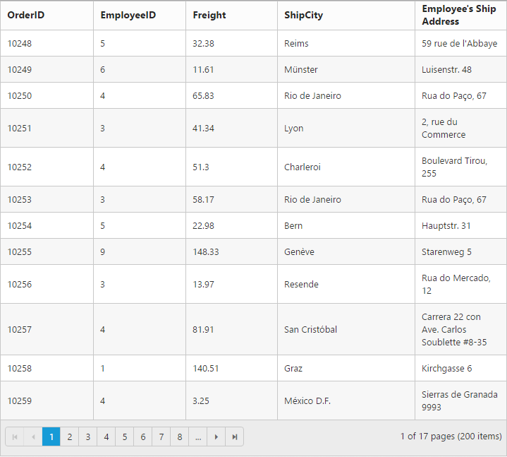
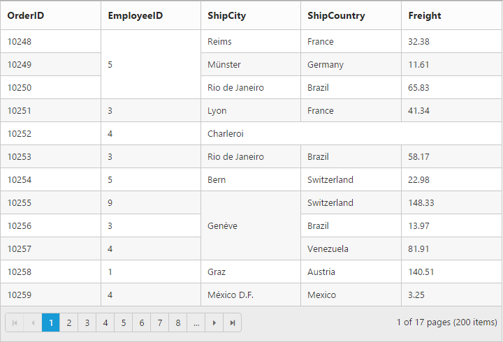
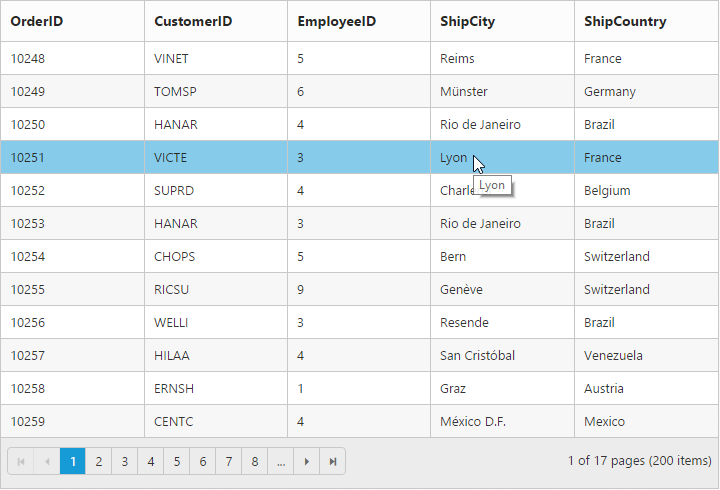
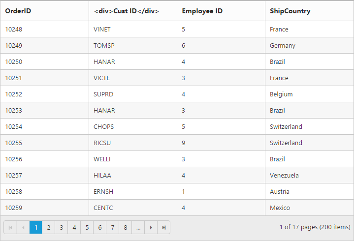
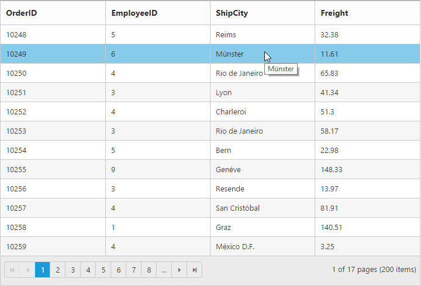
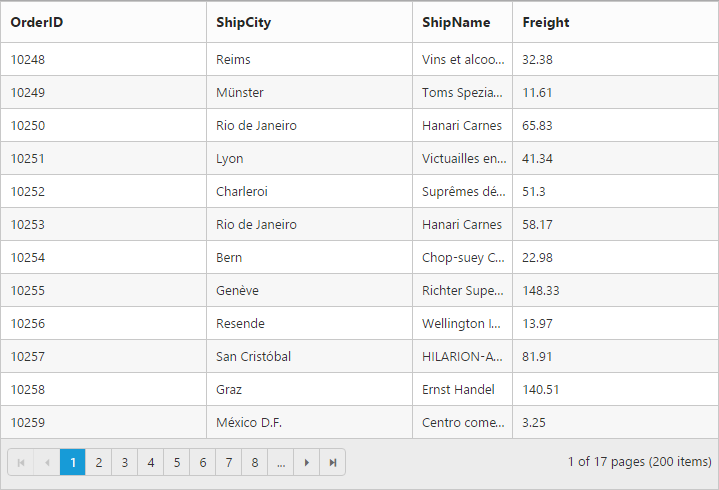
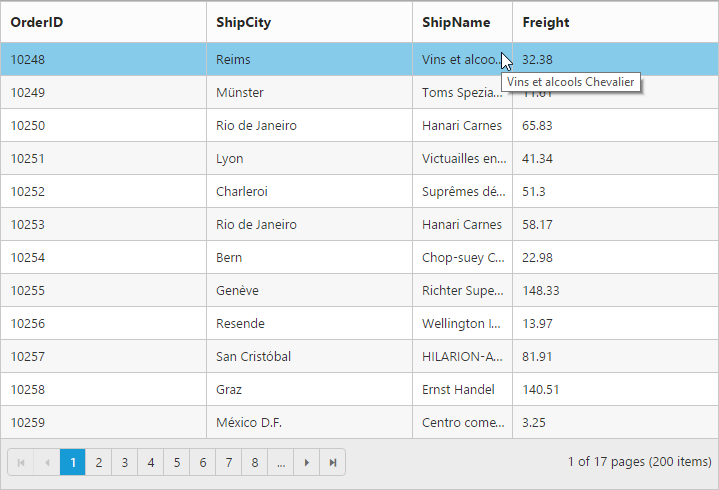

---
layout: post
title: Selection with Grid widget for Syncfusion Essential Angular-2
description: How to define the cells and its features
platform: Angular
control: Grid
documentation: ug
api: /api/Angular/grid
--- 
# Cell

## Auto wrap 

Auto wrap enables the Grid to wrap the cell content or header content to next line when the content exceeds the boundary of the cell width. To enable auto wrap, set the  [`allowTextWrap`](https://help.syncfusion.com/api/angular/ejgrid#members:allowtextwrap "allowTextWrap") property as `true`. 

We can specify the mode of auto wrap using [`wrapMode`](https://help.syncfusion.com/api/angular/ejgrid#members:textWrapSettings-wrapmode "wrapMode") property of the [`textWrapSettings`](https://help.syncfusion.com/api/angular/ejgrid#members:textwrapsettings "textWrapSettings"). 

Three types of `wrapMode` are available and they are,
  
 1. Both
 2. Header
 3. Content 
 
N> 1. By default the [`wrapMode`](https://help.syncfusion.com/api/angular/ejgrid#members:textWrapSettings-wrapmode  "wrapMode") will be set as `both`. 

N> 2. While using [`textWrapSettings`](https://help.syncfusion.com/api/angular/ejgrid#members:textwrapsettings "textWrapSettings") then it is must to set [`allowTextWrap`](https://help.syncfusion.com/api/angular/ejgrid#members:allowtextwrap "allowTextWrap") as `true`.

N> 3. For [`wrapMode`](https://help.syncfusion.com/api/angular/ejgrid#members:textWrapSettings-wrapmode "wrapMode") property you can assign either `string` value (`both`) or `enum` value (`ej.Grid.WrapMode.Both`).
 
## Both

When the [`wrapMode`](https://help.syncfusion.com/api/angular/ejgrid#members:textWrapSettings-wrapmode "wrapMode") of [`textWrapSettings`](https://help.syncfusion.com/api/angular/ejgrid#members:textwrapsettings "textWrapSettings") property is set as `both` then the auto wrap will be enabled for both the grid content and header.  

The following code example describes the above behavior.



 <ej-grid id="Grid" [dataSource]="gridData" [allowPaging]="true" [allowTextWrap]="true" [textWrapSettings]="textWrapSettings"  >
    <e-columns>
        <e-column field="OrderID"  headerText="OrderID" width="100"></e-column>
        <e-column field="EmployeeID" headerText="EmployeeID" width="100"></e-column>
         <e-column field="Freight" headerText="Freight" width="100"></e-column>
        <e-column field="ShipCity" headerText="ShipCity" width="150"></e-column>
        <e-column field="ShipAddress" headerText="Ship Address"width="200"></e-column>
       
    </e-columns>
 </ej-grid>





    import {Component, ViewEncapsulation} from '@angular/core';
    @Component({
      selector: 'ej-app',
      templateUrl: 'app/app.component.html',  //give the path file for Grid control html file.
    })
    export class AppComponent {
        public gridData;
        public textWrapSettings;
        constructor()
        {
           //The datasource "window.gridData" is referred from 'http://js.syncfusion.com/demos/web/scripts/jsondata.min.js'
           this.gridData = window.gridData;
		   this.textWrapSettings = { wrapMode: "both"};
         }
     }



The following output is displayed as a result of the above code example.

## Header

When the [`wrapMode`](https://help.syncfusion.com/api/angular/ejgrid#members:textWrapSettings-wrapmode "wrapMode") of [`textWrapSettings`](https://help.syncfusion.com/api/angular/ejgrid#members:textwrapsettings "textWrapSettings") property is set as `header` then the auto wrap will be enabled only for the grid header alone. 

The following code example describes the above behavior.



 <ej-grid id="Grid" [dataSource]="gridData" [allowPaging]="true" [allowTextWrap]="true" [textWrapSettings]="textWrapSettings"  >
    <e-columns>
        <e-column field="OrderID"  headerText="OrderID" width="100"></e-column>
        <e-column field="EmployeeID" headerText="EmployeeID" width="100"></e-column>
         <e-column field="Freight" headerText="Freight" width="100"></e-column>
        <e-column field="ShipCity" headerText="ShipCity" width="150"></e-column>
        <e-column field="ShipAddress" headerText="Ship Address"width="200"></e-column>
       
    </e-columns>
 </ej-grid>





    import {Component, ViewEncapsulation} from '@angular/core';
    @Component({
      selector: 'ej-app',
      templateUrl: 'app/app.component.html',  //give the path file for Grid control html file.
    })
    export class AppComponent {
        public gridData;
        public textWrapSettings;
        constructor()
        {
           //The datasource "window.gridData" is referred from 'http://js.syncfusion.com/demos/web/scripts/jsondata.min.js'
           this.gridData = window.gridData;
		   this.textWrapSettings = { wrapMode: "header"};
         }
     }



The following output is displayed as a result of the above code example.

## Content

When the [`wrapMode`](https://help.syncfusion.com/api/angular/ejgrid#members:textWrapSettings-wrapmode  "wrapMode") of [`textWrapSettings`](https://help.syncfusion.com/api/angular/ejgrid#members:textwrapsettings "textWrapSettings") property is set as `content` then the auto wrap will be enable only for the grid content alone. 

The following code example describes the above behavior.



 <ej-grid id="Grid" [dataSource]="gridData" [allowPaging]="true" [allowTextWrap]="true" [textWrapSettings]="textWrapSettings"  >
    <e-columns>
        <e-column field="OrderID"  headerText="OrderID" width="100"></e-column>
        <e-column field="EmployeeID" headerText="EmployeeID" width="100"></e-column>
         <e-column field="Freight" headerText="Freight" width="100"></e-column>
        <e-column field="ShipCity" headerText="ShipCity" width="150"></e-column>
        <e-column field="ShipAddress" headerText="Ship Address"width="200"></e-column>
       
    </e-columns>
 </ej-grid>





    import {Component, ViewEncapsulation} from '@angular/core';
    @Component({
      selector: 'ej-app',
      templateUrl: 'app/app.component.html',  //give the path file for Grid control html file.
    })
    export class AppComponent {
        public gridData;
        public textWrapSettings;
        constructor()
        {
           //The datasource "window.gridData" is referred from 'http://js.syncfusion.com/demos/web/scripts/jsondata.min.js'
           this.gridData = window.gridData;
		   this.textWrapSettings = { wrapMode: "content"};
         }
     }



The following output is displayed as a result of the above code example.

## Cell Merging

The Grid has options to merge the Grid cells based on the required conditions. This can be enabled by setting [`allowCellMerging`](https://help.syncfusion.com/api/angular/ejgrid#members:allowcellmerging "allowCellMerging") property as `true` and the merge conditions can be defined in [`mergeCellInfo`](https://help.syncfusion.com/api/angular/ejgrid#events:mergecellinfo "mergeCellInfo") event. In this event, you can get the column details and data of that particular row and column which is helpful in defining conditions. 

You can merge the rows and cells of grid, using `rowMerge`, `colMerge` and `merge` functions available in [`mergeCellInfo`](https://help.syncfusion.com/api/angular/ejgrid#events:mergecellinfo "mergeCellInfo") event's argument.

N> The following features are not supported with Cell Merging
N> 1. Normal Mode Editing
N> 2. Inline Mode Editing
N> 3. Inline TemplateForm Mode Editing
N> 4. Grouping
N> 5. Virtual Scrolling
N> 6. Frozen Columns
N> 7. Cell Selection Modes
N> 8. Column Selection

The following code example describes the above behavior.



 <ej-grid id="Grid" [dataSource]="gridData" [allowPaging]="true" [allowCellMerging]="true" (mergeCellInfo)="mergeCellInfo($event)">
    <e-columns>
        <e-column field="OrderID"  headerText="OrderID"></e-column>
        <e-column field="EmployeeID" headerText="EmployeeID"></e-column>
         <e-column field="ShipCity" headerText="ShipCity"></e-column>
        <e-column field="ShipCountry" headerText="ShipCountry"></e-column>
        <e-column field="Freight" headerText="Freight"></e-column>
       
    </e-columns>
 </ej-grid>





    import {Component, ViewEncapsulation} from '@angular/core';
    @Component({
      selector: 'ej-app',
      templateUrl: 'app/app.component.html',  //give the path file for Grid control html file.
    })
    export class AppComponent {
        public gridData;
        public mergeCellInfo(e){ 
	        if (e.column.field == "EmployeeID" && e.rowData.OrderID == 10248)
				e.rowMerge(3);
			else if (e.column.field == "ShipCity" && e.rowData.OrderID == 10252)
				e.colMerge(3);
			else if (e.column.field == "ShipCity" && e.rowData.OrderID == 10255)
				e.merge(0, 3);
	     }
        constructor()
        {
           //The datasource "window.gridData" is referred from 'http://js.syncfusion.com/demos/web/scripts/jsondata.min.js'
           this.gridData = window.gridData;
		}
     }



The following output is displayed as a result of the above code example.

## Custom Attribute

You can add the [custom attribute](https://help.syncfusion.com/api/angular/ejgrid#members:columns-customattributes "custom attribute") for the particular column `td` element by using the [`customAttributes`](https://help.syncfusion.com/api/angular/ejgrid#members:columns-customattributes "customAttributes") property of column.

Based on custom attribute you can customize the style and appearance of the `td` element or handling jQuery functionalities. 

You can use JsRender syntax in the template.For more information about JsRender syntax, please refer to [this link](http://www.jsviews.com/#jsrapi "the link").

The following code example describes the above behavior.



 <ej-grid id="Grid" [dataSource]="gridData" [allowPaging]="true">
    <e-columns>
         <e-column field="OrderID" headerText="OrderID"></e-column>
		 <e-column field="CustomerID" headerText="CustomerID"></e-column>
         <e-column field="EmployeeID" headerText="EmployeeID"></e-column>
         <e-column field="ShipCity" headerText="ShipCity" [customAttributes]="customAttributes"></e-column>
         <e-column field="ShipCountry" headerText="ShipCountry"></e-column>
     </e-columns>
 </ej-grid>





    import {Component, ViewEncapsulation} from '@angular/core';
    @Component({
      selector: 'ej-app',
      templateUrl: 'app/app.component.html',  //give the path file for Grid control html file.
    })
    export class AppComponent {
        public gridData;
        public textWrapSettings;
		public customAttributes;
        constructor()
        {
           //The datasource "window.gridData" is referred from 'http://js.syncfusion.com/demos/web/scripts/jsondata.min.js'
           this.gridData = window.gridData;
		   this.customAttributes = { "title": "{"{{"}}:EmployeeID {{}}}" };
		}
     }



The following output is displayed as a result of the above code example.

## Displaying HTML content

This will helps you to show actual [HTML](https://help.syncfusion.com/api/angular/ejgrid#members:columns-disablehtmlencode "HTML") value in the  grid content and header. To disable HTML code, set the [`disableHtmlEncode`](https://help.syncfusion.com/api/angular/ejgrid#members:columns-disablehtmlencode "disableHtmlEncode") property of [`columns`](https://help.syncfusion.com/api/angular/ejgrid#members:columns "columns") as true. 

The following code example describes the above behavior.



 <ej-grid id="Grid" [dataSource]="gridData" [allowPaging]="true">
    <e-columns>
         <e-column field="OrderID"  headerText="OrderID"></e-column>
		 <e-column field="CustomerID"  headerText="
Customer ID
" [disableHtmlEncode]="true"></e-column>
         <e-column field="EmployeeID" headerText="
Employee ID
" [disableHtmlEncode]="false"></e-column>
         <e-column field="ShipCountry" headerText="ShipCountry"></e-column>
     </e-columns>
 </ej-grid>





    import {Component, ViewEncapsulation} from '@angular/core';
    @Component({
      selector: 'ej-app',
      templateUrl: 'app/app.component.html',  //give the path file for Grid control html file.
    })
    export class AppComponent {
        public gridData;
        public textWrapSettings;
	    constructor()
        {
           //The datasource "window.gridData" is referred from 'http://js.syncfusion.com/demos/web/scripts/jsondata.min.js'
           this.gridData = window.gridData;
		}
     }



The following output is displayed as a result of the above code example.

## Tooltip

When you move the cursor over the particular cell it provides an information about the corresponding cell value.

**Template**

HTML templates can be specified in the [`tooltip`](https://help.syncfusion.com/api/angular/ejgrid#members:columns-tooltip) property of the particular column cell as a string (HTML element) or ID of the template's HTML element.You can use JsRender syntax in the template. For more information about JsRender syntax, please refer to [this link](http://www.jsviews.com/#jsrapi "this link").
 
N> The [`tooltip`](https://help.syncfusion.com/api/angular/ejgrid#members:columns-tooltip) template must contain `value` property to bind the corresponding cell text in tooltip
 
The following code example describes the above behavior.



 <ej-grid id="Grid" [dataSource]="gridData" [allowPaging]="true">
    <e-columns>
         <e-column field="OrderID"  headerText="OrderID"></e-column>
		 <e-column field="EmployeeID"  headerText="EmployeeID"></e-column>
         <e-column field="ShipCity" headerText="ShipCity" tooltip="#colTip"></e-column>
         <e-column field="Freight" headerText="Freight"></e-column>
     </e-columns>
 </ej-grid>





    import {Component, ViewEncapsulation} from '@angular/core';
    @Component({
      selector: 'ej-app',
      templateUrl: 'app/app.component.html',  //give the path file for Grid control html file.
    })
    export class AppComponent {
        public gridData;
        public colTip;
	    constructor()
        {
           //The datasource "window.gridData" is referred from 'http://js.syncfusion.com/demos/web/scripts/jsondata.min.js'
           this.gridData = window.gridData;
		   this.colTip = "#colTip";
		}
     }







The following output is displayed as a result of the above code example.

## ClipMode

When the cell value contains a long text that will not fit into the grid column cell, the [`clipMode`](https://help.syncfusion.com/api/angular/ejgrid#members:columns-clipmode) property is used. By using the [`clipMode`](https://help.syncfusion.com/api/angular/ejgrid#members:columns-clipmode), the cell value will be displayed with ellipsis or with clipped content when the text overflows inside a column cell.

N> 1. By default the [`clipMode`](https://help.syncfusion.com/api/angular/ejgrid#members:columns-clipmode) will be set as `clip`. 

N> 2. For [`clipMode`](https://help.syncfusion.com/api/angular/ejgrid#members:columns-clipmode) property you can assign either `string` value (`ellipsis`)  or `enum` value (`ej.Grid.ClipMode.Ellipsis`).

**List of Enumeration types**
  
 1. Clip
 2. Ellipsis
 3. EllipsisWithTooltip 
 
### Clip

When the content overflows, the remaining content will be hidden in the particular cell.

The following code example describes the above behavior.



 <ej-grid id="Grid" [dataSource]="gridData" [allowPaging]="true">
    <e-columns>
         <e-column field="OrderID"  headerText="OrderID"></e-column>
		 <e-column field="ShipCity"  headerText="ShipCity"></e-column>
         <e-column field="ShipName" headerText="ShipName" [clipMode]="clip"></e-column>
         <e-column field="Freight" headerText="Freight"></e-column>
     </e-columns>
 </ej-grid>





    import {Component, ViewEncapsulation} from '@angular/core';
    @Component({
      selector: 'ej-app',
      templateUrl: 'app/app.component.html',  //give the path file for Grid control html file.
    })
    export class AppComponent {
        public gridData;
        constructor()
        {
           //The datasource "window.gridData" is referred from 'http://js.syncfusion.com/demos/web/scripts/jsondata.min.js'
           this.gridData = window.gridData;
		}
     }



The following output is displayed as a result of the above code example.

 
### Ellipsis

Ellipsis will be displayed when the content overflows its column width. Here tooltip will not be shown for corresponding columns.

The following code example describes the above behavior.



 <ej-grid id="Grid" [dataSource]="gridData" [allowPaging]"true">
    <e-columns>
         <e-column field="OrderID"  headerText="OrderID"></e-column>
		 <e-column field="ShipCity"  headerText="ShipCity"></e-column>
         <e-column field="ShipName" headerText="ShipName" [clipMode]="ellipsis"></e-column>
         <e-column field="Freight" headerText="Freight"></e-column>
     </e-columns>
 </ej-grid>





    import {Component, ViewEncapsulation} from '@angular/core';
    @Component({
      selector: 'ej-app',
      templateUrl: 'app/app.component.html',  //give the path file for Grid control html file.
    })
    export class AppComponent {
        public gridData;
		constructor()
        {
           //The datasource "window.gridData" is referred from 'http://js.syncfusion.com/demos/web/scripts/jsondata.min.js'
           this.gridData = window.gridData;
		}
     }



The following output is displayed as a result of the above code example.

### Ellipsis With Tooltip

Ellipsis will be displayed when the content overflows its column width. Here the tooltip will be shown only for the corresponding column cells that shows ellipsis.

N> If [`clipMode`](https://help.syncfusion.com/api/angular/ejgrid#members:columns-clipmode) is set as `EllipsisWithTooltip`, then `tooltip` must be given.

The following code example describes the above behavior.







 <ej-grid id="Grid" [dataSource]="gridData" [allowPaging]="true">
    <e-columns>
         <e-column field="OrderID"  headerText="OrderID"></e-column>
		 <e-column field="ShipCity"  headerText="ShipCity"></e-column>
         <e-column field="ShipName" headerText="ShipName" [tooltip]="#colTip" [clipMode]="ellipsiswithtooltip"></e-column>
         <e-column field="Freight" headerText="Freight"></e-column>
     </e-columns>
 </ej-grid>





    import {Component, ViewEncapsulation} from '@angular/core';
    @Component({
      selector: 'ej-app',
      templateUrl: 'app/app.component.html',  //give the path file for Grid control html file.
    })
    export class AppComponent {
        public gridData;
		 public colTip;
        constructor()
        {
           //The datasource "window.gridData" is referred from 'http://js.syncfusion.com/demos/web/scripts/jsondata.min.js'
           this.gridData = window.gridData;
		    this.colTip = "#colTip";
		}
     }



The following output is displayed as a result of the above code example.

