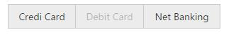

# Miscellaneous

## Show/Hide the items

Particular currently showing button items can be hidden. Also it provides the options to show the hidden button again. These functionalities can be achieved using **showItem** or **hideItem** method.

**Hide the Button item based on given index**



    <table width="500px">
    <tr>
        <td> Group Buttons </td>
        <td>
			<ej-groupbutton  id="GroupButton" groupButtonMode="radiobutton" (create)="create($event)">
            <ul>
            <li>
            Credit Card
            </li>
            <li>
            Debit Card
            </li>
            <li>
            Net Banking
            </li>
            </ul>
			</ej-groupbutton></td>
    </tr>
    </table>
      





import { Component } from '@angular/core';
@Component({
    selector: 'ej-app',
    templateUrl: './GroupButton.component.html'
})
export class GroupButtonComponent {
    constructor() {
    }
    create(e) {
        var groupButtonObj = $("#GroupButton").data("ejGroupButton");
        groupButtonObj.hideItem(1);
    }
}



**Show the hidden Button item based on given index**



    <table width="500px">
    <tr>
        <td> Group Buttons </td>
        <td>
			<ej-groupbutton  id="GroupButton" groupButtonMode="radiobutton" (create)="create($event)">
            <ul>
            <li>
            Credit Card
            </li>
            <li>
            Debit Card
            </li>
            <li>
            Net Banking
            </li>
            </ul>
			</ej-groupbutton></td>
    </tr>
    </table>
      





import { Component } from '@angular/core';
@Component({
    selector: 'ej-app',
    templateUrl: './GroupButton.component.html'
})
export class GroupButtonComponent {
    constructor() {
    }
    create(e) {
        var groupButtonObj = $("#GroupButton").data("ejGroupButton");
       groupButtonObj.showItem(1);
    }
}



## Enable/Disable

Particular Items can be enabled/disabled using **enableItem**, **disableItem** methods. This takes the index of the button as the argument. 

Also entire GroupButton can be enabled or disabled using enable (), disable public method.



    <table width="500px">
    <tr>
        <td> Group Buttons </td>
        <td>
			<ej-groupbutton  id="GroupButton" groupButtonMode="radiobutton" (create)="create($event)">
            <ul>
            <li>
            Credit Card
            </li>
            <li>
            Debit Card
            </li>
            <li>
            Net Banking
            </li>
            </ul>
			</ej-groupbutton></td>
    </tr>
    </table>
      





import { Component } from '@angular/core';
@Component({
    selector: 'ej-app',
    templateUrl: './GroupButton.component.html'
})
export class GroupButtonComponent {
   
    constructor() {
    }
    create(e) {
        var groupButtonObj = $("#GroupButton").data("ejGroupButton");
        groupButtonObj.disableItem(1);
    }
}



## Getting Index of given Element

By passing the jQuery element of the required button to **getIndex** public method, we can get the index of that passed button element.



    <table width="500px">
    <tr>
        <td> Group Buttons </td>
        <td>
			<ej-groupbutton  id="GroupButton" groupButtonMode="radiobutton" (create)="create($event)">
            <ul>
            <li>
            Credit Card
            </li>
            <li>
            Debit Card
            </li>
            <li>
            Net Banking
            </li
            </ul>
			</ej-groupbutton></td>
    </tr>
    </table>
      





import { Component } from '@angular/core';
@Component({
    selector: 'ej-app',
    templateUrl: './GroupButton.component.html'
})
export class GroupButtonComponent {
   
    constructor() {
       
    }
    create(e) {
        var groupButtonObj = $("#GroupButton").data("ejGroupButton");
        var element = $("#GroupButton").find('li')[0];
        alert(groupButtonObj.getIndex(element));
    }
}



## Getting state of given Button

You can get the selection state of required button by passing that button jQuery element to **isSelected** public method.



    <table width="500px">
    <tr>
        <td> Group Buttons </td>
        <td>
			<ej-groupbutton  id="GroupButton" groupButtonMode="radiobutton" (create)="create($event)">
            <ul>
            <li>
            Credit Card
            </li>
            <li>
            Debit Card
            </li>
            <li>
            Net Banking
            </li>
            </ul>
			</ej-groupbutton></td>
    </tr>
    </table>
      





import { Component } from '@angular/core';
@Component({
    selector: 'ej-app',
    templateUrl: './GroupButton.component.html'
})
export class GroupButtonComponent {
    constructor() {
    }
    create(e) {
        var groupButtonObj = $("#GroupButton").data("ejGroupButton");
        groupButtonObj.selectItem(1);
        alert(groupButtonObj.isSelected(1));
    }
}



Also you can get the active / disabled state required button by passing that button jQuery element to **isDisabled** public method.



    <table width="500px">
    <tr>
        <td> Group Buttons </td>
        <td>
			<ej-groupbutton  id="GroupButton" groupButtonMode="radiobutton" (create)="create($event)">
            <ul>
            <li>
            Credit Card
            </li>
            <li>
            Debit Card
            </li>
            <li>
            Net Banking
            </li>
            </ul>
			</ej-groupbutton></td>
    </tr>
    </table>
      





import { Component } from '@angular/core';
@Component({
    selector: 'ej-app',
    templateUrl: './GroupButton.component.html'
})
export class GroupButtonComponent {
    constructor() {
    }
    create(e) {
        var groupButtonObj = $("#GroupButton").data("ejGroupButton");
        groupButtonObj.disableItem(1);
        alert(groupButtonObj.isDisabled(1));
    }
}



