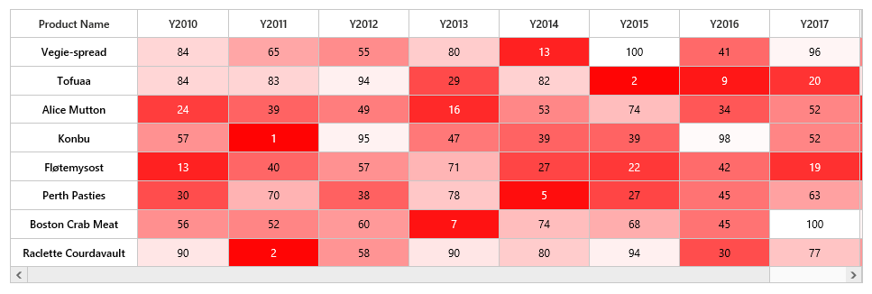

# Color Mapping

Color mapping is used to indicate values as colors instead of numerical values. For example, if a HeatMap represents a data from 0 to 100. `ColorMapping` is used to specify a color for lower value and higher value. For any value between two values, a medium color will be automatically be chosen.

In color mapping, when white color is set to value 0 and red color is set for value 30, as shown below.



<ej-heatmap id="heatmap" height="300px" width="100%">
    <e-colormappingcollection>
        <e-colormapping [value]="0" color="#8ec8f8">
        </e-colormapping>
        <e-colormapping [value]="100" color="#0d47a1">
        </e-colormapping>
    </e-colormappingcollection>
</ej-heatmap>





import { Component } from '@angular/core';

@Component({
    selector: 'ej-app',
    templateUrl: 'app/components/heatmap/celldatabinding.component.html'
})
export class DefaultComponent {}



Resultant HeatMap will be as shown below.

 