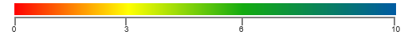

# Legend

Legend is a control used to summarize the range of colors in HeatMap. This gives visual guideline for mapping between value and color.

## Create Legend

Legend can be created with color mapping as shown below.



<ej-heatmaplegend id="heatmaplegend" style="margin-left:150px" height="50px" width="75%">
    <e-legendcolormappings>
        <e-legendcolormapping [value]="0" color="#8ec8f8">
            </e-legendcolormapping>
        <e-legendcolormapping [value]="100" color="#0d47a1">
            </e-legendcolormapping>
    </e-legendcolormappings>
</ej-heatmaplegend>





import { Component } from '@angular/core';

@Component({
    selector: 'ej-app',
    templateUrl: 'app/components/heatmap/legend.component.html'
})
export class LegendComponent {
    margin: Object;
    legendLabel: Object;
    legendCollection: Array<Object>;
    constructor() {
        this.margin = { 'left': 25, 'right': 25 };
        this.legendLabel = { 'text': 'poor' };
        this.legendCollection = ['heatmaplegend'];
    }
}



Resultant legend will be like following image.

 
## Legend Mode

There are two modes for Legend
* Gradient
* List

### Gradient:

 

<ej-heatmaplegend id="heatmaplegend" style="margin-left:150px" [legendMode]="legendMode" height="50px" width="75%">
    <e-legendcolormappings>
        <e-legendcolormapping [value]="0" color="#8ec8f8">
            </e-legendcolormapping>
        <e-legendcolormapping [value]="100" color="#0d47a1">
            </e-legendcolormapping>
    </e-legendcolormappings>
</ej-heatmaplegend>





import { Component } from '@angular/core';

@Component({
    selector: 'ej-app',
    templateUrl: 'app/components/heatmap/legend.component.html'
})
export class LegendComponent {
    margin: Object;
    legendMode: Object;
    legendCollection: Array<Object>;
    constructor() {
        this.margin = { 'left': 25, 'right': 25 };
        this.legendMode = 'gradient';
        this.legendCollection = ['heatmaplegend'];
    }
}


### List:

 

<ej-heatmaplegend id="heatmaplegend" style="margin-left:150px" [legendMode]="legendMode" height="50px" width="75%">
    <e-legendcolormappings>
        <e-legendcolormapping [value]="0" color="#8ec8f8">
            </e-legendcolormapping>
        <e-legendcolormapping [value]="100" color="#0d47a1">
            </e-legendcolormapping>
    </e-legendcolormappings>
</ej-heatmaplegend>





import { Component } from '@angular/core';

@Component({
    selector: 'ej-app',
    templateUrl: 'app/components/heatmap/legend.component.html'
})
export class LegendComponent {
    margin: Object;
    legendMode: Object;
    legendCollection: Array<Object>;
    constructor() {
        this.margin = { 'left': 25, 'right': 25 };
        this.legendMode = 'list';
        this.legendCollection = ['heatmaplegend'];
    }
}


## Orientation

There are 2 types of Orientation, applicable for Gradient and List Mode 
* Horizontal
* Vertical

### Horizontal:

 

<ej-heatmaplegend id="heatmaplegend" style="margin-left:150px" [legendMode]="legendMode" [orientation]="orientation" height="50px" width="75%">
    <e-legendcolormappings>
        <e-legendcolormapping [value]="0" color="#8ec8f8">
            </e-legendcolormapping>
        <e-legendcolormapping [value]="100" color="#0d47a1">
            </e-legendcolormapping>
    </e-legendcolormappings>
</ej-heatmaplegend>





import { Component } from '@angular/core';

@Component({
    selector: 'ej-app',
    templateUrl: 'app/components/heatmap/legend.component.html'
})
export class LegendComponent {
    margin: Object;
    legendMode: Object;
    orientation: Object;
    legendCollection: Array<Object>;
    constructor() {
        this.margin = { 'left': 25, 'right': 25 };
        this.legendMode = 'list';
        this.legendCollection = ['heatmaplegend'];
        this.orientation = 'horizontal';
    }
}


### Vertical:

 

<ej-heatmaplegend id="heatmaplegend" style="margin-left:150px" [legendMode]="legendMode" [orientation]="orientation" height="50px" width="75%">
    <e-legendcolormappings>
        <e-legendcolormapping [value]="0" color="#8ec8f8">
            </e-legendcolormapping>
        <e-legendcolormapping [value]="100" color="#0d47a1">
            </e-legendcolormapping>
    </e-legendcolormappings>
</ej-heatmaplegend>





import { Component } from '@angular/core';

@Component({
    selector: 'ej-app',
    templateUrl: 'app/components/heatmap/legend.component.html'
})
export class LegendComponent {
    margin: Object;
    legendMode: Object;
    orientation: Object;
    legendCollection: Array<Object>;
    constructor() {
        this.margin = { 'left': 25, 'right': 25 };
        this.legendMode = 'list';
        this.legendCollection = ['heatmaplegend'];
        this.orientation = 'vertical';
    }
}

