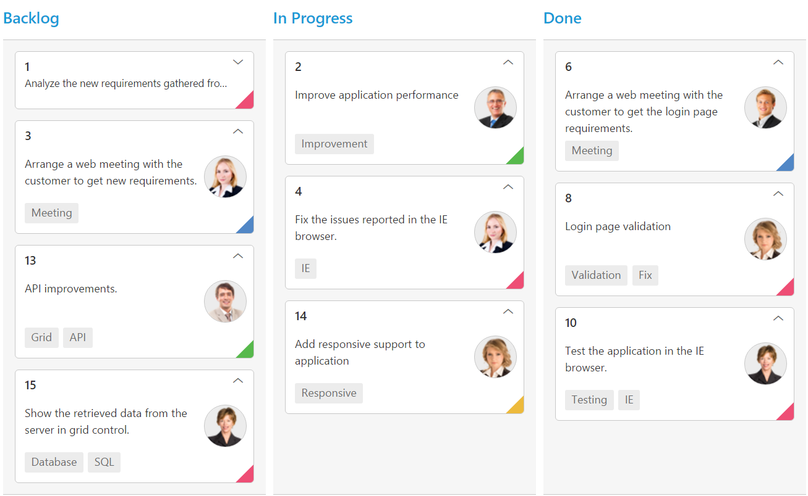
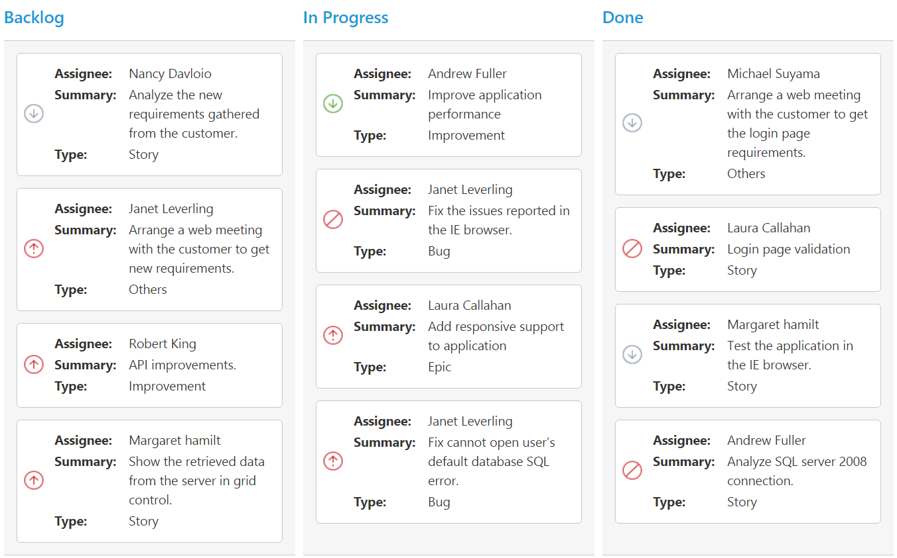

# Cards

## Customization

Cards can be customized with appropriate mapping fields from the database. The customizable mapping properties are listed as follows 

<table>
<tr>
<th>
Mapping Fields</th><th>
Description</th></tr>
<tr>
<td>
{{ '[fields.content](https://help.syncfusion.com/api/js/ejkanban#members:fields-content)' | markdownify }} </td><td> Map the column name to use as content to cards.</td></tr>
<tr>
<td>
{{ '[fields.tag](https://help.syncfusion.com/api/js/ejkanban#members:fields-tag)' | markdownify }} </td><td>
Map the column name to use as tag. Multiple tags can be given with comma separated.  E.g. "API","SQL, Database".</td></tr>
<tr>
<td>
{{ '[fields.color](https://help.syncfusion.com/api/js/ejkanban#members:fields-color)' | markdownify }} </td><td>
 Map the column name to use as colors to highlight cards left border.</td></tr>
<tr>
<td>
{{ '[cardSettings.colorMapping](https://help.syncfusion.com/api/js/ejkanban#members:cardsettings.colormapping)' | markdownify }} </td><td>
Map the colors to use with column values which is mapped with `fields.color`.</td></tr>
<tr>
<td>
{{ '[fields.imageUrl](https://help.syncfusion.com/api/js/ejkanban#members:fields-imgurl)' | markdownify }} </td><td>
Map the column name to use as image to cards.</td></tr>
<tr>
<td>
{{ '[fields.primaryKey](https://help.syncfusion.com/api/js/ejkanban#members:fields-primarykey)' | markdownify }} </td><td>
Map the column name to use as primary key to cards.</td></tr>
<tr>
<td>
{{ '[fields.priority](https://help.syncfusion.com/api/js/ejkanban#members:fields-priority)' | markdownify }} </td><td>
Map the column name to use as priority to cards.</td></tr>
<tr>
<td>
{{ '[fields.title](https://help.syncfusion.com/api/js/ejkanban#members:fields-title)' | markdownify }} </td><td>
Map the column name to use as title to cards. Default title is  `primaryKey`.</td></tr>
<tr>
<td>
{{ '[allowTitle](https://help.syncfusion.com/api/js/ejkanban#members:allowtitle)' | markdownify }} </td><td>
Set as true to enable title for card.</td></tr>
</table>

The following code example describes the above behavior.



<ej-kanban [dataSource]="kanbanData" keyField="Status" fields.content="Summary" fields.primaryKey="Id" fields.priority="RankId" fields.tag="Tags" fields.color="Type" fields.imageUrl="ImgUrl" allowTitle="true" [cardSettings.colorMapping]="color" [query]="query">
    <e-kanban-columns>
        <e-kanban-column key="Open" headertext="Backlog"></e-kanban-column>
        <e-kanban-column key="InProgress" headertext="In Progress"></e-kanban-column>
        <e-kanban-column key="Close" headertext="Done"></e-kanban-column>
    </e-kanban-columns>
</ej-kanban>





import { Component } from '@angular/core';
import { NorthwindService } from '../../services/northwind.service';

@Component({
  selector: 'ej-app',
  templateUrl: 'app/components/kanban/default.component.html',
  providers: [NorthwindService]
})
export class DefaultComponent {
  public kanbanData: any;
    constructor(private northwindService: NorthwindService) {
        this.kanbanData = northwindService.getTasks();
        this.query = ej.Query().from('kanbanData').take(20);
    }
    color = {
        "#cb2027": "Bug,Story",
        "#67ab47": "Improvement",
        "#fbae19": "Epic",
        "#6a5da8": "Others"
    };
}
    


The following output is displayed as a result of the above code example.

## Template

Templates are used to create custom card layout as per the user convenient. HTML templates can be specified in the [`template`](https://help.syncfusion.com/api/js/ejkanban#members:cardSettings-template) property of the [`cardSettings`](https://help.syncfusion.com/api/js/ejkanban#members:cardsettings) as an ID of the template’s HTML element.

The following code example describes the above behavior.

Place the ng-template in the "index.html" page.



    
            




<ej-kanban id="Kanban" [dataSource]="kanbanData" keyField="Status" fields.primaryKey="Id" cardSettings.template="#template">
    <e-kanban-columns>
        <e-kanban-column key="Open" headerText="Backlog"></e-kanban-column>
        <e-kanban-column key="InProgress" headerText="In Progress"></e-kanban-column>
        <e-kanban-column key="Close" headerText="Done"></e-kanban-column>
    </e-kanban-columns>
</ej-kanban>





import { Component } from '@angular/core';

import {ViewEncapsulation} from '@angular/core';
@Component({
    selector: 'ej-app',
    templateUrl: 'src/kanban/kanban.component.html'
})

export class KanbanComponent {
    public kanbanData: any;
    constructor() {
        this.kanbanData = [
		     { Id: 1, Status: "Open", Summary: "Analyze the new requirements gathered from the customer.", Type: "Story", Priority: "Low", Tags: "Analyze,Customer", Estimate: 3.5, Assignee: "Nancy", ImageUrl: "/images/kanban/1.png", RankId: 1 },
			 { Id: 2, Status: "InProgress", Summary: "Improve application performance", Type: "Improvement", Priority: "Normal", Tags: "Improvement", Estimate: 6, Assignee: "Andrew Fuller", ImageUrl: "/images/kanban/2.png", RankId: 1 }, 
			 { Id: 3, Status: "Open", Summary: "Arrange a web meeting with the customer to get new requirements.", Type: "Others", Priority: "Critical", Tags: "Meeting", Estimate: 5.5, Assignee: "Janet Leverling", ImageUrl: "/images/kanban/3.png", RankId: 2 }, 
			 { Id: 4, Status: "InProgress", Summary: "Fix the issues reported in the IE browser.", Type: "Bug", Priority: "Release Breaker", Tags: "IE", Estimate: 2.5, Assignee: "Janet Leverling", ImageUrl: "/images/kanban/3.png", RankId: 2 }, 
			 { Id: 5, Status: "Testing", Summary: "Fix the issues reported by the customer.", Type: "Bug", Priority: "Low", Tags: "Customer", Estimate: "3.5", Assignee: "Steven walker", ImageUrl: "/images/kanban/5.png", RankId: 1 }, 
			 { Id: 6, Status: "Close", Summary: "Arrange a web meeting with the customer to get the login page requirements.", Type: "Others", Priority: "Low", Tags: "Meeting", Estimate: 2, Assignee: "Michael Suyama", ImageUrl: "/images/kanban/6.png", RankId: 1 },
			 { Id: 7, Status: "Validate", Summary: "Validate new requirements", Type: "Improvement", Priority: "Low", Tags: "Validation", Estimate: 1.5, Assignee: "Robert King", ImageUrl: "/images/kanban/7.png", RankId: 1 },
			 { Id: 8, Status: "Close", Summary: "Login page validation", Type: "Story", Priority: "Release Breaker", Tags: "Validation,Fix", Estimate: 2.5, Assignee: "Laura Callahan", ImageUrl: "/images/kanban/8.png", RankId: 2 },
			 { Id: 9, Status: "Testing", Summary: "Fix the issues reported in Safari browser.", Type: "Bug", Priority: "Release Breaker", Tags: "Fix,Safari", Estimate: 1.5, Assignee: "Nancy", ImageUrl: "/images/kanban/1.png", RankId: 2 }, 
			 { Id: 10, Status: "Close", Summary: "Test the application in the IE browser.", Type: "Story", Priority: "Low", Tags: "Testing,IE", Estimate: 5.5, Assignee: "Margaret", ImageUrl: "/images/kanban/4.png", RankId: 3 }];
    }
}



The following output is displayed as a result of the above code example.

## Tooltip

You can enable HTML tooltip for Kanban card elements by setting [`tooltipSettings.enable`](https://help.syncfusion.com/api/js/ejkanban#members:tooltipsettings-enable) property as true in [`tooltipSettings`](https://help.syncfusion.com/api/js/ejkanban#members:tooltipsettings).

The following code example describes the above behavior.



<ej-kanban [dataSource]="kanbanData" keyField="Status" fields.primaryKey="Id" fields.content="Summary" fields.tag="Tags" [tooltipSettings.enable]="true" [query]="query">
    <e-kanban-columns>
        <e-kanban-column key="Open" headerText="Backlog"></e-kanban-column>
        <e-kanban-column key="InProgress" headerText="In Progress"></e-kanban-column>
        <e-kanban-column key="Close" headerText="Done"></e-kanban-column>
    </e-kanban-columns>
</ej-kanban>





import { Component } from '@angular/core';
import { NorthwindService } from '../../services/northwind.service';

@Component({
  selector: 'ej-app',
  templateUrl: 'app/components/kanban/default.component.html',
  providers: [NorthwindService]
})
export class DefaultComponent {
  public kanbanData: any;
    constructor(private northwindService: NorthwindService) {
        this.kanbanData = northwindService.getTasks();
        this.query = ej.Query().from('kanbanData').take(20);
    }
}


 
The following output is displayed as a result of the above code example.

### Template

By making use of template feature with tooltip, all the field names that are mapped from the `dataSource` can be accessed to define the [`template`](https://help.syncfusion.com/api/js/ejkanban#members:tooltipsettings-template) tooltip for card. The [`tooltipSettings.enable`](https://help.syncfusion.com/api/js/ejschedule#members:tooltipsettings.enable) must be enabled first.

The following code example describes the tooltip template.

Place the ng-template in the "index.html" page.



     





<ej-kanban id="Kanban" [dataSource]="kanbanData" keyField="Status" fields.primaryKey="Id" fields.content="Summary" fields.tag="Tag" tooltipSettings.enable="true" tooltipSettings.template="#tooltipTemp">
    <e-kanban-columns>
        <e-kanban-column key="Open" headerText="Backlog"></e-kanban-column>
        <e-kanban-column key="InProgress" headerText="In Progress"></e-kanban-column>
        <e-kanban-column key="Close" headerText="Done"></e-kanban-column>
    </e-kanban-columns>
</ej-kanban>





import { Component } from '@angular/core';

import {ViewEncapsulation} from '@angular/core';
@Component({
    selector: 'ej-app',
    templateUrl: 'src/kanban/kanban.component.html'
})

export class KanbanComponent {
    public kanbanData: any;
    constructor() {
        this.kanbanData = [
		     { Id: 1, Status: "Open", Summary: "Analyze the new requirements gathered from the customer.", Type: "Story", Priority: "Low", Tags: "Analyze,Customer", Estimate: 3.5, Assignee: "Nancy", ImageUrl: "/images/kanban/1.png", RankId: 1 },
			 { Id: 2, Status: "InProgress", Summary: "Improve application performance", Type: "Improvement", Priority: "Normal", Tags: "Improvement", Estimate: 6, Assignee: "Andrew Fuller", ImageUrl: "/images/kanban/2.png", RankId: 1 }, 
			 { Id: 3, Status: "Open", Summary: "Arrange a web meeting with the customer to get new requirements.", Type: "Others", Priority: "Critical", Tags: "Meeting", Estimate: 5.5, Assignee: "Janet Leverling", ImageUrl: "/images/kanban/3.png", RankId: 2 }, 
			 { Id: 4, Status: "InProgress", Summary: "Fix the issues reported in the IE browser.", Type: "Bug", Priority: "Release Breaker", Tags: "IE", Estimate: 2.5, Assignee: "Janet Leverling", ImageUrl: "/images/kanban/3.png", RankId: 2 }, 
			 { Id: 5, Status: "Testing", Summary: "Fix the issues reported by the customer.", Type: "Bug", Priority: "Low", Tags: "Customer", Estimate: "3.5", Assignee: "Steven walker", ImageUrl: "/images/kanban/5.png", RankId: 1 }, 
			 { Id: 6, Status: "Close", Summary: "Arrange a web meeting with the customer to get the login page requirements.", Type: "Others", Priority: "Low", Tags: "Meeting", Estimate: 2, Assignee: "Michael Suyama", ImageUrl: "/images/kanban/6.png", RankId: 1 },
			 { Id: 7, Status: "Validate", Summary: "Validate new requirements", Type: "Improvement", Priority: "Low", Tags: "Validation", Estimate: 1.5, Assignee: "Robert King", ImageUrl: "/images/kanban/7.png", RankId: 1 },
			 { Id: 8, Status: "Close", Summary: "Login page validation", Type: "Story", Priority: "Release Breaker", Tags: "Validation,Fix", Estimate: 2.5, Assignee: "Laura Callahan", ImageUrl: "/images/kanban/8.png", RankId: 2 },
			 { Id: 9, Status: "Testing", Summary: "Fix the issues reported in Safari browser.", Type: "Bug", Priority: "Release Breaker", Tags: "Fix,Safari", Estimate: 1.5, Assignee: "Nancy", ImageUrl: "/images/kanban/1.png", RankId: 2 }, 
			 { Id: 10, Status: "Close", Summary: "Test the application in the IE browser.", Type: "Story", Priority: "Low", Tags: "Testing,IE", Estimate: 5.5, Assignee: "Margaret", ImageUrl: "/images/kanban/4.png", RankId: 3 }];
     }
}



The following output is displayed as a result of the above code example.

