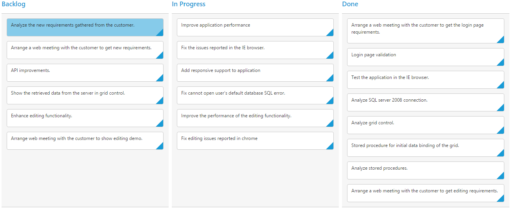

# Columns 

Column fields are present in the [`dataSource`](https://help.syncfusion.com/api/js/ejkanban#members:datasource) schema and it is rendering cards based its mapping column values.

## Key Mapping

To render Kanban with simple cards, you need to map the `dataSource` fields to Kanban cards and [`columns`](https://help.syncfusion.com/api/js/ejkanban#members:columns). The required mapping field are listed as follows

<table>
<tr>
<th>
Mapping Fields</th><th>
Description</th></tr>
<tr>
<td>
{{ '[keyField](https://help.syncfusion.com/api/js/ejkanban#members:keyField)' | markdownify }} </td><td>
Map the column name to use as {{ '[key](https://help.syncfusion.com/api/js/ejkanban#members:columns-key)'| markdownify }} values to columns.</td></tr>
<tr>
<td>
{{ '[columns.key](https://help.syncfusion.com/api/js/ejkanban#members:columns-key)' | markdownify }} </td><td>
Map the corresponding `key` values of `keyField` column to each columns.</td></tr>
<tr>
<td>
{{ '[columns.headerText](https://help.syncfusion.com/api/js/ejkanban#members:columns-headertext)' | markdownify }} </td><td>
 It represents the title for particular column</td></tr>
<tr>
<td>
{{ '[fields.content](https://help.syncfusion.com/api/js/ejkanban#members:fields-content)' | markdownify }} </td><td>
Map the column name to use as content to cards.</td></tr>
</table>

N> 1. If the column with `keyField` is not in the dataSource and `key` values specified will not available in column values, then the cards will not be rendered.
N> 2. If the `fields.content` is not in the dataSource, then empty cards will be rendered.

The following code example describes the above behavior.



<ej-kanban [dataSource] ="kanbanData" keyField="Status" fields.content="Summary" fields.primaryKey="Id" [query]="query">
    <e-kanban-columns>
        <e-kanban-column key="Open" headerText="Backlog"></e-kanban-column>
        <e-kanban-column key="InProgress" headerText="In Progress"></e-kanban-column>
        <e-kanban-column key="Testing" headerText="Testing"></e-kanban-column>
        <e-kanban-column key="Close" headerText="Done"></e-kanban-column>
    </e-kanban-columns>
</ej-kanban>





import { Component } from '@angular/core';
import { NorthwindService } from '../../services/northwind.service';

@Component({
  selector: 'ej-app',
  templateUrl: 'app/components/kanban/default.component.html',
  providers: [NorthwindService]
})
export class DefaultComponent {
  constructor(private northwindService: NorthwindService) {
      this.kanbanData = northwindService.getTasks();
      this.query = ej.Query().from('kanbanData').take(15);
  }
} 



The following output is displayed as a result of the above code example.

## Multiple Key Mapping

You can map more than one datasource fields as [`key`](https://help.syncfusion.com/api/js/ejkanban#members:columns-key) values to show different key cards into single column. For e.g , you can map "Validate,In progress" keys under "In progress" column. 

The following code example and screenshot which describes the above behavior.



 <ej-kanban [dataSource] ="kanbanData" keyField="Status" [allowTitle]="true" fields.content="Summary" fields.primaryKey="Id" [query]="query">
    <e-kanban-columns>
        <e-kanban-column key="Open" headerText="Backlog"></e-kanban-column>
        <e-kanban-column key="InProgress, Validate" headerText="In Progress or Validate"></e-kanban-column>
        <e-kanban-column key="Testing" headerText="Testing"></e-kanban-column>
        <e-kanban-column key="Close" headerText="Done"></e-kanban-column>
    </e-kanban-columns>
</ej-kanban>





import { Component } from '@angular/core';
import { NorthwindService } from '../../services/northwind.service';

@Component({
  selector: 'ej-app',
  templateUrl: 'app/components/kanban/default.component.html',
  providers: [NorthwindService]
})
export class DefaultComponent {
  constructor(private northwindService: NorthwindService) {
      this.kanbanData = northwindService.getTasks();
      this.query = ej.Query().from('kanbanData').take(15);
  }
}



The following output is displayed as a result of the above code example.

## Headers

### Header Template

The template design that applies on for the column header. To render template, set [`headerTemplate`](https://help.syncfusion.com/api/js/ejkanban#members:columns-headertemplate) property of the [`columns`](https://help.syncfusion.com/api/js/ejkanban#members:columns).

You can use JsRender syntax in the template. For more information about JsRender syntax, please refer the [`link`](https://www.jsviews.com/).

The following code example describes the above behavior.



<ej-kanban [dataSource] ="kanbanData" keyField="Status" fields.content="Summary" fields.primaryKey="Id" [query]="query">
   <e-kanban-columns>
        <e-kanban-column key="Open" headerText="Backlog" headerTemplate="#column1"></e-kanban-column>
        <e-kanban-column key="InProgress" headerText="In Progress"></e-kanban-column>
        <e-kanban-column key="Testing" headerText="Testing"></e-kanban-column>
        <e-kanban-column key="Close" headerText="Done" headerTemplate="#column4"></e-kanban-column>
   </e-kanban-columns>
</ej-kanban>

      Backlog

      Done

       




import { Component } from '@angular/core';
import { NorthwindService } from '../../services/northwind.service';

@Component({
  selector: 'ej-app',
  templateUrl: 'app/components/kanban/default.component.html',
  providers: [NorthwindService]
})
export class DefaultComponent {
  constructor(private northwindService: NorthwindService) {
      this.kanbanData = northwindService.getTasks();
      this.query = ej.Query().from('kanbanData').take(15);
  }
}



The following output is displayed as a result of the above code example.

## Width

You can specify the width for particular column by setting [`width`](https://help.syncfusion.com/api/js/ejkanban#members:columns-width) property of [`columns`](https://help.syncfusion.com/api/js/ejkanban#members:columns) as in pixel (ex: 100) or in percentage (ex: 40%).

The following code example describes the above behavior.


  
<ej-kanban [dataSource] ="kanbanData" keyField="Status" fields.content="Summary" fields.primaryKey="Id" [query]="query">
    <e-kanban-columns>
        <e-kanban-column key="Open" headerText="Backlog" width="5%"></e-kanban-column>
        <e-kanban-column key="InProgress" headerText="In Progress" width="12%"></e-kanban-column>
        <e-kanban-column key="Testing" headerText="Testing" width="100"></e-kanban-column>
        <e-kanban-column key="Close" headerText="Done" width="100"></e-kanban-column>
    </e-kanban-columns>
</ej-kanban>





import { Component } from '@angular/core';
import { NorthwindService } from '../../services/northwind.service';

@Component({
  selector: 'ej-app',
  templateUrl: 'app/components/kanban/default.component.html',
  providers: [NorthwindService]
})
export class DefaultComponent {
  constructor(private northwindService: NorthwindService) {
      this.kanbanData = northwindService.getTasks();
      this.query = ej.Query().from('kanbanData').take(15);
  }
}



The following output is displayed as a result of the above code example.

## Visibility 

You can hide particular column in Kanban by setting [`visible`](https://help.syncfusion.com/api/js/ejkanban#members:columns-visible) property of it as false.

The following code example describes the above behavior.



<ej-kanban [dataSource] ="kanbanData" keyField="Status" fields.content="Summary" fields.primaryKey="Id" [query]="query">
    <e-kanban-columns>
        <e-kanban-column key="Open" headerText="Backlog"></e-kanban-column>
        <e-kanban-column key="InProgress" headerText="In Progress"></e-kanban-column>
        <e-kanban-column key="Testing" headerText="Testing" [visible]="false"></e-kanban-column>
        <e-kanban-column key="Close" headerText="Done"></e-kanban-column>
    </e-kanban-columns>
</ej-kanban>





import { Component } from '@angular/core';
import { NorthwindService } from '../../services/northwind.service';

@Component({
  selector: 'ej-app',
  templateUrl: 'app/components/kanban/default.component.html',
  providers: [NorthwindService]
})
export class DefaultComponent {
  constructor(private northwindService: NorthwindService) {
      this.kanbanData = northwindService.getTasks();
      this.query = ej.Query().from('kanbanData').take(15);
  }
}



The following output is displayed as a result of the above code example.

## Toggle 

You can set particular column collapsed state in Kanban by setting [`isCollapsed`](https://help.syncfusion.com/api/js/ejkanban#members:columns-iscollapsed) property of it as true. You need to set [`allowToggleColumn`](https://help.syncfusion.com/api/js/ejkanban#members:allowtogglecolumn) as true to use “Expand/Collapse” Column.

The following code example describes the above behavior.



<ej-kanban [dataSource] ="kanbanData" keyField="Status" fields.content="Summary" fields.primaryKey="Id" [query]="query" [allowToggleColumn]="true">
    <e-kanban-columns>
        <e-kanban-column key="Open" headerText="Backlog" [isCollapsed]="true"></e-kanban-column>
        <e-kanban-column key="InProgress" headerText="In Progress"></e-kanban-column>
        <e-kanban-column key="Testing" headerText="Testing"></e-kanban-column>
        <e-kanban-column key="Close" headerText="Done"></e-kanban-column>
    </e-kanban-columns>
</ej-kanban>





import { Component } from '@angular/core';
import { NorthwindService } from '../../services/northwind.service';

@Component({
  selector: 'ej-app',
  templateUrl: 'app/components/kanban/default.component.html',
  providers: [NorthwindService]
})
export class DefaultComponent {
  constructor(private northwindService: NorthwindService) {
      this.kanbanData = northwindService.getTasks();
      this.query = ej.Query().from('kanbanData').take(15);
  }
}



The following output is displayed as a result of the above code example.

## Allow Dragging

You can enable and disable drag behavior to the cards in the Kanban columns using the `allowDrag` property and the default value is `true`.

The following code example describes the above behavior.



<ej-kanban [dataSource] ="kanbanData" keyField="Status" fields.content="Summary" fields.primaryKey="Id" fields.priority="RankId" [query]="query">
    <e-kanban-columns>
        <e-kanban-column key="Open" headerText="Backlog" [allowDrag]="false"></e-kanban-column>
        <e-kanban-column key="InProgress" headerText="In Progress"></e-kanban-column>
        <e-kanban-column key="Close" headerText="Done"></e-kanban-column>
    </e-kanban-columns>
</ej-kanban>





import { Component } from '@angular/core';
import { NorthwindService } from '../../services/northwind.service';

@Component({
  selector: 'ej-app',
  templateUrl: 'app/components/kanban/default.component.html',
  providers: [NorthwindService]
})
export class DefaultComponent {
  constructor(private northwindService: NorthwindService) {
      this.kanbanData = northwindService.getTasks();
      this.query = ej.Query().from('kanbanData').take(15);
  }
}



The following output is displayed as a result of the above code example.

## Allow Dropping

You can enable and disable drop behavior to the cards in the Kanban columns using the `allowDrop` property and the default value is `true`.

The following code example describes the above behavior.



<ej-kanban [dataSource] ="kanbanData" keyField="Status" fields.content="Summary" fields.primaryKey="Id" fields.priority="RankId" [query]="query">
    <e-kanban-columns>
        <e-kanban-column key="Open" headerText="Backlog"></e-kanban-column>
        <e-kanban-column key="InProgress" headerText="In Progress"></e-kanban-column>
        <e-kanban-column key="Close" headerText="Done" [allowDrop]="false"></e-kanban-column>
    </e-kanban-columns>
</ej-kanban>





import { Component } from '@angular/core';
import { NorthwindService } from '../../services/northwind.service';

@Component({
  selector: 'ej-app',
  templateUrl: 'app/components/kanban/default.component.html',
  providers: [NorthwindService]
})
export class DefaultComponent {
  constructor(private northwindService: NorthwindService) {
      this.kanbanData = northwindService.getTasks();
      this.query = ej.Query().from('kanbanData').take(15);
  }
}



The following output is displayed as a result of the above code example.

## Items Count

You can show total cards count in each column's header using the property `enableTotalCount` and the default value is `false`.

The following code example describes the above behavior.



<ej-kanban [dataSource] ="kanbanData" keyField="Status" fields.content="Summary" fields.primaryKey="Id" [enableTotalCount]="true" [query]="query">
    <e-kanban-columns>
        <e-kanban-column key="Open" headerText="Backlog"></e-kanban-column>
        <e-kanban-column key="InProgress" headerText="In Progress"></e-kanban-column>
        <e-kanban-column key="Close" headerText="Done"></e-kanban-column>
    </e-kanban-columns>
</ej-kanban>





import { Component } from '@angular/core';
import { NorthwindService } from '../../services/northwind.service';

@Component({
  selector: 'ej-app',
  templateUrl: 'app/components/kanban/default.component.html',
  providers: [NorthwindService]
})
export class DefaultComponent {
  constructor(private northwindService: NorthwindService) {
      this.kanbanData = northwindService.getTasks();
      this.query = ej.Query().from('kanbanData').take(20);
  }
}



The following output is displayed as a result of the above code example.

## Customize Items Count Text

You can customize the Items count text using the property `totalCount.text`.

The following code example describes the above behavior.



<ej-kanban [dataSource] ="kanbanData" keyField="Status" fields.content="Summary" fields.primaryKey="Id" [enableTotalCount]="true" [query]="query">
    <e-kanban-columns>
        <e-kanban-column key="Open" headerText="Backlog" [totalCount]="totalcount"></e-kanban-column>
        <e-kanban-column key="InProgress" headerText="In Progress"></e-kanban-column>
        <e-kanban-column key="Close" headerText="Done"></e-kanban-column>
    </e-kanban-columns>
</ej-kanban>





import { Component } from '@angular/core';
import { NorthwindService } from '../../services/northwind.service';

@Component({
  selector: 'ej-app',
  templateUrl: 'app/components/kanban/default.component.html',
  providers: [NorthwindService]
})
export class DefaultComponent {
  constructor(private northwindService: NorthwindService) {
      this.kanbanData = northwindService.getTasks();
      this.query = ej.Query().from('kanbanData').take(20);
      this.totalcount = { text: "Backlog Count" };
  }
}



The following output is displayed as a result of the above code example.

