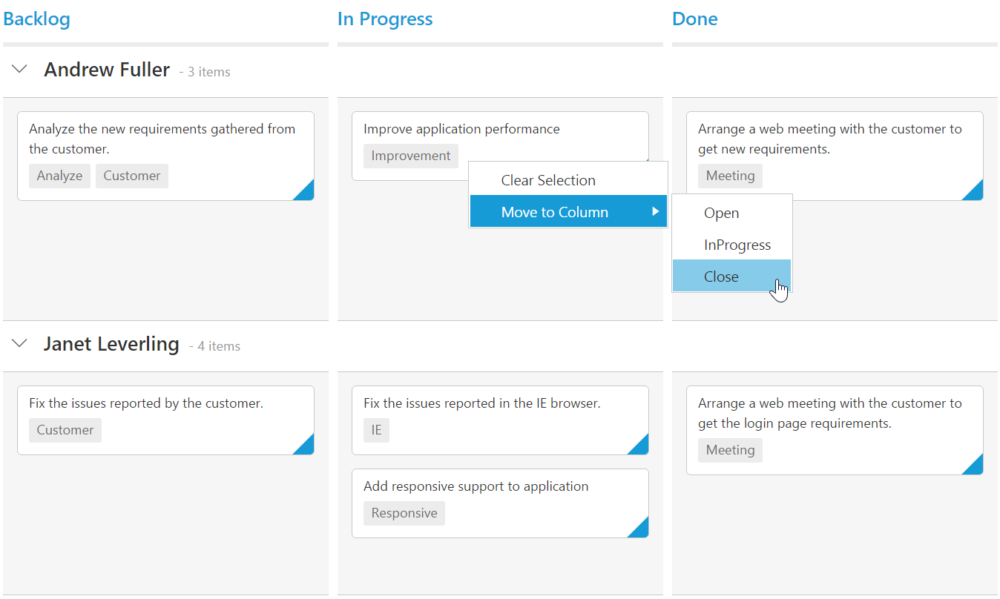

# Context Menu  

Context menu is used to improve user action with Kanban using popup menu. It can be shown by defining [`contextMenuSettings.enable`](https://help.syncfusion.com/api/js/ejkanban#members:contextmenusettings-enable) as true. Context menu has option to add default items in [`contextMenuSettings.menuItems`](https://help.syncfusion.com/api/js/ejkanban#members:contextmenusettings-menuitems) and customized items in [`contextMenuSettings.customMenuItems`](https://help.syncfusion.com/api/js/ejkanban#members:contextmenusettings-custommenuitems).

## Default Context Menu items

Please find the below table for default context menu items and its actions.

<table>
        <tr>
            <th>
                Section 
            </th>
            <th>
               Context menu items 
            </th>
            <th>
                Action
            </th>
        </tr>
        <tr>
            <td rowspan="2">
                Header 
            </td>
            <td>
                Hide Column
            </td>
            <td>
               Hide the current column 
            </td>
        </tr>
        <tr>
            <td>
                Visible Columns
            </td>
            <td>
                Show the column if already hidden 
            </td>
        </tr>
       <tr>
            <td>
                Content
            </td>
            <td>
                Add Card 
            </td>
             <td>
                Start Add new card 
            </td>
        </tr>
        <tr>
            <td rowspan="10">
                Card
            </td>
            <td>
               Edit Card 
            </td>
            <td>
               Start Edit in current card 
            </td>
        </tr>
        <tr>
            <td>
               Delete Card 
            </td>
            <td>
                Delete the current card 
            </td>
        </tr>
        <tr>
            <td>
                Top of Row
            </td>
            <td>
                Move the card to Top of Row
            </td>
        </tr>
        <tr>
            <td>
               Bottom of Row
            </td>
            <td>
                Move the card to Bottom of Row
            </td>
        </tr>
        <tr>
            <td>
               Move Up
            </td>
            <td>
                Move the card in Up direction 
            </td>
        </tr>
        <tr>
            <td>
               Move Down
            </td>
            <td>
               Move the card in Down direction
            </td>
        </tr>
        <tr>
            <td>
                Move Left
            </td>
            <td>
                Move the card in Left direction
            </td>
        </tr>
        <tr>
            <td>
               Move Right
            </td>
            <td>
                Move the card in Right direction
            </td>
        </tr>
        <tr>
            <td>
              Move to Swimlane
            </td>
            <td>
                Move the card to Swim lane which is chosen from given list
            </td>
        </tr>
         <tr>
            <td>
              Print Card
            </td>
            <td>
                Print the specific card
            </td>
        </tr>
    </table>

    
The following code example describes the above behavior.



<ej-kanban [dataSource]="kanbanData" keyField="Status" fields.content="Summary" fields.primaryKey="Id" fields.priority="RankId" [query]="query" [contextMenuSettings.enable]="true">
    <e-kanban-columns>
        <e-kanban-column key="Open" headerText="Backlog"></e-kanban-column>
        <e-kanban-column key="InProgress" headerText="In Progress"></e-kanban-column>
        <e-kanban-column key="Close" headerText="Done"></e-kanban-column>
    </e-kanban-columns>
</ej-kanban>





import { Component } from '@angular/core';
import { NorthwindService } from '../../services/northwind.service';

@Component({
  selector: 'ej-app',
  templateUrl: 'app/components/kanban/default.component.html',
  providers: [NorthwindService]
})
export class DefaultComponent {
  constructor(private northwindService: NorthwindService) {
      this.kanbanData = northwindService.getTasks();
      this.query = ej.Query().from('kanbanData').take(20);
  }
}



The following output is displayed as a result of the above code example.

## Custom Context Menu

Custom context menu is used to create your own menu item and its action. To add customized context menu items, you need to use `contextMenuSettings.customMenuItems` property and to bind required actions for this, use `contextClick` event.

The following code example describes the above behavior.



    <ej-kanban [datasource]="kanbanData" keyfield="Status" fields.swimlaneKey="Assignee" fields.content="Summary" fields.primarykey="Id" [contextmenusettings.enable]="true" (contextclick)="onContextClick($event)" fields.tag="Tags" [contextmenusettings.menuitems]="menuItem" [contextmenusettings.custommenuitems]="customMenuItems">
    <e-kanban-columns>
        <e-kanban-column key="Open" headertext="Backlog"></e-kanban-column>
        <e-kanban-column key="InProgress" headertext="In Progress"></e-kanban-column>
        <e-kanban-column key="Close" headertext="Done"></e-kanban-column>
    </e-kanban-columns>
   </ej-kanban>





      import { Component } from '@angular/core';
import { NorthwindService } from '../../services/northwind.service';

@Component({
    selector: 'ej-app',
    templateUrl: 'app/components/kanban/contextmenu.component.html',
    providers: [NorthwindService]
})
export class KanbanComponent {
    public kanbanData: any;
    constructor(private northwindService: NorthwindService) {
        this.kanbanData = northwindService.getTasks();
    }
    editItem = [
        { field: 'Id', editType: ej.Kanban.EditingType.String, validationRules: { required: true, number: true } },
        { field: 'Status', editType: ej.Kanban.EditingType.Dropdown },
        { field: 'Assignee', editType: ej.Kanban.EditingType.Dropdown },
        { field: 'Estimate', editType: ej.Kanban.EditingType.Numeric, editParams: { decimalPlaces: 2 }, validationRules: { range: [0, 1000] } },
        { field: 'Summary', editType: ej.Kanban.EditingType.TextArea, validationRules: { required: true } }
    ];
        this.menuItem = [];
        this.customMenuItems = [{ text: "Clear Selection" }];
    };
    onContextClick(event) {
        var kanbanObj = $(event.targetelement).parents('.e-kanban').data('ejKanban')
        if (event.text == "Clear Selection")
            kanbanObj.KanbanSelection.clear();
    }

} 



The following output is displayed as a result of the above code example.

## Sub Context Menu

Sub context menu is used to add customized sub menu to the custom context menu item. To add a sub context menu, you need to use `contextMenuSettings.subMenu` property and to bind required actions for this, use `contextClick` event.

The following code example describes the above behavior.



    <ej-kanban [datasource]="kanbanData" keyfield="Status" fields.swimlaneKey="Assignee" fields.content="Summary" fields.primarykey="Id" [contextmenusettings.enable]="true" (contextclick)="onContextClick($event)" fields.tag="Tags" [contextmenusettings.menuitems]="menuItem" [contextmenusettings.custommenuitems]="customMenuItems">
    <e-kanban-columns>
        <e-kanban-column key="Open" headertext="Backlog"></e-kanban-column>
        <e-kanban-column key="InProgress" headertext="In Progress"></e-kanban-column>
        <e-kanban-column key="Close" headertext="Done"></e-kanban-column>
    </e-kanban-columns>
   </ej-kanban>
<ul id="submenu">
    <li><a>Open</a> </li>
    <li><a>InProgress</a> </li>
    <li><a>Close</a> </li>
</ul> 





import { Component } from '@angular/core';
import { NorthwindService } from '../../services/northwind.service';

@Component({
    selector: 'ej-app',
    templateUrl: 'app/components/kanban/contextmenu.component.html',
    providers: [NorthwindService]
})
export class KanbanComponent {
    public kanbanData: any;
    constructor(private northwindService: NorthwindService) {
        this.kanbanData = northwindService.getTasks();
    }
    editItem = [
        { field: 'Id', editType: ej.Kanban.EditingType.String, validationRules: { required: true, number: true } },
        { field: 'Status', editType: ej.Kanban.EditingType.Dropdown },
        { field: 'Assignee', editType: ej.Kanban.EditingType.Dropdown },
        { field: 'Estimate', editType: ej.Kanban.EditingType.Numeric, editParams: { decimalPlaces: 2 }, validationRules: { range: [0, 1000] } },
        { field: 'Summary', editType: ej.Kanban.EditingType.TextArea, validationRules: { required: true } }
    ];
        this.menuItem = [];
        this.customMenuItems = [{ text: "Clear Selection" }, { text: "Move to Column", template: "#submenu" }];
    };
    onContextClick(event) {
        var kanbanObj = $(event.targetelement).parents('.e-kanban').data('ejKanban')
        if (event.text == "Clear Selection")
            kanbanObj.KanbanSelection.clear();
        else if (event.text != "Move to Column")
            kanbanObj.updateCard(event.cardData.Id, event.cardData);
    }

} 



The following output is displayed as a result of the above code example.

