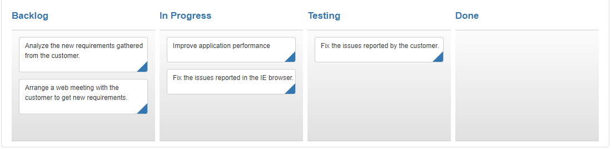
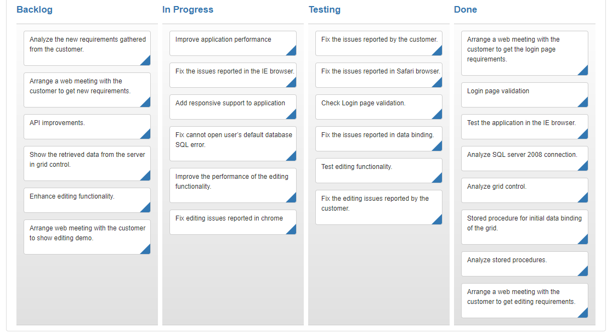

# Data Binding  

The Kanban control uses [`ej.DataManager`](https://help.syncfusion.com/js/datamanager/overview) which supports both RESTful JSON data services binding and local JSON array binding. The [`dataSource`](https://help.syncfusion.com/api/js/ejkanban#members:datasource) property can be assigned either with the instance of [`ej.DataManager`](https://help.syncfusion.com/js/datamanager/overview) or JSON data array collection. It supports different kinds of data binding methods such as

1.	Local data
2.	Remote data

## Local Data

To bind local data to the Kanban, you can assign a JSON array to the [`dataSource`](https://help.syncfusion.com/api/js/ejkanban#members:datasource) property.

The JSON array to the [`dataSource`](https://help.syncfusion.com/api/js/ejkanban#members:datasource) property can also be provided as an instance of the [`ej.DataManager`](https://help.syncfusion.com/js/datamanager/overview). When the JSON array is passed as an instance of [`ej.DataManager`](https://help.syncfusion.com/js/datamanager/overview), the `ej.JsonAdaptor` will be used to manipulate the Kanban data source.

The following code example describes the above behavior.



    <ej-kanban id="defaultkanban" [dataSource] ="kanbanData" keyField="Status" fields.content="Summary" fields.primaryKey="Id">
    <e-kanban-columns>
        <e-kanban-column key="Open" headerText="Backlog"></e-kanban-column>
        <e-kanban-column key="InProgress" headerText="In Progress"></e-kanban-column>
        <e-kanban-column key="Testing" headerText="Testing"></e-kanban-column>
        <e-kanban-column key="Close" headerText="Done"></e-kanban-column>
    </e-kanban-columns>
</ej-kanban>



Add the following code in typescript file.



    export class DefaultComponent {

    public kanbanData: any;
    constructor() {
      this.kanbanData =[
        { Id: 1, Status: "Open", Summary: "Analyze the new requirements gathered from the customer.", Assignee: "Nancy" },
        { Id: 2, Status: "InProgress", Summary: "Improve application performance", Assignee: "Andrew" },
        { Id: 3, Status: "Open", Summary: "Arrange a web meeting with the customer to get new requirements.", Assignee: "Janet" },
        { Id: 4, Status: "InProgress", Summary: "Fix the issues reported in the IE browser.", Assignee: "Janet" },
        { Id: 5, Status: "Testing", Summary: "Fix the issues reported by the customer.", Assignee: "Steven" }
        ];
      }
    }



The following output is displayed as a result of the above code example.

## Remote Data

To bind remote data to Kanban Control, you can assign a service data as an instance of [`ej.DataManager`](https://help.syncfusion.com/js/datamanager/overview) to the [`dataSource`](https://help.syncfusion.com/api/js/ejkanban#members:datasource) property.

### OData

OData is a standardized protocol for creating and consuming data. You can provide the [`OData service`](http://www.odata.org/) URL directly to the [`ej.DataManager`](https://help.syncfusion.com/api/js/ejdatamanager) class and then you can assign it to Kanban [`dataSource`](https://help.syncfusion.com/api/js/ejkanban#members:datasource).

The following code example describes the above behavior.



    





    export class DefaultComponent {
        kanbanData: any;
         constructor(private northwindService:      NorthwindService) {
          this.kanbanData = new ej.DataManager({ url: 'http://js.syncfusion.com/ejServices/wcf/NorthWind.svc/Tasks',crossDomain: true });
	  
        }
        }



The following output is displayed as a result of the above code example.

