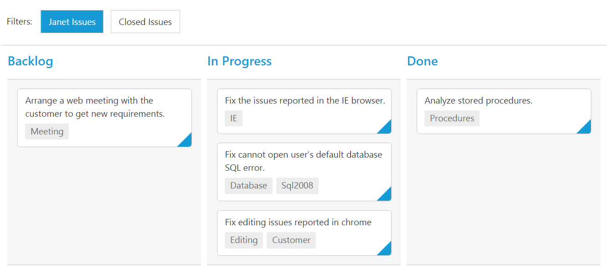

# Filtering

Filtering allows to filter the collection of cards from `dataSource` which meets the predefined `query` in the quick filters collection. To enable filtering, define [`filterSettings`](https://help.syncfusion.com/api/js/ejkanban#members:filtersettings) collection with display `text` and [`ej.Query`](https://help.syncfusion.com/js/datamanager/query). 

You can also define display tip to describe filter definition to user using property `description`. If the [`description`](https://help.syncfusion.com/api/js/ejkanban#members:filtersettings-description) property is not defined, given [`text`](https://help.syncfusion.com/api/js/ejkanban#members:filtersettings-text) will act as display tip.

We can also customize filter option through external button or [`customToolbarItems`](https://help.syncfusion.com/api/js/ejkanban#members:customtoolbaritems) by using [`filterCards()`](https://help.syncfusion.com/api/js/ejkanban#methods:filtercards) method.

The following code example describes the above behavior.



<ej-kanban [dataSource]="kanbanData" keyField="Status" fields.primaryKey="Id" fields.content="Summary" fields.tag="Tags" [filterSettings]="filterSetting" [query]="query">
    <e-kanban-columns>
        <e-kanban-column key="Open" headerText="Backlog"></e-kanban-column>
        <e-kanban-column key="InProgress" headerText="In Progress"></e-kanban-column>
        <e-kanban-column key="Close" headerText="Done"></e-kanban-column>
    </e-kanban-columns>
</ej-kanban>





import { Component } from '@angular/core';
import { NorthwindService } from '../../services/northwind.service';

@Component({
  selector: 'ej-app',
  templateUrl: 'app/components/kanban/default.component.html',
  providers: [NorthwindService]
})
export class DefaultComponent {
  public kanbanData: any;
    constructor(private northwindService: NorthwindService) {
        this.kanbanData = northwindService.getTasks();
        this.query = ej.Query().from('kanbanData').take(30);
        this.filterSetting = [
            { text: "Janet Issues", query: new ej.Query().where("Assignee", "equal", "Janet Leverling"), description: "Displays issues which matches the asssignee as 'Janet Leverling'" },
            { text: "Closed Issues", query: new ej.Query().where("Status", "equal", "Close"), description: "Display the 'Closed' issues" }
        ];
    }
}



The following output is displayed as a result of the above code example.

