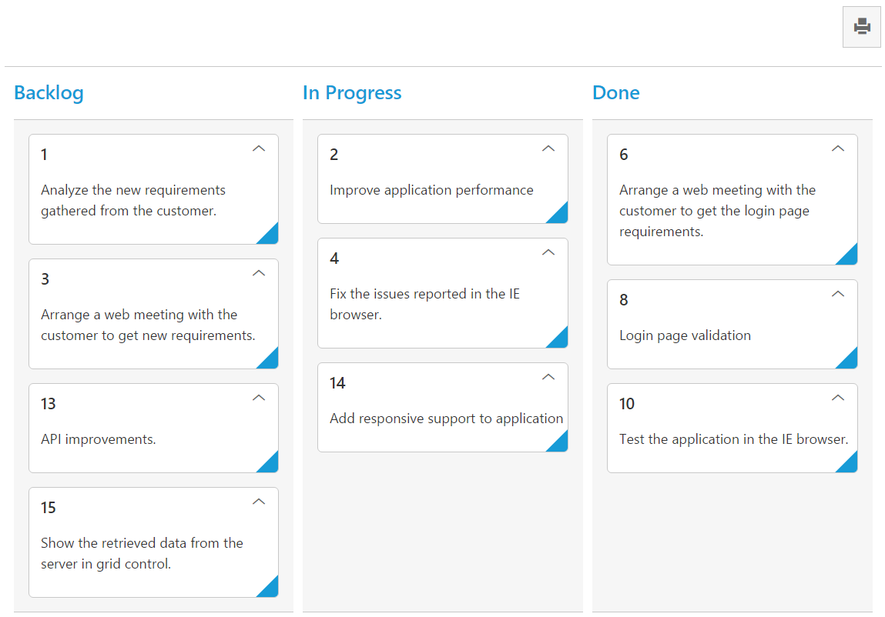

# Print

 Set [‘allowPrinting’](https://help.syncfusion.com/api/js/ejkanban#members:allowprinting) as true, to enable Print icon in the Kanban toolbar.  You can use [‘print()’](https://help.syncfusion.com/api/js/ejkanban#methods:print) method from Kanban instance to print the Kanban.

The following code example describes the above behavior.



<ej-kanban [dataSource]="kanbanData" keyField="Status" fields.content="Summary" fields.primaryKey="Id" [query]="query" [allowTitle]="true" [allowPrinting]="true">
    <e-kanban-columns>
        <e-kanban-column key="Open" headerText="Backlog"></e-kanban-column>
        <e-kanban-column key="InProgress" headerText="In Progress"></e-kanban-column>
        <e-kanban-column key="Close" headerText="Done"></e-kanban-column>
    </e-kanban-columns>
</ej-kanban>





import { Component } from '@angular/core';
import { NorthwindService } from '../../services/northwind.service';

@Component({
  selector: 'ej-app',
  templateUrl: 'app/components/kanban/default.component.html',
  providers: [NorthwindService]
})
export class DefaultComponent {
  public kanbanData: any;
    constructor(private northwindService: NorthwindService) {
        this.kanbanData = northwindService.getTasks();
        this.query = ej.Query().from('kanbanData').take(20);  
    }
}



The following output is displayed as a result of the above code example.

