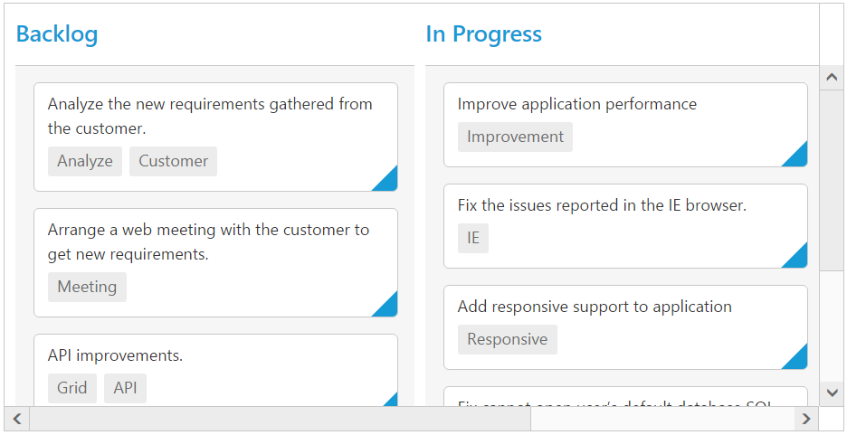

# Scrolling

Scrolling can be enabled by setting [`allowScrolling`](https://help.syncfusion.com/api/js/ejkanban#members:allowscrolling) as true. The height and width can be set to Kanban by using the properties [`height`](https://help.syncfusion.com/api/js/ejkanban#members:scrollsettings-height) and [`width`](https://help.syncfusion.com/api/js/ejkanban#members:scrollsettings-width) respectively.

N> The height and width can be set in percentage and pixel. The default value for [`height`](https://help.syncfusion.com/api/js/ejkanban#members:scrollsettings-height) and [`width`](https://help.syncfusion.com/api/js/ejkanban#members:scrollsettings-width) in [`scrollSettings`](https://help.syncfusion.com/api/js/ejkanban#members:scrollsettings) is 0 and auto respectively.

## Set width and height in pixel

To specify the [`width`](https://help.syncfusion.com/api/js/ejkanban#members:scrollsettings-width) and [`height`](https://help.syncfusion.com/api/js/ejkanban#members:scrollsettings-height) in pixel, by set the pixel value as integer.

The following code example describes the above behavior.



<ej-kanban [dataSource]="kanbanData" keyField="Status" fields.primaryKey="Id" fields.content="Summary" fields.tag="Tags" allowScrolling="true" [scrollSettings]="scrollSetting" [query]="query">
    <e-kanban-columns>
        <e-kanban-column key="Open" headerText="Backlog"></e-kanban-column>
        <e-kanban-column key="InProgress" headerText="In Progress"></e-kanban-column>
        <e-kanban-column key="Close" headerText="Done"></e-kanban-column>
    </e-kanban-columns>
</ej-kanban>





import { Component } from '@angular/core';
import { NorthwindService } from '../../services/northwind.service';

@Component({
  selector: 'ej-app',
  templateUrl: 'app/components/kanban/default.component.html',
  providers: [NorthwindService]
})
export class DefaultComponent {
  public kanbanData: any;
    constructor(private northwindService: NorthwindService) {
        this.kanbanData = northwindService.getTasks();
        this.query = ej.Query().from('kanbanData').take(30);
        this.scrollSetting = {
            width: 900,
            height: 450
        }
    }
}



The following output is displayed as a result of the above code example.

## Set height and width in percentage

To specify the [`width`](https://help.syncfusion.com/api/js/ejkanban#members:scrollsettings-width) and [`height`](https://help.syncfusion.com/api/js/ejkanban#members:scrollsettings-height) in percentage, by set the percentage value as string.

The following code example describes the above behavior.



<ej-kanban [dataSource]="kanbanData" keyField="Status" fields.primaryKey="Id" fields.content="Summary" fields.tag="Tags" allowScrolling="true" [scrollSettings]="scrollSetting" [query]="query">
    <e-kanban-columns>
        <e-kanban-column key="Open" headerText="Backlog"></e-kanban-column>
        <e-kanban-column key="InProgress" headerText="In Progress"></e-kanban-column>
        <e-kanban-column key="Close" headerText="Done"></e-kanban-column>
    </e-kanban-columns>
</ej-kanban>





import { Component } from '@angular/core';
import { NorthwindService } from '../../services/northwind.service';

@Component({
  selector: 'ej-app',
  templateUrl: 'app/components/kanban/default.component.html',
  providers: [NorthwindService]
})
export class DefaultComponent {
  public kanbanData: any;
    constructor(private northwindService: NorthwindService) {
        this.kanbanData = northwindService.getTasks();
        this.query = ej.Query().from('kanbanData').take(30);
        this.scrollSetting = {
            width: "70%",
            height: "70%"
        }
    }
}



The following output is displayed as a result of the above code example.

