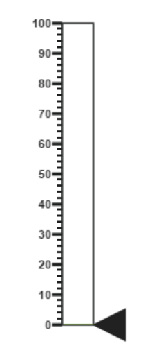
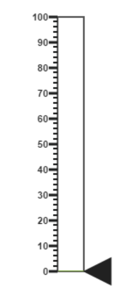
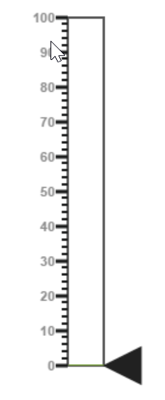
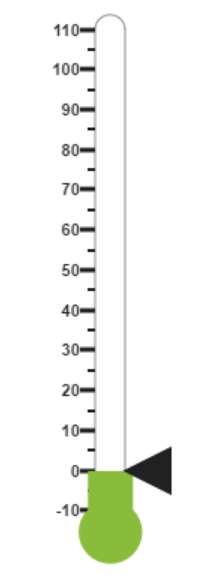
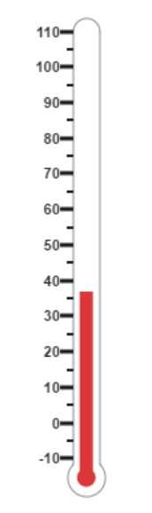
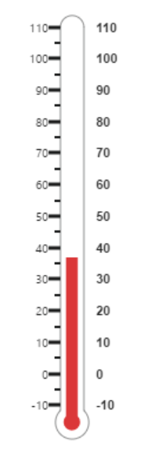
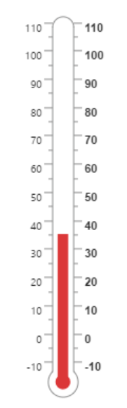

#Getting Started

Before we start with the LinearGauge, please refer [this page](https://help.syncfusion.com/angular-2/overview) for general information regarding integrating Syncfusion widget’s.

## Adding JavaScript and CSS Reference

To render the LinearGauge control, the following list of external dependencies are needed, 

* [jQuery](http://jquery.com) - 1.7.1 and later versions
* [jsRender](https://github.com/borismoore/jsrender) - to render the templates
* [Angular](https://angular.io/) - Angular latest versions

The other required internal dependencies are tabulated below,

<table>
   <tr>
      <th>
         <b>Files</b>
      </th>
      <th>
         <b>Description/Usage </b>
      </th>
   </tr>
   <tr>
      <td>
         ej.core.min.js
      </td>
      <td>
        It is referred always before using all the JS controls.
      </td>
   </tr>
   <tr>
      <td>
         ej.data.min.js
      </td>
      <td>
         Used to handle data operation and is used while binding data to the JS controls.
      </td>
   </tr>
   <tr>
      <td>
        ej.lineargauge.min.js
      </td>
      <td>
        LinearGauge core script file which includes LinearGauge related scripts files.
      </td>
   </tr>
   <tr>
      <td>
        excanvas.min.js
      </td>
      <td>
        
      </td>
   </tr>
</table>

## Preparing HTML document

Create an HTML page and add the scripts references in the order mentioned in the following code example.



    <html>
    <head>
    <title>Angular LinearGauge</title>

    <!-- Essential Studio for JavaScript  theme reference -->
    <link rel="stylesheet" href="http://cdn.syncfusion.com/{{ site.releaseversion }}/js/web/flat-azure/ej.web.all.min.css" />

    <!-- Angular related script references -->
    <!-- 1. Load libraries -->
         <!-- Polyfill(s) for older browsers -->
       
    
    
    

    <!-- Essential Studio for JavaScript  script references -->
    
    
     
    
    
    <!-- 2. Configure SystemJS -->
    
    

    </head>
    <!-- 3. Display the application -->
    <body>
    <ej-app>  
		    

			      
Angular Syncfusion Components App

			      

		    

	  </ej-app>
    </body>
    </html>



N> Uncompressed version of library files are also available which is used for development or debugging purpose and can be generated from the custom script [here](http://csg.syncfusion.com).

## Control Initialization

* Copy LinearGauge Syncfusion Angular source component(s) from the below build location and add it in `src/ej` folder (For ex., consider the `LinearGauge` component).


(Installed Location)\Syncfusion\Essential Studio\14.3.0.49\JavaScript\assets-src\angular2\ 


N> `core.ts` file is mandatory for all Syncfusion JavaScript Angular components. The repository having the source file from Essential Studio for JavaScript v14.3.0.49.

* Create `LinearGauge` folder inside `src` folder.

* Create `LinearGauge.component.html` view file inside `src/LinearGauge` folder and render ejLinearGauge Angular component using the below code example. 


<ej-lineargauge id="defaultlineargauge">
</ej-lineargauge>


* Create `LinearGauge.component.ts` model file inside the folder `src/LinearGauge` and create sample component using the below code example.



import { Component, ViewEncapsulation } from '@angular/core';

@Component({
  selector: 'ej-app',
  templateUrl: 'src/LinearGauge/LinearGauge.component.html'
})
export class LinearGaugeComponent {

}


## Configure the routes for the Router

Before adding router configuration for above created ejLinearGauge component, we recommend you to go through the [Angular Routing](https://angular.io/docs/ts/latest/guide/router.html) configuration to get the deeper knowledge about Angular routing. 

* Now, we are going to configure the route navigation link for created linear gauge sample in `src/app.component.html` file.



	<ul class="nav navbar-nav">
		<li>
            <a data-toggle="collapse" data-target="#skeleton-navigation-navbar-collapse.in" href="#LinearGauge" [routerLink]="['/LinearGauge']">LinearGauge </a>
        </li>
	</ul>

<main>
	<router-outlet></router-outlet>
</main>


* Import the ejLinearGauge sample component and define the route in `src/app.routes.ts` file.


import { Routes } from '@angular/router';
. . . . 
import { LinearGaugeComponent } from './LinearGauge/LinearGauge.component';

export const rootRouterConfig: Routes = [
    { path: '', redirectTo: 'home', pathMatch: 'full' },
    . . . . 
    { path: 'LinearGauge', component: LinearGaugeComponent }
];


* Import and declare the Syncfusion source component and ejLinearGauge sample component into `app.module.ts` like the below code snippet.


import { NgModule, enableProdMode, ErrorHandler } from '@angular/core';
. . . . . 
import { EJ_LINEARGAUGE_COMPONENTS } from './ej/LinearGauge.component';
import { LinearGaugeComponent } from './LinearGauge/LinearGauge.component';

import { rootRouterConfig } from './app.routes';
. . . . 
@NgModule({
  imports: [BrowserModule, FormsModule, HttpModule, RouterModule.forRoot(rootRouterConfig, { useHash: true })],
  declarations: [. . . . , EJ_LINEARGAUGE_COMPONENTS, LinearGaugeComponent],
  bootstrap: [AppComponent]
})
export class AppModule { }


## Running the application

* To run the application, execute below command.


npm start


* Browse to [http://localhost:3000](http://localhost:3000) to see the application. And navigate to linear gauge tab. The component is rendered as like the below screenshot. You can make changes in the code found under src folder and the browser should auto-refresh itself while you save files. 

 

## Set Height and Width values

* Basic attributes of each canvas elements are height and width properties. 

* You can set the height and width of the gauge as shown in the following code example.



<ej-lineargauge id="linearguage" [height]="550" [width]="500">
</ej-lineargauge>



On executing the above code sample renders a default **Linear Gauge** with height and width.

## Set animate option and Label Color

* You can draw the Thermometer with Label color and set animate property to _true_.  

* Initially set the animate property to _false_ to avoid unwanted script loads.



<ej-lineargauge id="lineargauge" labelColor="#8c8c8c" enableAnimation="false">
</ej-lineargauge>



On executing the above code sample renders a customized **Linear Gauge** as follows.

## Provide scale values

* You can change the Scale Style of Thermometer using **type** property.

* You can set the Minimum temperature up to -10 and maximum body temperature up to 110. 

* You can set the Minimum scale value as -10 and maximum value as 110.

* You can set the Location values such as vertical and horizontal position in the thermometer.

* You can set the thermometer height using **length** property.

* You can set the Minor Interval value as 5 to get the exact temperature of the patient.



<ej-lineargauge id="lineargauge" [height]="550" [width]="500">
    <e-scales>
       <e-scale type="thermometer" backgroundColor="transparent" [minimum]="-10"
               [maximum]="110" [minorIntervalValue]="5" [width]="20" [position.x]="50" 
                                [position.y]="18" [length]="355" [border.width]="0.5"> 
       </e-scale>
    </e-scales>
</ej-lineargauge>
    


On executing the above code sample renders a customized gauge with ranges as follows.

## Add pointers data

In **Linear gauge** there are two types of pointers available such as marker pointer and bar pointer.

* **Marker pointer** displays as a pointer device which shows the actual values. In this example, there is no need to show a marker pointer in a thermometer, therefore, you can hide it by setting the **Opacity** property to ‘0’.

* **Bar pointer** displays as a mercury metal that shows the exact temperature of the person. You can set the basic properties of the bar pointer such as **width**, **distanceFromScale**, **Value** and **backgroundColor**.



<ej-lineargauge id="lineargauge">
    <e-scales>
       <e-scale > 
           <e-markerpointers>
               <e-markerpointer opacity="0"></e-markerpointer>
           </e-markerpointers>
           <e-barpointers>
              <e-barpointer  [width]="10" [distanceFromScale]="-0.5" [value]="37"
                                          backgroundColor="#DB3738"></e-barpointer>
           </e-barpointers>
       </e-scale>
    </e-scales>
</ej-lineargauge>



On executing the above code sample renders a **Linear Gauge** with bar marker as follows.

## Add Label Customization

* You can display the label value on both sides to get temperature in different scales. For that you can add two label values in an array.

* You can use the scale labels to display the value in the gauge. You can customize the label placement, font (including its style and family) and  its distance from scale.



<ej-lineargauge id="lineargauge" [height]="550" [width]="500">
    <e-scales>
       <e-scale>
           <e-labels>
             <e-label placement="near" font.size="10px" font.fontFamily="Segoe UI"
                                                          font.fontStyle="Normal">
             </e-label>
             <e-label placement="far" [distanceFromScale.x]="10"></e-label>
          </e-labels>
       </e-scale>
    </e-scales>
</ej-lineargauge>



On executing the above code sample renders a customized **Linear Gauge** as follows.

## Add Ticks Details

* You can set the width and height of the major ticks greater than the Minor ticks. You can set dark background for tick Color to have a better visibility.

* You can also use four ticks for both the sides, each having two minor ticks and major ticks.



<ej-lineargauge id="lineargauge" [height]="550" [width]="500">
    <e-scales>
       <e-scale>
          <e-ticks>
              <e-tick type="majorinterval" [height]="8" [width]="1" color="#8c8c8c"
                                                 [distanceFromScale.y]="-4"></e-tick>
              <e-tick type="minorinterval" [height]="4" [width]="1" color="#8c8c8c"
                                                  [distanceFromScale.y]="-4"></e-tick>
              <e-tick type="majorinterval" placement="far" [height]="8" [width]="1" color="#8c8c8c" 
                      [distanceFromScale.y]="-4">
              </e-tick>
              <e-tick type="minorinterval" placement="far" [height]="4" [width]="1" color="#8c8c8c"
                      [distanceFromScale.y]="-4">
              </e-tick>
            </e-ticks>
       </e-scale>
    </e-scales>
</ej-lineargauge>



On executing the above code sample renders a **Linear Gauge** with custom labels as follows.

