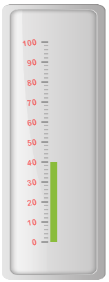

# Labels

Labels are units that are used to display the values in the scales. You can customize Labels with the properties like angle, color, font, opacity, etc.

## Label Customization

**Appearance**

* The attribute **angle** is used to display the labels in the specified angles and **color** attribute is used to display the labels in specified color. You can adjust the opacity of the label with the property **opacity** and the values of it lies between 0 and 1.The **includeFirstValue** is a special property by enabling this property, the first value of the label is not rendered.

* Font option is also available on the labels. The basic three properties of fonts such as size, family and style can be achieved by **size**, **fontStyle** and **fontFamily**. Labels are two types such as major and minor.Major type labels are for major interval values and minor type labels are for minor interval values.



 <ej-lineargauge id="LinearGauge1" [value]="78" [enableAnimation]=false [frame.innerWidth]=8
      [frame.outerWidth]=10 frame.backgroundImageUrl="../images/gauge/Gauge_linear_light.png" >
   <e-scales>
        <e-scale backgroundColor="transparent" [showCustomLabels]="true" [labels]="labels"
                                    [showMarkerPointers]="false" [showBarPointers]="true" 
                                                [border]="{ color: 'transparent', width: 0 }">
          <e-barpointers>
              <e-barpointer  [width]="10"></e-barpointer>
           </e-barpointers>	
          <e-ticks>
               <e-tick type="majorinterval" [width]=2 color="#8c8c8c" 
                             [distanceFromScale]="{ x: 7, y: 0 }"></e-tick>
               <e-tick type="minorinterval" [width]=1 [height]=6 color="#8c8c8c"
                                      [distanceFromScale]="{ x: 7, y: 0 }"></e-tick>
          </e-ticks>
        </e-scale>
   </e-scales>
</ej-lineargauge>





//Adding label collection
this.labels = [{
    font: { size: "12px", fontFamily: "Arial", fontStyle: "Bold" },
    textColor: "Red",
    angle: 10,
    opacity: 0.5,
    includeFirstValue: false
}];



Execute the above code to render the following output.

## Unit text and Positioning

* The **unitText** property is used to add some text along with the labels. For example, in speedometer, you need to mention the units in kph. You can also add the unit text in front of the labels. To achieve this use the enumerable property **unitTextPosition**. 

* Labels can be positioned with the help of two properties such as **distanceFromScale** and **placement**. **distanceFromScale** property defines the distance between the scale and labels. **Placement** property is used to locate the labels with respect to scale either inside the scale or outside the scale or along the scale. It is an enumerable data type.



 <ej-lineargauge id="LinearGauge1" [height]="250" [width]="600" [value]="31" 
                [enableAnimation]=false theme="flatlight" orientation="Horizontal" 
                labelColor="black" [isResponsive]="true" 
                frame.backgroundImageUrl="../images/gauge/Gauge_linear_light.png" >
   <e-scales>
        <e-scale backgroundColor="White" direction="clockwise" [width]=5 [majorIntervalValue]=25
                  [minorIntervalValue]=5 type="roundedrectangle" [showCustomLabels]="true" 
                  [labels]="labels" [customLabels]="customLabels" [showMarkerPointers]="false" 
                  [showBarPointers]="true" [border]="{ color: '#AEC75F', width: 2 }">
          <e-barpointers>
              <e-barpointer  [width]="10" backgroundColor="red"></e-barpointer>
           </e-barpointers>	
          <e-ticks>
               <e-tick type="majorinterval" [width]=2 color="#8c8c8c" 
                                            [distanceFromScale]="{ x: 7, y: 0 }"></e-tick>
               <e-tick type="minorinterval" [width]=1 [height]=6 color="#8c8c8c" 
                                            [distanceFromScale]="{ x: 7, y: 0 }"></e-tick>
          </e-ticks>
        </e-scale>
   </e-scales>
</ej-lineargauge>





// Adding label collection
this.labels = [{
    angle: 90,
    distanceFromScale: { x: 0, y: 60 },
    unitText: "%"
}];
this.customLabels = [{
    value: "Download in Progress", position: { x: 50, y: 20 },
}];



Execute the above code to render the following output.

