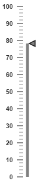
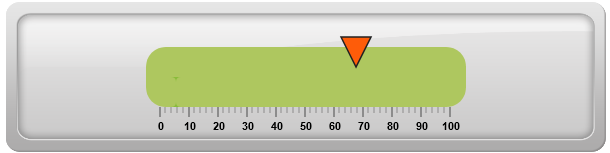
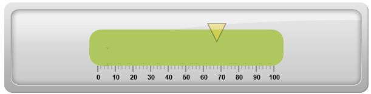
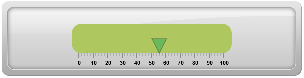
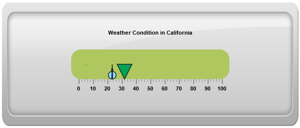

# Marker Pointers

**Marker Pointer** value points out the actual value set in the **Linear Gauge**. You can set values for various pointer attributes such as value, type, length, width, border and color in pointer collection. You can also customize the pointers to improve the appearance of gauge.

## Adding marker pointer collection

You can add **Marker Pointer** collection directly to the scale object. To add pointer collection in a gauge control refer the following code example.  



 <ej-lineargauge id="LinearGauge1"  [value]=78>
   <e-scales>
        <e-scale [showBarPointers]="true" [border]="{ color: 'transparent', width: 0 }">
           <e-barpointers>
              <e-barpointer  [width]="5" backgroundColor="grey"></e-barpointer>
           </e-barpointers>
          <e-markerpointers>
              <e-markerpointer  [width]="10" backgroundColor="grey" [distanceFromScale]=-12 [length]=10>
              </e-markerpointer>
           </e-markerpointers>	
          <e-ticks>
               <e-tick type="majorinterval" [width]=2 color="#8c8c8c" 
                                       [distanceFromScale]="{ x: 7, y: 0 }"></e-tick>
               <e-tick type="minorinterval" [width]=1 [height]=6 color="#8c8c8c" 
                                       [distanceFromScale]="{ x: 7, y: 0 }"></e-tick>
          </e-ticks>
        </e-scale>
     </e-scales>
  </ej-lineargauge>



Execute the above code to render the following output.

## Add marker pointer value

The **value** property is the important element in the marker pointer collection which indicates the gauge value. Real purpose of the **Linear Gauge** is based on the pointer value. You can set the pointer value either directly during rendering the control or it can be achieved by public method.



 <ej-lineargauge id="LinearGauge1"  [height]="150" [width]="600" [value]="31" [enableAnimation]=false
                    theme="flatlight" orientation="Horizontal" labelColor="black" [isResponsive]="true" 
                                     frame.backgroundImageUrl="../images/gauge/Gauge_linear_light.png">
   <e-scales>
        <e-scale backgroundColor="#AEC75F" direction="clockwise" [labels]="labels"
                 type="roundedrectangle" [border]="{ color: '#AEC75F', width:30 }">           
          <e-markerpointers>
              <e-markerpointer  [width]="30" backgroundColor="#FE5C09" [value]=67.5 [distanceFromScale]=20
                                placement="near" [length]=30>
              </e-markerpointer>
           </e-markerpointers>	
          <e-ticks>
               <e-tick type="majorinterval" [width]=2 color="#8c8c8c" 
                            [distanceFromScale]="{ x: 45, y: -1 }"></e-tick>
               <e-tick type="minorinterval" [width]=1 [height]=6 color="#8c8c8c" 
                                   [distanceFromScale]="{ x: 45, y: -1 }"></e-tick>
          </e-ticks>
        </e-scale>
     </e-scales>
  </ej-lineargauge>





  //Adding label collection
  this.labels= [{ angle: 90, distanceFromScale: { x: 0, y: 100 } }];



Execute the above code to render the following output.

## Pointer Styles

**Appearance**

* Based on the value, the **pointer** points out the label value. You can set the pointer length and width using **length** and **width** property respectively. You can also adjust the opacity of the pointer using the **opacity** property which holds the value between 0 and 1. You can add the gradient effects to the pointer using **gradient** object. 

* The marker pointer border is modified with the **border** object. It contains two border property namely **color** and **width** which are used to customize the border color of the scale and border width of the marker pointer. The background color can be customized with attribute **backgroundColor**.



 <ej-lineargauge id="LinearGauge1"  [height]="150" [width]="600" [value]="31" [enableAnimation]=false
                 theme="flatlight" orientation="Horizontal" labelColor="black" [isResponsive]="true" 
                 frame.backgroundImageUrl="../images/gauge/Gauge_linear_light.png" >
   <e-scales>
        <e-scale backgroundColor="#AEC75F" direction="clockwise" [labels]="labels" 
                 type="roundedrectangle" [border]="{ color: '#AEC75F', width:30 }">           
          <e-markerpointers>
              <e-markerpointer  [width]="30" backgroundColor="#FCDD34" [value]=67.5 
                   [distanceFromScale]=20 placement="near" [opacity]=0.4 [length]=30>
              </e-markerpointer>
           </e-markerpointers>	
          <e-ticks>
               <e-tick type="majorinterval" [width]=2 color="#8c8c8c" 
                       [distanceFromScale]="{ x: 45, y: -1 }"></e-tick>
               <e-tick type="minorinterval" [width]=1 [height]=6 color="#8c8c8c" 
                                    [distanceFromScale]="{ x: 45, y: -1 }"></e-tick>
          </e-ticks>
        </e-scale>
     </e-scales>
  </ej-lineargauge>





  //Adding label collection
  this.labels= [{ angle: 90, distanceFromScale: { x: 0, y: 100 } }];



Execute the above code to render the following output.

## Positioning the pointer

* You can position the Pointer with two properties, **distanceFromScale** and **placement**. The **distanceFromScale** property defines the distance between the scale and pointer. 

* The **Placement** property is used to locate the pointer with respect to scale either inside or outside the scale or along the scale. It is an enumerable data type.



 <ej-lineargauge id="LinearGauge1"  [height]="150" [width]="600" [value]="31" [enableAnimation]=false
                 theme="flatlight" orientation="Horizontal" labelColor="black" [isResponsive]="true" 
                  frame.backgroundImageUrl="../images/gauge/Gauge_linear_light.png" >
   <e-scales>
        <e-scale backgroundColor="#AEC75F" direction="clockwise" [labels]="labels" 
                         type="roundedrectangle" [border]="{ color: '#AEC75F', width:30 }">           
          <e-markerpointers>
              <e-markerpointer  [width]="30" [height]=8 backgroundColor="#01A357" [value]=55.5 
                                [distanceFromScale]=60 placement="near" [opacity]=0.4 [length]=30>
              </e-markerpointer>
           </e-markerpointers>	
          <e-ticks>
               <e-tick type="majorinterval" [width]=2 color="#8c8c8c" 
                             [distanceFromScale]="{ x: 45, y: -1 }"></e-tick>
               <e-tick type="minorinterval" [width]=1 [height]=6 color="#8c8c8c" 
                                   [distanceFromScale]="{ x: 45, y: -1 }"></e-tick>
          </e-ticks>
        </e-scale>
     </e-scales>
  </ej-lineargauge>





//Adding label collection
this.labels= [{ angle: 90, distanceFromScale: { x: 0, y: 100 } }];



Execute the above code to render the following output.

## Types

It is possible to change the dimension of the marker pointer. Dimensions available for marker pointer are,

* Rectangle

* Triangle

* Ellipse

* Diamond

* Pentagon

* Circle

* Slider

* Pointer

* Wedge

* Trapezoid

* Rounded Rectangle

**Multiple Marker Pointers**

**Linear Gauge** can contain multiple pointers on it. You can use any combination and any number of pointers in a gauge. That is, a gauge can contain any number of marker pointer and any number of bar pointers. Refer the following code example containing multiple marker pointers.



 <ej-lineargauge id="LinearGauge1"  [height]="150" [width]="600" [value]="31" [enableAnimation]=false
               theme="flatlight" orientation="Horizontal" labelColor="black" [isResponsive]="true" 
                frame.backgroundImageUrl="../images/gauge/Gauge_linear_light.png" >
   <e-scales>
        <e-scale backgroundColor="#AEC75F" direction="clockwise" [showCustomLabels]="true" 
          [labels]="labels" [customLabels]="customLabels" type="roundedrectangle" 
           [border]="{ color: '#AEC75F', width:30 }">           
          <e-markerpointers>
              <e-markerpointer [width]="30" [length]=30 backgroundColor="#01A357" [value]=32.2 
                                        [distanceFromScale]=60 placement="near"></e-markerpointer>
              <e-markerpointer [width]="10" [length]=30 backgroundColor="#90DAFB" [value]=23.7 
                              [distanceFromScale]=60 placement="near" type="circle"> </e-markerpointer>
              <e-markerpointer [width]="3" [length]=30 backgroundColor="#90DAFB" [value]=23.7 
                            [distanceFromScale]=60 placement="near" type="star"></e-markerpointer>
           </e-markerpointers>	
          <e-ticks>
               <e-tick type="majorinterval" [width]=2 color="#8c8c8c" 
                             [distanceFromScale]="{ x: 45, y: -1 }"></e-tick>
               <e-tick type="minorinterval" [width]=1 [height]=6 color="#8c8c8c" 
                                [distanceFromScale]="{ x: 45, y: -1 }"></e-tick>
          </e-ticks>
        </e-scale>
     </e-scales>
  </ej-lineargauge>





         
// Adding label collection
this.labels = [{ angle: 90, distanceFromScale: { x: 0, y: 100 } }];

// Adding custom label collection
this.customLabels = [{
    value: "Weather Condition in California", position: {
        x: 50, y: 20
    },
}];



Execute the above code to render the following output.

