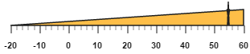
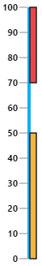
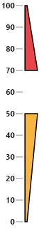

# Ranges 

Ranges are used to specify or group the scale values. You can describe the values in the pointers using ranges. 

## Adding range collection

Range collection can be directly added to the scale object. Refer the following code example to add range collection in a **Linear Gauge** control. 



<ej-lineargauge id="lineargauge" [width]=600 height=150 orientation="Horizontal" 
                [enableAnimation]="false" labelColor="black" [isResponsive]="true" >
    <e-scales>
       <e-scale [width]=0 backgroundColor="#AEC75F"  [labels]="labels" direction="Clockwise"
                     [maximum]=60 [minimum]=-20 [showBarPointers]="false" [showRanges]="true"
                                            [border]="{ color: 'transparent', width: 0 }">
           <e-markerpointers>
              <e-markerpointer  [width]="3" [length]=30 [value]=55 backgroundColor="#FE5C09"
                                          type="star" [distanceFromScale]=20></e-markerpointer>
           </e-markerpointers>	
          <e-ticks>
              <e-tick type="majorinterval" [width]="2" color="#8c8c8c" 
                                 [distanceFromScale]="{ x: 25, y: -1 }"></e-tick>
              <e-tick type="minorinterval" [height]="6" [width]="1" color="#8c8c8c" 
                                     [distanceFromScale]="{ x: 25, y: -1 }"></e-tick>
        </e-ticks>
        <e-ranges>
                <e-range [startValue]=-20 [endValue]=60 backgroundColor="#FEBE48" 
                 placement="near" [startWidth]=0 [endWidth]=20 [distanceFromScale]=20 >
                </e-range>
          </e-ranges>
       </e-scale>
    </e-scales>
</ej-lineargauge>





// Adding label collection         
this.labels= [{ angle: 90, distanceFromScale: { x: 0, y: 50 } }];



Execute the above code to render the following output.

## Range Customization

**Appearance**

The major attributes for ranges are **startValue** and **endValue**. The **startValue** defines the start position of the range and **endValue** defines the end position of the range. The **startWidth** and **endWidth** are used to specify the range width at the starting and ending position of the ranges.



<ej-lineargauge id="lineargauge" labelColor="#8c8c8c" [width]="500" >
    <e-scales>
       <e-scale [width]=4 backgroundColor="#10ADF5"  [labels]="labels" [length]=310
            [showMarkerPointers]="false" [showRanges]="true" [position]="{ x: 50, y: 50 }"
                                        [border]="{ color: 'transparent', width: 0 }">           	
          <e-ticks>
              <e-tick type="majorinterval" [width]="1" color="#8c8c8c"></e-tick>
        </e-ticks>
        <e-ranges>
                <e-range [startValue]=0 [endValue]=50 backgroundColor="#F6B53F"
                               [startWidth]=8 [endWidth]=8 [distanceFromScale]=5>
                </e-range>
                 <e-range [startValue]=70 [endValue]=100 backgroundColor="#E94649"
                                  [startWidth]=8 [endWidth]=8 [distanceFromScale]=5>
                </e-range>
          </e-ranges>
       </e-scale>
    </e-scales>
</ej-lineargauge>




  
//Adding label collection
this.labels = [{
    font: {
        size: "11px", fontFamily: "Segoe UI", fontStyle:
        "bold"
    }, distanceFromScale: { x: -12 }
}];



Execute the above code to render the following output.

## Colors and Border

* You can customize the ranges to improve the appearance of the **Gauge**. The range border is modified with the object called **border**. It has two border property such as **color** and **width** which are used to customize the border color of the ranges and border width of the ranges. 

* You can set the background color to improve the look and feel of the **Linear Gauge**. For customizing the background color of the ranges, **backgroundColor** is used.You can add the gradient effects to the ranges by using **gradient** object.



<ej-lineargauge id="lineargauge" labelColor="#8c8c8c" [width]="500" >
    <e-scales>
       <e-scale [width]=4 backgroundColor="#10ADF5"  [labels]="labels" [length]=310
                    [showMarkerPointers]="false" [showRanges]="true"
                    [position]="{ x: 50, y: 50 }" [border]="{ color: 'transparent', width: 0 }">           	
          <e-ticks>
              <e-tick type="majorinterval" [width]="1" color="#8c8c8c"></e-tick>
        </e-ticks>
        <e-ranges>
                <e-range [startValue]=0 [endValue]=50 backgroundColor="#F6B53F" [startWidth]=3
                               [endWidth]=18 [distanceFromScale]=5 [border]="{color: 'black'}">
                </e-range>
                 <e-range [startValue]=70 [endValue]=100 backgroundColor="#E94649" [startWidth]=3
                                 [endWidth]=18 [distanceFromScale]=5 [border]="{color: 'black'}"> 
                </e-range>
          </e-ranges>
       </e-scale>
    </e-scales>
</ej-lineargauge>





//Adding label collection
this.labels = [{
    font: {
        size: "11px", fontFamily: "Segoe UI", fontStyle:
        "bold"
    }, distanceFromScale: { x: -12 }
}];



Execute the above code to render the following output.

## Positioning the ranges

* You can position ranges using two properties such as **distanceFromScale** and **placement**. The **distanceFromScale** property defines the distance between the scale and range. 

* **Placement** property is used to locate the pointer with respect to scale either inside the scale or outside the scale or along the scale. It is an enumerable data type. 



<ej-lineargauge id="lineargauge" labelColor="#8c8c8c" [width]="500" >
    <e-scales>
       <e-scale [width]=4 backgroundColor="#10ADF5"  [labels]="labels" [length]=310
             [showMarkerPointers]="false" [showRanges]="true" [position]="{ x: 50, y: 50 }"
                  [border]="{ color: 'transparent', width: 0 }">
        <e-ranges>
                <e-range [startValue]=0 placement="near" [endValue]=50 backgroundColor="#F6B53F"
                 [startWidth]=3 [endWidth]=18 [distanceFromScale]=-30 [border]="{color: 'black'}">
                </e-range>
                 <e-range [startValue]=70 placement="near" [endValue]=100 backgroundColor="#E94649"
                 [startWidth]=3 [endWidth]=18 [distanceFromScale]=-30 [border]="{color: 'black'}">
                </e-range>
          </e-ranges>
       </e-scale>
    </e-scales>
</ej-lineargauge>



Execute the above code to render the following output.

## Multiple Ranges

You can set multiple ranges by adding an array of range objects. Refer the following code example for multiple range functionality.



<ej-lineargauge id="lineargauge" labelColor="black" [enableAnimation]="false" [isResponsive]="true"
                                       [width]="600" [height]="150" orientation="Horizontal" >
    <e-scales>
       <e-scale [width]=0 backgroundColor="#10ADF5"  [labels]="labels" [length]=310
             [showBarPointers]="false" [showRanges]="true" [minimum]=-20 [maximum]=60
                                        [border]="{ color: 'transparent', width: 0 }">
        <e-markerpointers>
              <e-markerpointer  [width]="3" [length]=30 [value]=55 backgroundColor="#FE5C09"
                       type="star" [distanceFromScale]=20 placement="near"></e-markerpointer>
        </e-markerpointers>
        <e-ticks>
               <e-tick type="majorinterval" [width]=2 color="#8c8c8c" 
                              [distanceFromScale]="{ x: 20, y: -1 }"></e-tick>
               <e-tick type="minorinterval" [width]=1 [height]=6 color="#8c8c8c" 
                                   [distanceFromScale]="{ x: 20, y: -1 }"></e-tick>
          </e-ticks>                                                                        
        <e-ranges>
                <e-range [startValue]=-20 placement="near" [endValue]=0 backgroundColor="#A5BA28"
                    [startWidth]=5 [endWidth]=10 [distanceFromScale]=20 [border]="{color: '#A5BA28'}">
                </e-range>
                <e-range [startValue]=0 placement="near" [endValue]=20 backgroundColor="#A5BA28"
                  [startWidth]=10 [endWidth]=15 [distanceFromScale]=20 [border]="{color: #A5BA28'}">
                </e-range>
                <e-range [startValue]=20 placement="near" [endValue]=40 backgroundColor="#FF0000"
                 [startWidth]=20 [endWidth]=25 [distanceFromScale]=20 [border]="{color: #FF0000'}">
                </e-range>
          </e-ranges>
       </e-scale>
    </e-scales>
</ej-lineargauge>





//Adding label collection
this.labels= [{ angle: 90, distanceFromScale: { x: 0, y: 50 } }];



Execute the above code to render the following output.

