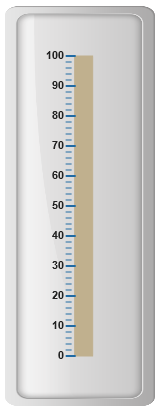
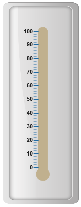
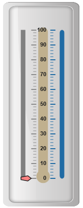

# Scales

**Scales** are the basic functional block of the **Linear Gauge**. You can improve the appearance of scales by customizing it. The functional blocks of **Linear Gauge** are 

* Marker Pointers

* Bar Pointer

* Labels

* Custom Labels

* Indicators

* Ticks

* Ranges

## Adding scale collection

**Scale** is the basic element of **Linear Gauge**. Scale collection is directly added to the gauge object. Refer the following code example to add scale collection in **Gauge** control. 



 <ej-lineargauge id="LinearGauge1" [enableAnimation]="false"  
           frame.backgroundImageUrl="../images/gauge/Gauge_linear_light.png">
   <e-scales>
        <e-scale backgroundColor="grey" [width]="8" [labels]="labels" [showCustomLabels]="true"
                             [showMarkerPointers]="true" [showBarPointers]="true"
                             [position]="{ x: 20, y: 50 }" [border]="{ color: 'grey', width: 1 }">
          <e-markerpointers>
              <e-markerpointer type="pentagon" placement="near" [width]="20" backgroundColor="#FE8282"
                                               [length]=10 placement="near" [distanceFromScale]=20 >
              </e-markerpointer>
           </e-markerpointers>	
          <e-ticks>
               <e-tick type="majorinterval" [width]=2 color="#8c8c8c" 
                         [distanceFromScale]="{ x: 30, y: 0 }"></e-tick>
               <e-tick type="minorinterval" [width]=1 [height]=6 color="#8c8c8c" 
                                           [distanceFromScale]="{ x: 30, y: 0 }"></e-tick>
          </e-ticks>
        </e-scale>
   </e-scales>
</ej-lineargauge>





// For Adding label collection
this.labels= [{ distanceFromScale: { x: 50, y: 0 } }];



Execute the above code to render the following output.

## Scale Customization

**Colors and Border**

* The **Scale** border is modified with **border** object. It has two border property, **color** and **width**  are used to customize the border color of the scale and border width of the scale. Setting the background color improves the look and feel of the **Linear Gauge**. You can customize the background color of the scale using **backgroundColor**. 

* Scales are used to enable or disable various properties such as **showRanges, showIndicators, showCustomLabels, showLabels, showTicks, showBarPointers** and **showMarkerPointers**. Enable/disable is done by setting the property into two states either “**true**” or “**false**”. You can adjust the Opacity of the scale with **opacity** property.



 <ej-lineargauge id="LinearGauge1" [enableAnimation]="false"  
            frame.backgroundImageUrl="../images/gauge/Gauge_linear_light.png">
   <e-scales>
        <e-scale backgroundColor="#FE8282" [width]="8" [labels]="labels" type="roundedrectangle"
                 [opacity]=0.5 [shadowOffset]=10 [showCustomLabels]="true" 
                 [showMarkerPointers]="true" [showBarPointers]="false" [position]="{ x: 20, y: 50 }"
                  [border]="{ color: 'red', width: 1 }">
          <e-markerpointers>
              <e-markerpointer type="pentagon" placement="near" [width]="20" backgroundColor="#FE8282"
               [length]=10 placement="near" [distanceFromScale]=20 ></e-markerpointer>
           </e-markerpointers>	
          <e-ticks>
               <e-tick type="majorinterval" [width]=2 color="#8c8c8c" 
                          [distanceFromScale]="{ x: 30, y: 0 }"></e-tick>
               <e-tick type="minorinterval" [width]=1 [height]=6 color="#8c8c8c" 
                                  [distanceFromScale]="{ x: 30, y: 0 }"></e-tick>
          </e-ticks>
        </e-scale>
   </e-scales>
</ej-lineargauge>





// For Adding label collection
this.labels= [{ distanceFromScale: { x: 50, y: 0 } }];



Execute the above code to render the following output.

## Appearance 

* You can improve the appearance of **Linear Gauge** using various properties. You can set the interval values for the scale with **major interval value** and **minor interval value** properties and maximum and minimum value by **minimum and maximum** property. The **width** property is used to set the scale bar width. 

* You can also adjust the Opacity of the scale with **opacity** property. The value for opacity lies between 0 and 1.**Linear Gauge** contains two scale directions, clockwise and counter clockwise. It can be set with **direction** property**.**



 <ej-lineargauge id="LinearGauge1" [enableAnimation]="false"  
                      frame.backgroundImageUrl="../images/gauge/Gauge_linear_light.png">
   <e-scales>
        <e-scale backgroundColor="grey" [minimum]=10 [maximum]=210 [majorIntervalValue]=50
                    [minorIntervalValue]=25 direction="clockwise" [width]="18"  [labels]="labels" 
                    type="roundedrectangle" [opacity]=0.5 [shadowOffset]=10 [showCustomLabels]="true"
                    [showMarkerPointers]="true" [showBarPointers]="false"[position]="{ x: 20, y: 50 }"
                     [border]="{ color: 'grey', width: 1 }">
          <e-markerpointers>
              <e-markerpointer type="pentagon" placement="near" [width]="20" backgroundColor="#FE8282"
               [length]=10 placement="near" [distanceFromScale]=20 >
              </e-markerpointer>
           </e-markerpointers>	
          <e-ticks>
               <e-tick type="majorinterval" [width]=2 color="#8c8c8c" 
                               [distanceFromScale]="{ x: 30, y: 0 }"></e-tick>
               <e-tick type="minorinterval" [width]=1 [height]=6 color="#8c8c8c" 
                                        [distanceFromScale]="{ x: 30, y: 0 }"></e-tick>
          </e-ticks>
        </e-scale>
   </e-scales>
</ej-lineargauge>




 
//Adding label collection
this.labels= [{ distanceFromScale: { x: 50, y: 0 } }];



Execute the above code to render the following output.

## Scale Types

Scale Type is an element which decides the appearance of the gauge**. Linear Gauge** contains three scale types such as,

* Rectangle

* Rounded Rectangle

* Thermometer

**Rectangle**

For rectangular scale type, the scale renders with rectangular structure. Refer the following code example.



 <ej-lineargauge id="LinearGauge1" [enableAnimation]="false"  
                         frame.backgroundImageUrl="../images/gauge/Gauge_linear_light.png">
   <e-scales>
        <e-scale backgroundColor="#C0B08E" [width]="18" type="rectangle" [length]=300 
                [showCustomLabels]="true" [showMarkerPointers]="true" [showBarPointers]="false" 
                [position]="{ x: 54, y: 50 }" [border]="{ color: '#C0B08E', width: 1 }">
          <e-markerpointers>
              <e-markerpointer type="pentagon" placement="near" [width]="20" backgroundColor="#FE8282"
                                           [length]=10 placement="near" [distanceFromScale]=20 >
              </e-markerpointer>
           </e-markerpointers>	
          <e-ticks>
               <e-tick type="majorinterval" [width]=2 color="#206BA4" placement="far" 
                                     [distanceFromScale]="{ x: -27, y: 0 }"></e-tick>
               <e-tick type="minorinterval" [width]=1 [height]=6 color="#206BA4" placement="far"
                                     [distanceFromScale]="{ x: -27, y: 0 }"></e-tick>
          </e-ticks>
        </e-scale>
   </e-scales>
</ej-lineargauge>



Execute the above code to render the following output.

**Rounded Rectangle**

For rounded rectangular scale type, the scale renders as rectangular structure but with constant radius rounded corner. Refer the following code example.



 <ej-lineargauge id="LinearGauge1" [enableAnimation]="false"  
                                   frame.backgroundImageUrl="../images/gauge/Gauge_linear_light.png">
   <e-scales>
        <e-scale backgroundColor="#C0B08E" [width]="18" type="roundedrectangle" 
                  [length]=300 [showCustomLabels]="true" [showMarkerPointers]="true" 
                   [showBarPointers]="false"[position]="{ x: 54, y: 50 }" 
                    [border]="{ color: '#C0B08E', width: 1 }">
          <e-markerpointers>
              <e-markerpointer type="pentagon" placement="near" [width]="20" backgroundColor="#FE8282"
                [length]=10 placement="near" [distanceFromScale]=20 > </e-markerpointer>
           </e-markerpointers>	
          <e-ticks>
               <e-tick type="majorinterval" [width]=2 color="#206BA4" placement="far" 
                                          [distanceFromScale]="{ x: -27, y: 0 }"></e-tick>
               <e-tick type="minorinterval" [width]=1 [height]=6 color="#206BA4" placement="far" 
                                                  [distanceFromScale]="{ x: -27, y: 0 }"></e-tick>
          </e-ticks>
        </e-scale>
   </e-scales>
</ej-lineargauge>



Execute the above code to render the following output.

**Thermometer**

For thermometer scale type, the scale renders as thermometer structure with rounded bottom. Refer the following code example.



 <ej-lineargauge id="LinearGauge1" [enableAnimation]="false"  
                      frame.backgroundImageUrl="../images/gauge/Gauge_linear_light.png">
   <e-scales>
        <e-scale backgroundColor="#C0B08E" [width]="18" type="thermometer" [length]=300 
                [showCustomLabels]="true" [showMarkerPointers]="true" [showBarPointers]="false" 
                [position]="{ x: 54, y: 50 }" [border]="{ color: '#C0B08E', width: 1 }">
          <e-markerpointers>
              <e-markerpointer type="pentagon" placement="near" [width]="20"  
              backgroundColor="#FE8282" [length]=10 placement="near" [distanceFromScale]=20 >
              </e-markerpointer>
           </e-markerpointers>	
          <e-ticks>
               <e-tick type="majorinterval" [width]=2 color="#206BA4" placement="far"
                [distanceFromScale]="{ x: -27, y: 0 }"></e-tick>
               <e-tick type="minorinterval" [width]=1 [height]=6 color="#206BA4"
                placement="far" [distanceFromScale]="{ x: -27, y: 0 }"></e-tick>
          </e-ticks>
        </e-scale>
   </e-scales>
</ej-lineargauge>



Execute the above code to render the following output.

## Adding multiple scales

You can set multiple scales for a single **Linear Gauge** control by using an array of scale objects. Each scale object is independent of each other. Refer the following code example to add multiple scale collection.



 <ej-lineargauge id="LinearGauge1" [enableAnimation]="false"  
                              frame.backgroundImageUrl="../images/gauge/Gauge_linear_light.png">
   <e-scales>
        <e-scale backgroundColor="Grey" [width]="18" type="rectangle" [length]=300
                   [showCustomLabels]="true" [labels]="labels" [showMarkerPointers]="true"
                   [showBarPointers]="false"[position]="{ x: 15, y: 50 }" 
                                            [border]="{ color: 'Grey', width: 1 }">
          <e-markerpointers>
              <e-markerpointer type="pentagon" placement="near" [width]="20" backgroundColor="#FE8282"
                                          [length]=10 placement="near" [distanceFromScale]=20 >
              </e-markerpointer>
           </e-markerpointers>	
          <e-ticks>
               <e-tick type="majorinterval" [width]=2 color="#206BA4" placement="far"
                                         [distanceFromScale]="{ x: 30, y: 0 }"></e-tick>
               <e-tick type="minorinterval" [width]=1 [height]=6 color="#206BA4"
                             placement="far" [distanceFromScale]="{ x: 30, y: 0 }"></e-tick>
          </e-ticks>
        </e-scale>
        <e-scale backgroundColor="#206BA4" [width]="8" type="roundedrectangle"
           [showMarkerPointers]="false" [showBarPointers]="false" direction="clockwise"
                [position]="{ x: 90, y: 50 }" [border]="{ color: '#206BA4', width: 1 }">
          <e-ticks>
               <e-tick type="majorinterval" [width]=2 color="#206BA4" placement="far"
                                    [distanceFromScale]="{ x: -27, y: 0 }"></e-tick>
               <e-tick type="minorinterval" [width]=1 [height]=6 color="#206BA4"
                            placement="far" [distanceFromScale]="{ x: -27, y: 0 }"></e-tick>
          </e-ticks>
        </e-scale>
        <e-scale backgroundColor="#C0B08E" [width]="18" [length]=300 [showLabels]="false"
                [showTicks]="false" type="thermometer" [showMarkerPointers]="false" 
                      [showBarPointers]="false" direction="clockwise" [position]="{ x:54, y: 50 }"
                      [border]="{ color: '#C0B08E', width: 1 }">
        </e-scale>
   </e-scales>
</ej-lineargauge>





//Adding label collection
this.labels= [{ distanceFromScale: { x: 50, y: 0 } }];



Execute the above code to render the following output.

