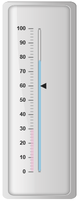
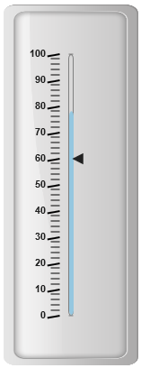
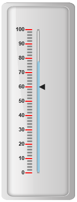

# Ticks

Ticks are used to mark some values on the scale. Based on the tick’s value you can set the labels on the required position.

## Adding tick collection 

Tick collection can be directly added to the scale object. Refer the following code example to add tick collection in a **Linear Gauge** control.



 <ej-lineargauge id="LinearGauge1" [enableAnimation]="false" [value]=78 [frame.innerWidth]=8
     [frame.outerWidth]=10 frame.backgroundImageUrl="../images/gauge/Gauge_linear_light.png">
   <e-scales>
        <e-scale backgroundColor="transparent" [width]="5" type="roundedrectangle" 
                  [labels]="labels" [showMarkerPointers]="true" [showBarPointers]="true" 
                   [position]="{ x: 54, y: 50 }" [border]="{ color: 'grey', width: 1 }">
          <e-markerpointers>
              <e-markerpointer [value]=60 [width]="10" [length]=10 >
              </e-markerpointer>
           </e-markerpointers>	
           <e-barpointers>
              <e-barpointer [width]="5" backgroundColor="#95C7E0" >
              </e-barpointer>
              <e-barpointer [width]="6" backgroundColor="#EDC1D7" [distanceFromScale]=-20
                                          [value]=30 [opacity]=0.7 ></e-barpointer>
           </e-barpointers>
          <e-ticks>
               <e-tick type="majorinterval" [width]=2 color="#8c8c8c" placement="far"
                                            [distanceFromScale]="{ x: -10, y: 0 }"></e-tick>
               <e-tick type="minorinterval" [width]=1 [height]=6 color="#8c8c8c" placement="far"
                                            [distanceFromScale]="{ x: -10, y: 0 }"></e-tick>
          </e-ticks>
        </e-scale>
   </e-scales>
</ej-lineargauge>





  //Adding label collections
  this.labels= [{ distanceFromScale: { x: -25, y: 0 } }];



Execute the above code to render the following output.

## Tick Customization

**Appearance**

* Height and width of the ticks can be applied by using the properties **height** and **width**. You can customize ticks with the properties like angle, color, etc. **angle** attribute is used to display the labels in the specified angles and **color** attribute is used to display the labels in specified color. 

* Ticks are two types such as major and minor. The opacity of the labels can be adjusted with the property **opacity.** The opacity values lies between 0 and 1.



 <ej-lineargauge id="LinearGauge1" [enableAnimation]="false" [value]=78 [frame.innerWidth]=8
      [frame.outerWidth]=10 frame.backgroundImageUrl="../images/gauge/Gauge_linear_light.png">
   <e-scales>
        <e-scale backgroundColor="transparent" [width]="5" type="roundedrectangle"
                [showMarkerPointers]="true"  [showBarPointers]="true" [position]="{ x: 54, y: 50 }"
                [border]="{ color: 'grey', width: 1 }">
          <e-markerpointers>
              <e-markerpointer [value]=60 [width]="10" [length]=10 >
              </e-markerpointer>
           </e-markerpointers>	
           <e-barpointers>
              <e-barpointer [width]="5" backgroundColor="#95C7E0" >
              </e-barpointer>
              <e-barpointer [width]="6" backgroundColor="#EDC1D7" [distanceFromScale]=-20 
                                                        [value]=30 [opacity]=0.7 >
              </e-barpointer>
           </e-barpointers>
          <e-ticks>
               <e-tick type="majorinterval" [width]=2 [height]=14 [angle]=10 color="Black"
                                 position="far" [distanceFromScale]="{ x: -10, y: 0 }"></e-tick>
               <e-tick type="minorinterval" [width]=1 [height]=10 color="black" position="far"
                                 [distanceFromScale]="{ x: -10, y: 0 }"></e-tick>
          </e-ticks>
        </e-scale>
   </e-scales>
</ej-lineargauge>



Execute the above code to render the following output.

## Types

Ticks are two types such as **majorInterval** and **minorInterval**. Major type ticks are for major interval values and minor type ticks are for minor interval values.



 <ej-lineargauge id="LinearGauge1" [enableAnimation]="false" [value]=78 [frame.innerWidth]=8
      [frame.outerWidth]=10 frame.backgroundImageUrl="../images/gauge/Gauge_linear_light.png">
   <e-scales>
        <e-scale backgroundColor="transparent" [width]="5" type="roundedrectangle" 
                  [showMarkerPointers]="true" [showBarPointers]="true"[position]="{ x: 54, y: 50 }" 
                                                        [border]="{ color: 'grey', width: 1 }">
          <e-markerpointers>
              <e-markerpointer [value]=60 [width]="10" [length]=10 >
              </e-markerpointer>
           </e-markerpointers>	
           <e-barpointers>
              <e-barpointer [width]="5" backgroundColor="#95C7E0" >
              </e-barpointer>
              <e-barpointer [width]="6" backgroundColor="#EDC1D7" [distanceFromScale]=-20 
              [value]=30 [opacity]=0.7 >
              </e-barpointer>
           </e-barpointers>
          <e-ticks>
               <e-tick type="majorinterval"></e-tick>
               <e-tick type="minorinterval"></e-tick>
          </e-ticks>
        </e-scale>
   </e-scales>
</ej-lineargauge>



Execute the above code to render the following output.

## Positioning the ticks

* You can position ticks with the help of two properties such as **distanceFromScale** and **placement**. The property **distanceFromScale** defines the distance between the scale and ticks. 

* **Placement** property is used to locate the ticks with respect to scale either inside the scale or outside the scale or along the scale. It is an enumerable data type.



 <ej-lineargauge id="LinearGauge1" [enableAnimation]="false" [value]=78 [frame.innerWidth]=8
      [frame.outerWidth]=10 frame.backgroundImageUrl="../images/gauge/Gauge_linear_light.png">
   <e-scales>
        <e-scale backgroundColor="transparent" [width]="5" type="roundedrectangle" 
              [showMarkerPointers]="true" [showBarPointers]="true"[position]="{ x: 54, y: 50 }"
                                                     [border]="{ color: 'grey', width: 1 }">
          <e-markerpointers>
              <e-markerpointer [value]=60 [width]="10" [length]=10 >
              </e-markerpointer>
           </e-markerpointers>	
           <e-barpointers>
              <e-barpointer [width]="5" backgroundColor="#95C7E0" >
              </e-barpointer>
              <e-barpointer [width]="6" backgroundColor="#EDC1D7" [distanceFromScale]=-20
                                                               [value]=30 [opacity]=0.7 >
              </e-barpointer>
           </e-barpointers>
          <e-ticks>
               <e-tick type="majorinterval" [width]=2 [height]=14 color="red" position="far"
                                           [distanceFromScale]="{ x: -10, y: 0 }"></e-tick>
               <e-tick type="minorinterval" color="grey" [distanceFromScale]=
                                                    "{ x: -10, y: 0 }"></e-tick>
          </e-ticks>
        </e-scale>
   </e-scales>
</ej-lineargauge>



Execute the above code to render the following output.

