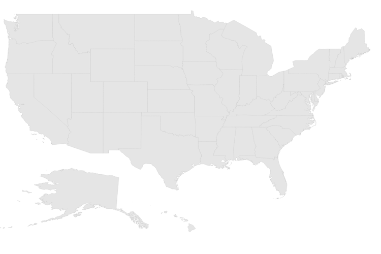

#Getting Started

Before we start with the Maps, please refer [this page](https://help.syncfusion.com/angular-2/overview) for general information regarding integrating Syncfusion widget’s.

## Adding JavaScript and CSS Reference

To render the Maps control, the following list of external dependencies are needed, 

* [jQuery](http://jquery.com) - 1.7.1 and later versions
* [jsRender](https://github.com/borismoore/jsrender) - to render the templates
* [Angular](https://angular.io/) - Angular latest versions

The other required internal dependencies are tabulated below,

<table>
   <tr>
      <th>
         <b>Files</b>
      </th>
      <th>
         <b>Description/Usage </b>
      </th>
   </tr>
   <tr>
      <td>
         ej.core.min.js
      </td>
      <td>
        It is referred always before using all the JS controls.
      </td>
   </tr>
   <tr>
      <td>
         ej.data.min.js
      </td>
      <td>
         Used to handle data operation and is used while binding data to the JS controls.
      </td>
   </tr>
   <tr>
      <td>
        ej.maps.min.js
      </td>
      <td>
        Maps core script file which includes Maps related scripts files.
      </td>
   </tr>
</table>

N> Maps uses one or more script files, therefore refer the `ej.web.all.min.js` (which encapsulates all the `ej` controls and frameworks in a single file) in the application instead of referring all the above specified internal dependencies. 

To get the real appearance of the Maps, the dependent CSS file `ej.web.all.min.css` (which includes styles of all the widgets) should also needs to be referred.

## Preparing HTML document

Create an HTML page and add the scripts references in the order mentioned in the following code example.



    <html>
    <head>
    <title>Angular Maps</title>

    <!-- Essential Studio for JavaScript  theme reference -->
    <link rel="stylesheet" href="http://cdn.syncfusion.com/{{ site.releaseversion }}/js/web/flat-azure/ej.web.all.min.css" />

    <!-- Angular related script references -->
    <!-- 1. Load libraries -->
         <!-- Polyfill(s) for older browsers -->
       
    
    
    

    <!-- Essential Studio for JavaScript  script references -->
    
     
    
    
    <!-- 2. Configure SystemJS -->
    
    

    </head>
    <!-- 3. Display the application -->
    <body>
    <ej-app>  
		    

			      
Angular Syncfusion Components App

			      

		    

	  </ej-app>
    </body>
    </html>



N> Uncompressed version of library files are also available which is used for development or debugging purpose and can be generated from the custom script [here](http://csg.syncfusion.com).

## Control Initialization

* Copy Maps Syncfusion Angular source component(s) from the below build location and add it in `src/ej` folder (For ex., consider the `maps` component).



(Installed Location)\Syncfusion\Essential Studio\14.3.0.49\JavaScript\assets-src\angular2\



N> `core.ts` file is mandatory for all Syncfusion JavaScript Angular components. The repository having the source file from Essential Studio for JavaScript v14.3.0.49.

* Create `maps` folder inside `src` folder.

* Create `maps.component.html` view file inside `src/maps` folder and render ejMaps Angular component using the below code example. 


<ej-maps id="defaultmaps" layerType="bing">
</ej-maps>


* Create `maps.component.ts` model file inside the folder `src/maps` and create sample component using the below code example.



import { Component, ViewEncapsulation } from '@angular/core';

@Component({
  selector: 'ej-app',
  templateUrl: 'src/maps/maps.component.html'
})
export class MapsComponent {

}


## Configure the routes for the Router

Before adding router configuration for above created ejMaps component, we recommend you to go through the [Angular Routing](https://angular.io/docs/ts/latest/guide/router.html) configuration to get the deeper knowledge about Angular routing. 

* Now, we are going to configure the route navigation link for created maps sample in `src/app.component.html` file.



	<ul class="nav navbar-nav">
		<li>
          <a data-toggle="collapse" data-target="#skeleton-navigation-navbar-collapse.in" href="#maps" [routerLink]="['/maps']">maps </a>
        </li>
	</ul>

<main>
	<router-outlet></router-outlet>
</main>


* Import the ejMaps sample component and define the route in `src/app.routes.ts` file.



import { Routes } from '@angular/router';
. . . . 
import { MapsComponent } from './maps/maps.component';

export const rootRouterConfig: Routes = [
    { path: '', redirectTo: 'home', pathMatch: 'full' },
    . . . . 
    { path: 'maps', component: MapsComponent }
];


* Import and declare the Syncfusion source component and ejMaps sample component into `app.module.ts` like the below code snippet.


import { NgModule, enableProdMode, ErrorHandler } from '@angular/core';
. . . . . 
import { EJ_MAPS_COMPONENTS } from './ej/maps.component';
import { MapsComponent } from './maps/maps.component';

import { rootRouterConfig } from './app.routes';
. . . . 
@NgModule({
  imports: [BrowserModule, FormsModule, HttpModule, RouterModule.forRoot(rootRouterConfig, { useHash: true })],
  declarations: [. . . . , EJ_MAPS_COMPONENTS, MapsComponent],
  bootstrap: [AppComponent]
})
export class AppModule { }



## Running the application

* To run the application, execute below command.


npm start


* Browse to [http://localhost:3000](http://localhost:3000) to see the application. And navigate to maps tab. The component is rendered as like the below screenshot. You can make changes in the code found under src folder and the browser should auto-refresh itself while you save files. 

 

### Prepare Shape Data

The Shape Data collection describing geographical shape information can be obtained from [GEOJSON format shapes](http://www.syncfusion.com/uploads/user/uploads/Maps_GeoJSON.zip). 

In this example, USA shape is used as shape data by utilizing the “**United States of America.json**” file in the following folder structure obtained from downloaded Maps_GeoJSON folder.

**..\ Maps_GeoJSON\All Countries with States**

You can assign the complete contents in “**United States of America.json**” file to new JSON object. For your better understanding, a JS file “**usa.js**” is already created to store JSON data in JSON object “usMap”.

### Prepare DataSource

The datasource is populated with JSON data relative to shape data and stored in JSON object. USA population as datasource is used for better understanding. The “**populationData.js**” file is used to store JSON data in JSON object “**populationData**”.



import { Component, ViewEncapsulation} from '@angular/core';
import { DataService} from '../service/data.service';

@Component({
selector:"ej-app",
templateUrl:"src/maps/maps.component.html",
providers:[DataService]
})
export class MapsComponent{
usMap: any;
dataSource: any;
colorMapping: any;
    constructor(dataService:DataService){
        this.usMap=dataService.mapsData();
        this.dataSource=dataService.populationData();
    }
}



Create a folder service and add file data.service.ts for serving data to  map component file. Refer the below code snippet.



export class DataService{
// Shape data method
    mapsData():any{
        return{
        //Paste all the content copied from the usa.js file//
        }
    }
// Data source method
 populationData():Array<any> {
        return[
        { name: 'California', population: '38332521' },
        { name: 'Texas', population: '26448193' },
        { name: 'New York', population: '19651127' },
        { name: 'Florida', population: '19552860' },
        { name: 'Illinois', population: '12882135' },
        { name: 'Pennsylvania', population: '12773801' },
        { name: 'Ohio', population: '11570808' },
        { name: 'Georgia', population: '9992167' },
        { name: 'Michigan', population: '9895622' },
        { name: 'North Carolina', population: '9848060' },
        { name: 'New Jersey', population: '8899339' },
        { name: 'Virginia', population: '8260405' },
        { name: 'Washington', population: '6971406' },
        { name: 'Massachusetts', population: '6692824' },
        { name: 'Arizona', population: '6626624' },
        { name: 'Indiana', population: '6570902' },
        { name: 'Tennessee', population: '6495978' },
        { name: 'Missouri', population: '6044171' },
        { name: 'Maryland', population: '5928814' },
        { name: 'Wisconsin', population: '5742713' },
        { name: 'Minnesota', population: '5420380' },
        { name: 'Colorado', population: '5268367' },
        { name: 'Alabama', population: '4833722' },
        { name: 'South Carolina', population: '4774839' },
        { name: 'Louisiana', population: '4625470' },
        { name: 'Kentucky', population: '4395295' },
        { name: 'Oregon', population: '3930065' },
        { name: 'Oklahoma', population: '3850568' },
        { name: 'Puerto Rico', population: '3615086' },
        { name: 'Connecticut', population: '3596080' },
        { name: 'Iowa', population: '3090416' },
        { name: 'Mississippi', population: '2991207' },
        { name: 'Arkansas', population: '2959373' },
        { name: 'Utah', population: '2900872' },
        { name: 'Kansas', population: '2893957' },
        { name: 'Nevada', population: '2790136' },
        { name: 'New Mexico', population: '2085287' },
        { name: 'Nebraska', population: '1868516' },
        { name: 'West Virginia', population: '1854304' },
        { name: 'Idaho', population: '1612136' },
        { name: 'Hawaii', population: '1404054' },
        { name: 'Maine', population: '1328302' },
        { name: 'New Hampshire', population: '1323459' },
        { name: 'Rhode Island', population: '1051511' },
        { name: 'Montana', population: '1015165' },
        { name: 'Delaware', population: '925749' },
        { name: 'South Dakota', population: '844877' },
        { name: 'Alaska', population: '735132' },
        { name: 'North Dakota', population: '723393' },
        { name: 'District of Columbia', population: '646449' },
        { name: 'Vermont', population: '626630' },
        { name: 'Wyoming', population: '582658' }
       ];
    }
}



## Initialize Map

1\. Create a **&lt;div&gt;** tag with a specific id and set the height and width to determine the rendering map’s size with `ej-map` attribute.
2\. Create a `e-layers` with parent of `e-layers` inside the mapContainer tag `ej-map`.
3\. Set the shapeData attribute value as usMap which contains the USA shape data details. 



<ej-map id="container" style="height:400px;width:600px;">
    <e-layers>
        <e-layer [shapeData]="usmap"></e-layer>
    </e-layers>
</ej-map>



2\. Add a script tag anywhere in the web page and add the following code. 



import { Component} from '@angular/core';
import { DataService} from '../service/data.service';

@Component({
selector:"ej-app",
templateUrl:"src/maps/maps.component.html",
providers:[DataService]
})
export class MapsComponent{
usMap: any;
    constructor(dataService:DataService){
        this.usMap=dataService.mapsData();
    }
}



The above code renders a map, with default properties and shape input provided through data in layers.

## Data Binding in Map

The following properties in shape layers are used for binding data in **Map** control.

* dataSource
* shapeDataPath
* shapePropertyPath

### DataSource

The `dataSource` property accepts collection values as input. For example, the list of objects can be provided as input.

### Shape Data Path

The `shapeDataPath` property used to refer the data ID in dataSource. For example, "populationData" JSON object contains data ids ‘name’ and ‘population’. The `shapeDataPath` and the `shapePropertyPath` properties are related to each other (refer to `shapePropertyPath` for more details).

### Shape Property Path

The `shapePropertyPath` property is similar to the `shapeDataPath` that refers the column name in the `shapeData` property of shape layers to identify the shape. When the values of the `shapeDataPath` property in the `dataSource` property and the value of `shapePropertyPath` in the shapeData property match, then the associated object from the `dataSource` is bound to the corresponding shape.

The **JSON** object “populationData” is used as dataSource in the following code example.



<ej-map id="container" style="height:400px;width:600px;">
    <e-layers>
        <e-layer [shapeData]="usmap" [dataSource]="dataSource" shapeDataPath="name"
                                         shapePropertyPath="name">
        </e-layer>
    </e-layers>
</ej-map>



## Customize Map Appearance 

You can customize the shape’s color by using `fill`, `stroke` and `strokeThickness` properties in `shapeSettings`.



<ej-map id="container" style="height:400px;width:600px;">
    <e-layers>
        <e-layer enableSelection="false" enableMouseHover="true"
         shapeSettings.strokeThickness="0.5" shapeSettings.fill="#9CBF4E"
         shapeSettings.highlightStroke="White" shapeSettings.highlightColor="#BC5353" 
         shapeSettings.highlightBorderWidth="1"  shapeSettings.stroke="White">
        </e-layer>
    </e-layers>
</ej-map>



### Customize Map Appearance by Range

The Range color mapping is used to differentiate the shape’s fill based on its underlying value and color ranges. The `from` and `to` properties defines the value ranges and the `gradientColors` property defines the equivalent color ranges respective to their value ranges.

N> The `enableGradient` property value is set to true to apply gradient colors for the maps.



<ej-map id="container">
    <e-layers>
        <e-layer shapeSettings.valuePath="name" [shapeSettings.enableGradient]="true" 
                 shapeSettings.colorValuePath="population"
                 [shapeSettings.colorMappings.rangeColorMapping]="colorMapping">
        </e-layer>
    </e-layers>
</ej-map>





import { Component, ViewEncapsulation} from '@angular/core';
import { DataService} from '../service/data.service';

@Component({
selector:"ej-app",
templateUrl:"src/maps/maps.component.html",
providers:[DataService]
})
export class MapsComponent{
colorMapping: any;
    constructor(dataService:DataService){
        this.colorMapping=
            [
                {
                    from:500000, to:1000000, gradientColors:["#9CBF4E", "#B8CE7B"]
                },
                {
                    from:1000001, to:5000000, gradientColors:["#B8CE7B", "#CBD89A"]
                },
                {
                    from:5000001, to:10000000, gradientColors:["#CBD89A", "#DEE2B9"]
                },
                {
                    from:10000001, to:40000000, gradientColors:["#DEE2B9", "#F1ECD8"]
                }
         ];
    }
}


The following screenshot illustrates a map with gradient color property enabled.

## Enable Tooltip

The tooltip is displayed only when the `showTooltip` is set to “**true**” in the `layers`. By default, it takes the property of the bound object that is referred in the `valuePath` and displays its content on hovering the corresponding shape. The `tooltipTemplate` property is used for customizing the template for tooltip.	



<ej-map id="container">
    <e-layers>
        <e-layer [showTooltip]="true">
        </e-layer>
    </e-layers>
</ej-map>

    



The following screenshot illustrates a map control displaying a Tooltip.

## Legend

A Legend can be made visible by setting the `showLegend` property in `legendSettings`. 

### Interactive Legend

The legends can be made interactive with an arrow mark indicating the exact range color in the legend, when the mouse hovers on the corresponding shape. You can enable this option by setting the `mode` property in the `legendSettings` value as "**interactive**". The default value of `mode` property is "**default**" to enable the normal legend.

#### Title

Use the `title` property to provide title for interactive legend.

#### Label

You can use `leftLabel` and `rightLabel` property to provide left and right labels for interactive legend.



<ej-map id="container">
    <e-layers>
        <e-layer
         [legendSettings.showLegend]="true" [legendSettings.dockOnMap]="true" 
         [legendSettings.height]="18" [legendSettings.width]="190"
         legendSettings.mode="interactive"
         legendSettings.title="Population"
         legendSettings.leftLabel='0.5M'
         legendSettings.rightLabel='40M'>
        </e-layer>
    </e-layers>
</ej-map>



The following screenshot illustrates a map displaying an interactive legend.

