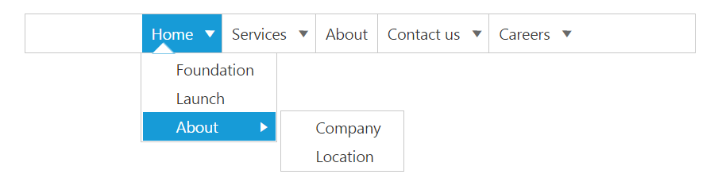

# Center Menu

You can align the **Menu** items to center by setting [enableCenterAlign](https://help.syncfusion.com/api/js/ejmenu#members:enablecenteralign) property as true. “**enableCenterAlign**” property accepts Boolean value. By default, its value is **false**. When set to **true**, then the root menu items is aligned in center.

Add the following code to show menu in center.


    
    <ej-menu id="menu" [enableCenterAlign]="true" [fields.dataSource]="data" [fields]="fieldsvalues"></ej-menu>





    import {Component} from '@angular/core';
    @Component({
            selector: 'sd-home',
            templateUrl: 'app/components/menu/menu.component.html'
            })
    export class MenuComponent {
            data: Array<Object>;
            fieldsvalues: Object;
            constructor() {
                this.data = [
                    { id: 1, text: "Home", parentId: null },
                    { id: 2, text: "Services", parentId: null },
                    { id: 3, text: "About", parentId: null },
                    { id: 4, text: "Contact us", parentId: null },
                    { id: 5, text: "Careers", parentId: null },
                    { id: 11, parentId: 1, text: "Foundation" },
                    { id: 12, parentId: 1, text: "Launch" },
                    { id: 13, parentId: 1, text: "About" },
                    { id: 14, parentId: 2, text: "Consulting" },
                    { id: 15, parentId: 2, text: "Outsourcing" },
                    { id: 16, parentId: 4, text: "Contact number" },
                    { id: 17, parentId: 4, text: "E-mail" },
                    { id: 18, parentId: 5, text: "Position" },
                    { id: 19, parentId: 5, text: "Apply online" },
                    { id: 20, parentId: 13, text: "Company" },
                    { id: 21, parentId: 13, text: "Location" },
                ];
                this.fieldsvalues = { parentId: "parentId", id: "id", text: "text" };
            }
    }



The following screenshot displays the output of the above code.

 