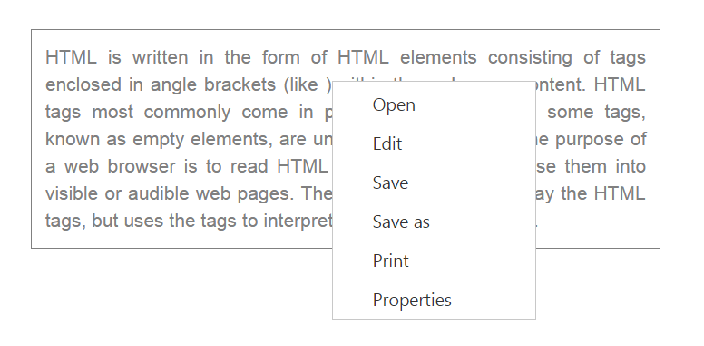

# Context Menu

A context menu is a type of menu in a graphical user interface (GUI) that appears when you perform right click operation. In this **Menu** control you can use a context menu by specifying the type of menu as **ContextMenu**. A context also provides support for nested level of menu items.

Before using the context menu, we need to set the target area for it. 

In the following example, a context menu for the division containing text is created. In this, when you perform right click operation, the following menu appears with open, edit, etc.

Add the following code in your **HTML** page.



    

        HTML is written in the form of HTML elements consisting of tags enclosed in angle
        brackets (like &lt;html&gt;),within the web page content. HTML tags most commonly come in pairs like and ,although
        some tags, known as empty elements, are unpaired, for example
        &lt;img&gt;. The purpose of a web browser is to read HTML documents and compose them into
        visible or audible web pages. The browser does not display the HTML tags, but uses
        the tags to interpret the content of the page.
    

	<ej-menu id="contextMenu" [menuType]="type" [contextMenuTarget]="target" [fields.dataSource]="data"></ej-menu>





    import {Component} from '@angular/core';
    import {ViewEncapsulation} from '@angular/core'; 
    @Component({
            selector: 'sd-home',
            templateUrl: 'app/components/menu/menu.component.html',
            styleUrls: ['app/components/menu/menu.component.css'],
            encapsulation: ViewEncapsulation.None 
            })
    export class MenuComponent {
            type: any;
            data: array;
            target: any;
            constructor() {
                this.type = ej.MenuType.ContextMenu;
                this.data = [
                    { id: 1, text: "Cut" },
                    { id: 2, text: "Copy" },
                    { id: 3, text: "Paste" },
                    { id: 4, text: "Comments" },
                    { id: 5, text: "Links" },
                    { id: 6, text: "Clear Formatting" }

                ];
                this.target = "#target";
            }
     }



Add the following code in menu.component.css file.



    .textarea {
        border: 1px solid;
        padding: 10px;
        position: relative;
        text-align: justify;
        width: 463px;
        color: gray;
        margin: 0 auto;
    }



The following screen shot displays the output of the above code.

 

You can hide and show the context menu using the following methods.

## HideContextMenu

We can hide the context menu using [hide()](https://help.syncfusion.com/api/js/ejmenu#methods:hide) method. Add the following script code in the sample in order to hide the context menu.



    //create an instance from an existing Menu.

        // only after control creation we can get menuObj otherwise it throws exception.
         //initialize the menu object
        var menuObj = $("#contextMenu").data("ejMenu");
        //To hide the context menu
        menuObj.hide();

    });



## ShowContextMenu

Shows the context menu control. Add the following script code in the sample in order to show the context menu.



    //create an instance from an existing Menu.
        // only after control creation we can get menuObj otherwise it throws exception.
         //initialize the menu object
        var menuObj = $("#contextMenu").data("ejMenu");
        //To show the context menu
        menuObj.show();

