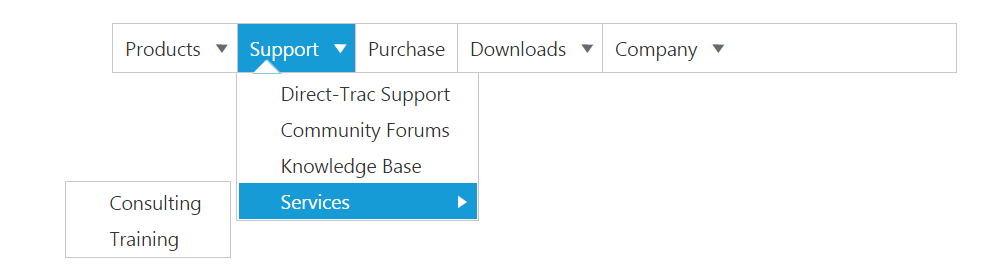
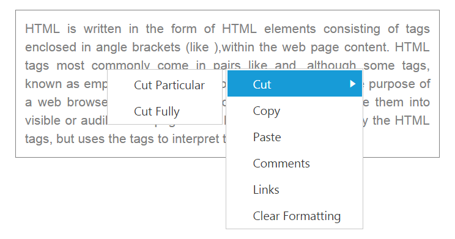

# Customizing the Submenu direction

You can customize the direction to open the sub menu items using [subMenuDirection](https://help.syncfusion.com/api/js/ejmenu#members:submenudirection) property. **subMenuDirection** accepts the type as string or enum and value as “Left” and “Right”. 

In the following example, the Sub menus opens in the Left side of the menu.

Add the following code in your **HTML** page.



<ej-menu id="menu" [subMenuDirection]="direction" [fields.dataSource]="data" [fields]="fieldsvalues"></ej-menu>





    import {Component} from '@angular/core';
    @Component({
            selector: 'sd-home',
            templateUrl: 'app/components/menu/menu.component.html'
            })
    export class MenuComponent {
        data: Array<Object>;
        fieldsvalues: Object;
        direction:any;
        constructor() {
        this.data = [
            { id: 1, text: "Products", parentId: null },
            { id: 2, text: "Support", parentId: null },
            { id: 3, text: "Purchase", parentId: null },
            { id: 4, text: "Downloads", parentId: null },
            { id: 5, text: "Company", parentId: null },
            //first level child
            { id: 11, parentId: 1, text: "ASP.NET" },
            { id: 12, parentId: 1, text: "ASP.NET MVC" },
            { id: 13, parentId: 1, text: "Mobile MVC" },
            { id: 14, parentId: 1, text: "Silverlight" },
            { id: 15, parentId: 2, text: "Direct-Trac Support" },
            { id: 16, parentId: 2, text: "Community Forums" },
            { id: 17, parentId: 2, text: "Knowledge Base" },
            { id: 18, parentId: 2, text: "Services" },
            { id: 19, parentId: 4, text: "Evaluation" },
            { id: 20, parentId: 4, text: "Free E-Books" },
            { id: 21, parentId: 4, text: "Metro Studio" },
            { id: 22, parentId: 4, text: "Latest Version" },
            { id: 23, parentId: 5, text: "Technology Resource Portal " },
            { id: 24, parentId: 5, text: "Case Studies" },
            { id: 25, parentId: 5, text: "Bouchers & Datasheets" },
            { id: 26, parentId: 5, text: "FAQ" },
            //second level child
            { id: 27, parentId: 18, text: "Consulting" },
            { id: 28, parentId: 18, text: "Training" }
        ];
        this.fieldsvalues = { parentId: "parentId", id: "id", text: "text" };
        this.direction = ej.Direction.Left;
        }
    }



The output for the above code example is as follows.          

 

You can even achieve auto positioning for Context Menu. Use the following code sample for context menu in order to open the submenu items of context menu in left side.

Add the following code in your **HTML** page.



     

        HTML is written in the form of HTML elements consisting of tags enclosed in angle
        brackets (like
        &lt;html&gt;
        ),within the web page content. HTML tags most commonly come in pairs like and ,although
        some tags, known as empty elements, are unpaired, for example
        &lt;img&gt;. The purpose of a web browser is to read HTML documents and compose them into
        visible or audible web pages. The browser does not display the HTML tags, but uses
        the tags to interpret the content of the page.
    

	
    <ej-menu id="contextMenu" [menuType]="type" [subMenuDirection]="direction" [contextMenuTarget]="target" [fields.dataSource]="data" [fields.parentId]="parentId"></ej-menu>





    import {Component} from '@angular/core';
    import {ViewEncapsulation} from '@angular/core'; 
    @Component({
            selector: 'sd-home',
            templateUrl: 'app/components/menu/menu.component.html',
            styleUrls: ['app/components/menu/menu.component.css'],
            encapsulation: ViewEncapsulation.None 
            })
    export class MenuComponent {
            type: any;
            direction: any;
            data: Array<Object>;
            target: any;
            constructor() {
                this.type = ej.MenuType.ContextMenu;
                this.direction = ej.Direction.Left;
                this.data = [
                    { id: 1, text: "Cut", parentId: null },
                    { id: 2, text: "Copy" },
                    { id: 3, text: "Paste" },
                    { id: 4, text: "Comments" },
                    { id: 5, text: "Links" },
                    { id: 6, text: "Clear Formatting" },
                    { id: 7, parentId:1, text: "Cut Particular" },
                    { id: 8, parentId:1, text: "Cut Fully" }
                ];
                this.target = "#target";
            }
     }



Add the following code in menu.component.css file.



    .textarea {
        border: 1px solid;
        padding: 10px;
        position: relative;
        text-align: justify;
        width: 463px;
        color: gray;
        margin: 0 auto;
    }



The output for the above code example is as follows.

