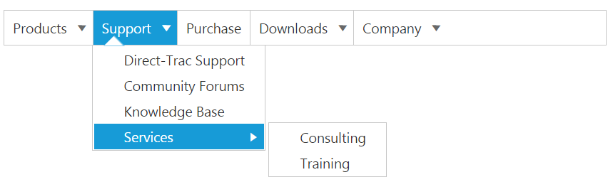

# Data binding

Data binding enables you to synchronize the elements with different sources of data. 

## Field Members

[Field](https://help.syncfusion.com/api/js/ejmenu#members:fields) is a property that includes the object type. Fields are used to bind the data source and it includes following field members to make binding easier.

List of Field members

<table>
<tr>
<th>Name</th><th>Description</th></tr>
<tr>
<td>
dataSource</td><td>
datasource receives  Essential DataManager object and JSON object. </td></tr>
<tr>
<td>
Query</td><td>
It receives query to retrieve data from the table (query is same as SQL). Example:  ej.Query().from("Categories").select("CategoryID,CategoryName").take(3);</td></tr>
<tr>
<td>
tableName</td><td>
It receives table name to execute query on the corresponding table</td></tr>
<tr>
<td>
Id</td><td>
Specifies the id to menu items list</td></tr>
<tr>
<td>
parentId</td><td>
Specifies the parent id of the table.</td></tr>
<tr>
<td>
Text</td><td>
Specifies the text of menu items list</td></tr>
<tr>
<td>
spriteCssClass</td><td>
Specifies the sprite CSS class to “li” item list</td></tr>
<tr>
<td>
linkAttribute</td><td>
Specifies the link attribute to “a” tag in item list</td></tr>
<tr>
<td>
imageAttribute</td><td>
Specifies the image attribute to “img” tag inside items list </td></tr>
<tr>
<td>
htmlAttribute</td><td>
Specifies the HTML attributes to “li” item list</td></tr>
<tr>
<td>
imageUrl</td><td>
Specifies the image URL to “img” tag inside item list. </td></tr>
</table>

## Local data

To define the local data to the **Menu** control, map the user-defined **JSON** data names with its appropriate dataSource column names.

Add the following code in your **HTML** page.



<ej-menu id="menu" [fields.dataSource]="data" [fields]="fieldsvalues"></ej-menu>





    import {Component} from '@angular/core';
    @Component({
            selector: 'sd-home',
            templateUrl: 'app/components/menu/menu.component.html'
            })
    export class MenuComponent {
        data: Array<Object>;
        fieldsvalues: Object;
        constructor() {
        this.data = [
            { id: 1, text: "Products", parentId: null },
            { id: 2, text: "Support", parentId: null },
            { id: 3, text: "Purchase", parentId: null },
            { id: 4, text: "Downloads", parentId: null },
            { id: 5, text: "Company", parentId: null },
            //first level child
            { id: 11, parentId: 1, text: "ASP.NET" },
            { id: 12, parentId: 1, text: "ASP.NET MVC" },
            { id: 13, parentId: 1, text: "Mobile MVC" },
            { id: 14, parentId: 1, text: "Silverlight" },
            { id: 15, parentId: 2, text: "Direct-Trac Support" },
            { id: 16, parentId: 2, text: "Community Forums" },
            { id: 17, parentId: 2, text: "Knowledge Base" },
            { id: 18, parentId: 2, text: "Services" },
            { id: 19, parentId: 4, text: "Evaluation" },
            { id: 20, parentId: 4, text: "Free E-Books" },
            { id: 21, parentId: 4, text: "Metro Studio" },
            { id: 22, parentId: 4, text: "Latest Version" },
            { id: 23, parentId: 5, text: "Technology Resource Portal " },
            { id: 24, parentId: 5, text: "Case Studies" },
            { id: 25, parentId: 5, text: "Bouchers & Datasheets" },
            { id: 26, parentId: 5, text: "FAQ" },
            //second level child
            { id: 27, parentId: 18, text: "Consulting" },
            { id: 28, parentId: 18, text: "Training" }
        ];
        this.fieldsvalues = { parentId: "parentId", id: "id", text: "text" };
        }
    }



The following screenshot displays the output of the above code.

