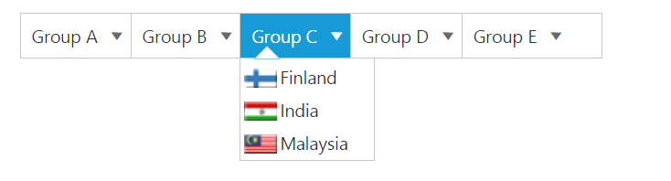
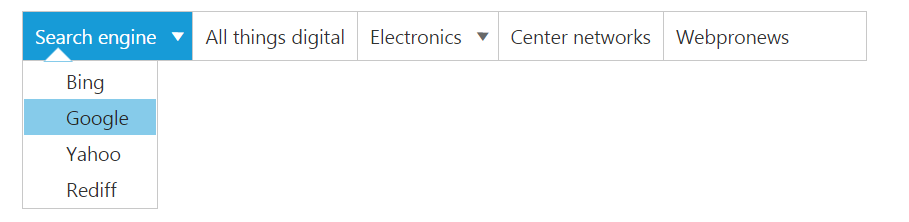

# Icons and navigation

## Icons

Icons are the images that is displayed in the **Menu** control. To specify the menu with icons you can use [spriteCssClass](https://help.syncfusion.com/api/js/ejmenu#members:fields-spritecssclass) property to display the icons. 

Add the following code in your **HTML** page.



<ej-menu id="menu" [fields.dataSource]="data" [fields]="fieldsvalues"></ej-menu>





    import {Component} from '@angular/core';
    import {ViewEncapsulation} from '@angular/core'; 
    @Component({
            selector: 'sd-home',
            templateUrl: 'app/components/menu/menu.component.html',
            styleUrls: ['app/components/menu/menu.component.css'],
            encapsulation: ViewEncapsulation.None 
            })
    export class MenuComponent {
        data: Array<Object>;
        fieldsvalues: Object;
        constructor() {
            this.data = [
                { id: 1, text: "Group A", parentId: null },
                { id: 2, text: "Group B", parentId: null },
                { id: 3, text: "Group C", parentId: null },
                { id: 4, text: "Group D", parentId: null },
                { id: 5, text: "Group E", parentId: null },
                //first level child
                { id: 11, parentId: 1, text: "Algeria", sprite: "flag-dz" },
                { id: 12, parentId: 1, text: "Armenia", sprite: "flag-am" },
                { id: 13, parentId: 1, text: "Bangladesh", sprite: "flag-bd" },
                { id: 14, parentId: 1, text: "Cuba", sprite: "flag-cu" },
                { id: 15, parentId: 2, text: "Denmark", sprite: "flag-dk" },
                { id: 16, parentId: 2, text: "Egypt", sprite: "flag-eg" },
                { id: 17, parentId: 3, text: "Finland", sprite: "flag-fi" },
                { id: 18, parentId: 3, text: "India", sprite: "flag-in" },
                { id: 19, parentId: 3, text: "Malaysia", sprite: "flag-my" },
                { id: 20, parentId: 4, text: "New Zealand", sprite: "flag-nz" },
                { id: 21, parentId: 4, text: "Norway", sprite: "flag-no" },
                { id: 22, parentId: 4, text: "Poland", sprite: "flag-pl" },
                { id: 23, parentId: 5, text: "Romania", sprite: "flag-ro" },
                { id: 24, parentId: 5, text: "Singapore", sprite: "flag-sg" },
                { id: 25, parentId: 5, text: "Thailand", sprite: "flag-th" },
                { id: 26, parentId: 5, text: "Ukraine", sprite: "flag-ua" },
            ];
            this.fieldsvalues = { parentId: "parentId", id: "id", text: "text", spriteCssClass:"sprite" };
        }
    }



Add the following code in menu.component.css file.



        #menujson {
            margin-left: 50px;
        }
        .e-menu li > ul > li > a {
            padding: 3px 24px 3px 35px;
        }
        [class^="flag-"],
        [class*="flag-"] {
            background-image: url("../content/images/autocomplete/flags.png");
            height: 14px;
            left: 2px;
            top: 4px;
            width: 24px;
        }
        .flag-am {background-position: -25px 0;}
        .flag-bd {background-position: -75px 0;}
        .flag-cu {background-position: -25px -15px;}
        .flag-dk {background-position: -50px -15px;}
        .flag-dz {background-position: -75px -15px;}
        .flag-eg {background-position: -125px -15px;}
        .flag-fi {background-position: -25px -30px;}
        .flag-id {background-position: -100px -30px;}
        .flag-in {background-position: -125px -30px;}
        .flag-my {background-position: -25px -45px;}
        .flag-no {background-position: -75px -45px;}
        .flag-nz {background-position: -100px -45px;}
        .flag-pl {background-position: -125px -45px;}
        .flag-ro {background-position: -50px -60px;}



The following screenshot displays the output for the above code.                                                                                                       

 

N> Images for this sample are available in (installed location)\Syncfusion\Essential Studio\{{ site.releaseversion }}\JavaScript\samples\web\content\images 

## Navigation

Navigation in Menu control is the default usage to navigate into the other web page. You can navigate to another page in menu item by providing link to the menu items. Navigation in **Menu** control can be achieved by placing “**href**” path to the anchor tag. Use the following code sample for navigating in **Menu** control.

Add the following code in your **HTML** page.


 
   <ej-menu id="menu" [fields.dataSource]="data" [fields]="fieldsvalues"></ej-menu>





    import {Component} from '@angular/core';
    @Component({
            selector: 'sd-home',
            templateUrl: 'app/components/menu/menu.component.html'
            })
    export class MenuComponent {
            data: Array<Object>;
            fieldsvalues: Object;
            constructor() {
                this.data = [
                    { id: 1, text: "Search engine", parentId: null, url: null },
                    { id: 2, text: "All things digital", parentId: null, url: "http://allthingsd.com/"},
                    { id: 3, text: "Electronics", parentId: null, url: null },
                    { id: 4, text: "Center networks", parentId: null, url: "http://www.centernetworks.com/" },
                    { id: 5, text: "Webpronews", parentId: null, url: "http://www.webpronews.com/" },
                    //first level child
                    { id: 11, parentId: 1, text: "Bing", url: "http://www.bing.com/"},
                    { id: 12, parentId: 1, text: "Google", url:"https://www.google.co.in/"},
                    { id: 13, parentId: 1, text: "Yahoo", url: "https://in.yahoo.com/"},
                    { id: 14, parentId: 1, text: "Rediff", url: "http://www.rediff.com/"},
                    { id: 15, parentId: 3, text: "Engadget", url: "http://www.engadget.com/" },
                    { id: 16, parentId: 3, text: "Electronista", url: "http://www.electronista.com/" },
                    { id: 17, parentId: 3, text: "Gearlog", url: "http://www.gearlog.com/" },
                ];
                this.fieldsvalues = { parentId: "parentId", id: "id", text: "text", url:"url" };
            }
    }



The following screenshot displays the output for the above code example.            

 

When you click on “**Google**” that is present under “Search engine”, it navigates to the link that you specified in the sample code. Then the output is as follows.

