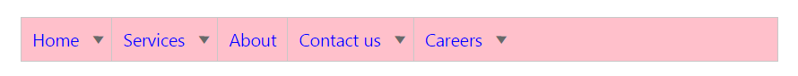

# Look and feel

**Essential JavaScript** controls feature 12 built-in themes, six flat and gradient effects, and also supports custom skin options for user-defined themes.

12 themes support available for **Menu** control namely,

* default-theme
* flat-azure-dark
* flat-lime
* flat-lime-dark
* flat-saffron
* flat-saffron-dark
* gradient-azure
* gradient-azure-dark
* gradient-lime
* gradient-lime-dark
* gradient-saffron
* gradient-saffron-dark

## CssClass

**Menu** control also customizes its appearance using user-defined **CSS** and custom skin options (colors and backgrounds). To apply custom themes you can use the [cssClass](https://help.syncfusion.com/api/js/ejmenu#members:cssclass) property. [cssClass](https://help.syncfusion.com/api/js/ejmenu#members:cssclass) property sets the root class for **Menu** control theme.

Using this **cssClass** you can override the existing styles under the theme style sheet. The theme stylesheet applies theme-specific styles like colors and backgrounds. In the following sample the value of "cssClass" property is set as “Purple-dark”. Purple-dark is added as root class to **Menu** control at the runtime. From this root class you can customize the **Menu** control theme.

Add the following code in your **HTML** page.



    <ej-menu id="menu" cssClass="Purple-dark" [fields.dataSource]="data" [fields]="fieldsvalues"></ej-menu>





    import {Component} from '@angular/core';
    import {ViewEncapsulation} from '@angular/core'; 
    @Component({
            selector: 'sd-home',
            templateUrl: 'app/components/menu/menu.component.html',
            styleUrls: ['app/components/menu/menu.component.css'],
            encapsulation: ViewEncapsulation.None 
            })
    export class MenuComponent {
            data: Array<Object>;
            fieldsvalues: Object;
            constructor() {
                this.data = [
                    { id: 1, text: "Home", parentId: null },
                    { id: 2, text: "Services", parentId: null },
                    { id: 3, text: "About", parentId: null },
                    { id: 4, text: "Contact us", parentId: null },
                    { id: 5, text: "Careers", parentId: null },
                    { id: 11, parentId: 1, text: "Foundation" },
                    { id: 12, parentId: 1, text: "Launch" },
                    { id: 13, parentId: 1, text: "About" },
                    { id: 14, parentId: 2, text: "Consulting" },
                    { id: 15, parentId: 2, text: "Outsourcing" },
                    { id: 16, parentId: 4, text: "Contact number" },
                    { id: 17, parentId: 4, text: "E-mail" },
                    { id: 18, parentId: 5, text: "Position" },
                    { id: 19, parentId: 5, text: "Apply online" },
                    { id: 20, parentId: 13, text: "Company" },
                    { id: 21, parentId: 13, text: "Location" },
                ];
                this.fieldsvalues = { parentId: "parentId", id: "id", text: "text" };
            }
    }



Add the following code in menu.component.css file.



    .Purple-dark .e-menu,.e-menu.e-horizontal .e-list > ul { 
       background: pink;    
     }            
    .Purple-dark .e-menu.e-horizontal .e-list > a {    
      color: blue;      
     }



Following screenshot displays the output of the above code.

