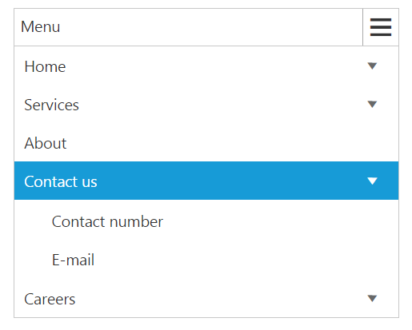
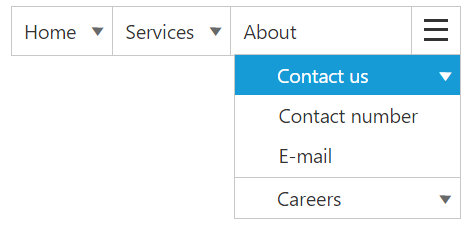
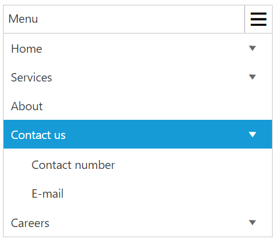

# Responsive Layout

Responsive Layout is aimed at crafting sites to provide an optimal viewing experience—easy reading and navigation with a minimum of resizing, panning, and scrolling—across a wide range of devices (from mobile phones to desktop computer monitors). In order to get responsive layout, you can add **ej.responsive.css** file in this sample. **CDN** link for the responsive CSS file is as follows.

[http://cdn.syncfusion.com/{{ site.releaseversion }}/js/web/responsive-css/ej.responsive.css](http://cdn.syncfusion.com/{{ site.releaseversion }}/js/web/responsive-css/ej.responsive.css)

N> Refer to the ej.responsive.css file after the ej.widgets.all.min.css file.

Add the above **css** link in the code sample.         

Add the following code in your **HTML** page.



<ej-menu id="menu" [fields.dataSource]="data" [fields]="fieldsvalues"></ej-menu>





    import {Component} from '@angular/core';
    @Component({
            selector: 'sd-home',
            templateUrl: 'app/components/menu/menu.component.html'
            })
    export class MenuComponent {
        data: Array<Object>;
        fieldsvalues: Object;
        constructor() {
        this.data = [
            { id: 1, text: "Products", parentId: null },
            { id: 2, text: "Support", parentId: null },
            { id: 3, text: "Purchase", parentId: null },
            { id: 4, text: "Downloads", parentId: null },
            { id: 5, text: "Company", parentId: null },
            //first level child
            { id: 11, parentId: 1, text: "ASP.NET" },
            { id: 12, parentId: 1, text: "ASP.NET MVC" },
            { id: 13, parentId: 1, text: "Mobile MVC" },
            { id: 14, parentId: 1, text: "Silverlight" },
            { id: 15, parentId: 2, text: "Direct-Trac Support" },
            { id: 16, parentId: 2, text: "Community Forums" },
            { id: 17, parentId: 2, text: "Knowledge Base" },
            { id: 18, parentId: 2, text: "Services" },
            { id: 19, parentId: 4, text: "Evaluation" },
            { id: 20, parentId: 4, text: "Free E-Books" },
            { id: 21, parentId: 4, text: "Metro Studio" },
            { id: 22, parentId: 4, text: "Latest Version" },
            { id: 23, parentId: 5, text: "Technology Resource Portal " },
            { id: 24, parentId: 5, text: "Case Studies" },
            { id: 25, parentId: 5, text: "Bouchers & Datasheets" },
            { id: 26, parentId: 5, text: "FAQ" },
            //second level child
            { id: 27, parentId: 18, text: "Consulting" },
            { id: 28, parentId: 18, text: "Training" }
        ];
        this.fieldsvalues = { parentId: "parentId", id: "id", text: "text" };
        }
    }



The following screenshot displays the output on executing the above code

## Responsive in Desktop:

When menu width is small and window width is normal as desktop ,only the overflown menu items will be moved inside menu popup.You can also set width and height for popup menu using **overflowHeight** and **overflowWidth** property.

Set the width like [width]="300" in the above code and the output will be shown as below,

## Responsive in Mobile or Tablet:

Menu will be displayed in mobile or Tablet as shown in the below image:

N> Window width below 767px is considered as Mobile or Tablet mode in our Menu control.