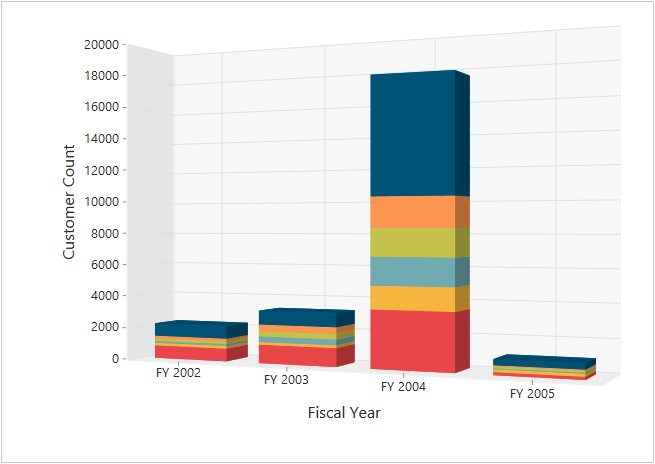

# 3D Visualization

The PivotChart control allows you to view the data in a 3D view. Following are the chart types that are supported:

* Bar
* Column
* Stacking Bar
* Stocking Column 
* Pie

## 3D Column Chart

3D Column Chart is rendered by specifying the chart type as **“Column”** in the **“commonSeriesOptions”** enumeration property as well as by setting the `enable3d` property to **“true”.**





<ej-pivotchart [commonSeriesOptions]="commonSeriesOptions" [size]="size" [enable3d]="true" [rotation]=24>
</ej-pivotchart>





//..

export class PivotChartComponent {
    public size; commonSeriesOptions; 
    constructor() {
      //..
      this.size = { height: "460px", width: "950px" };
      this.commonSeriesOptions = { type: ej.PivotChart.ChartTypes.Column };
    }
}





## 3D Bar Chart

3D Bar Chart is rendered by specifying the chart type as **“Bar”** in the **“commonSeriesOptions”** enumeration property as well as by setting the `enable3d` property to **“true”.**



//..

export class PivotChartComponent {
    public size; commonSeriesOptions; 
    constructor() {
      //..
      this.size = { height: "460px", width: "950px" };
      this.commonSeriesOptions = { type: ej.PivotChart.ChartTypes.Bar };
    }
}



## 3D Stacking Bar Chart

3D Stacking Bar Chart is rendered by specifying the chart type as **“Stacking Bar”** in the **“commonSeriesOptions”** enumeration property as well as by setting the `enable3d` property to **“true”.**



//..

export class PivotChartComponent {
    public size; commonSeriesOptions; 
    constructor() {
      //..
      this.size = { height: "460px", width: "950px" };
      this.commonSeriesOptions = { type: ej.PivotChart.ChartTypes.StackingBar };
    }
}



## 3D Stacking Column Chart

3D Stacking Column Chart is rendered by specifying the chart type as **“Stacking Column”** in the **“commonSeriesOptions”** enumeration property as well as by setting the `enable3d` property to **“true”.**



//..

export class PivotChartComponent {
    public size; commonSeriesOptions; 
    constructor() {
      //..
      this.size = { height: "460px", width: "950px" };
      this.commonSeriesOptions = { type: ej.PivotChart.ChartTypes.StackingColumn };
    }
}



## 3D Pie Chart

3D Pie Chart is rendered by specifying the chart type as **"Pie"** in the **"commonSeriesOptions"** enumeration property as well as by setting the `enable3d` property to **“true”.**



//..

export class PivotChartComponent {
    public size; commonSeriesOptions; 
    constructor() {
      //..
      this.size = { height: "460px", width: "950px" };
      this.commonSeriesOptions = { type: ej.PivotChart.ChartTypes.Pie };
    }
}



## Rotating 3D Chart

We can rotate the 3D Chart towards left or right by setting an appropriate angle value to the `rotation` property. The direction of the Chart display depends upon the positive or negative angle value.





<ej-pivotchart [commonSeriesOptions]="commonSeriesOptions" [size]="size" [enable3d]="true" [rotation]=40>
</ej-pivotchart>





//..

export class PivotChartComponent {
    public size; commonSeriesOptions; 
    constructor() {
      //..
      this.size = { height: "460px", width: "950px" };
      this.commonSeriesOptions = { type: ej.PivotChart.ChartTypes.Column };
    }
}





 
 