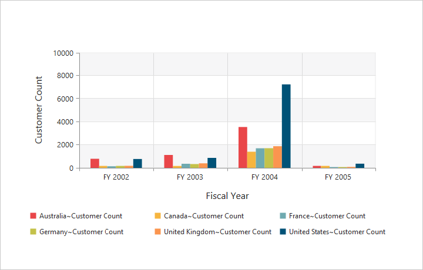

# Appearance

## PivotChart - Area Customization

### Grid Bands Customization
By using the [`alternateGridBand`](/api/angular/ejchart#members:primaryxaxis-alternategridband) property of the axis, you can provide different color for grid rows and columns formed by the grid lines in the Chart area. The properties [`odd`](/api/angular/ejchart#members:primaryyaxis-alternategridband-odd) and [`even`](/api/angular/ejchart#members:primaryyaxis-alternategridband-even) are used to customize the grid bands at odd and even positions respectively.





<ej-pivotchart [primaryYAxis]="primaryYAxis">
</ej-pivotchart>





//..

export class PivotChartComponent {
    public primaryYAxis;
    constructor() {
      //..
        this.primaryYAxis = { 
                //..
                //Customizing horizontal grid bands at even position
                alternateGridBand:
                {
                    even:
                    {
                        fill: "#A7A9AB",
                        opacity: 0.1,
                    }
                },
                //....
        };
    }
}





### Animation

You can enable animation by using the `enableAnimation` property under `commonSeriesOptions` of the PivotChart control. This animates the Chart series on two occasions - when the Chart is loaded for the first time and when you change the series type by using the `type` property.





<ej-pivotchart [commonSeriesOptions]="commonSeriesOptions" [size]="size">
</ej-pivotchart>





//..

export class PivotChartComponent {
    public size; commonSeriesOptions; 
    constructor() {
      //..
      this.size = { height: "460px", width: "950px" };
      this.commonSeriesOptions = { 
            //Enabling animation in series
            enableAnimation: true,
            //....
       };
    }
}




