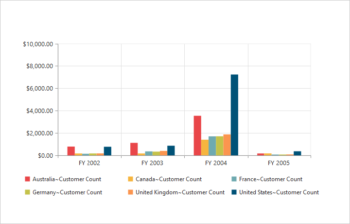
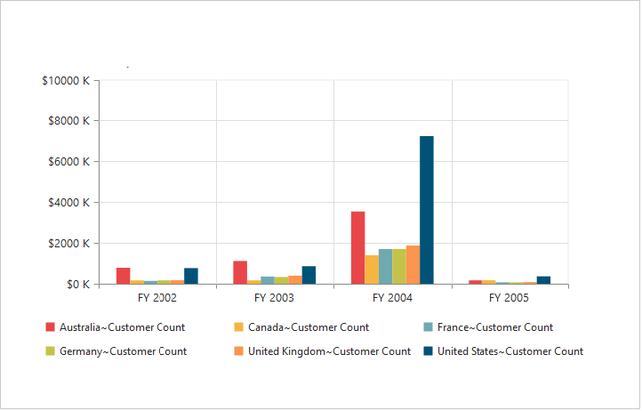
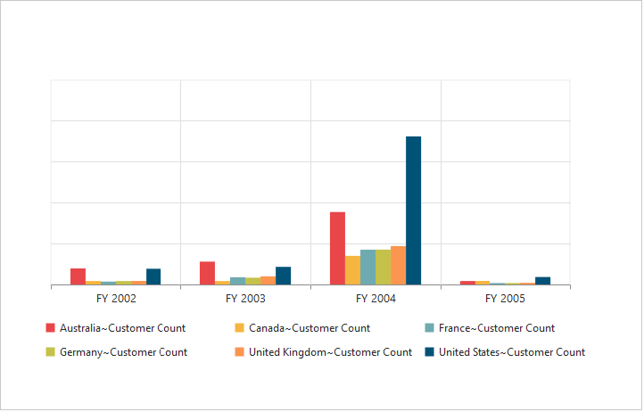
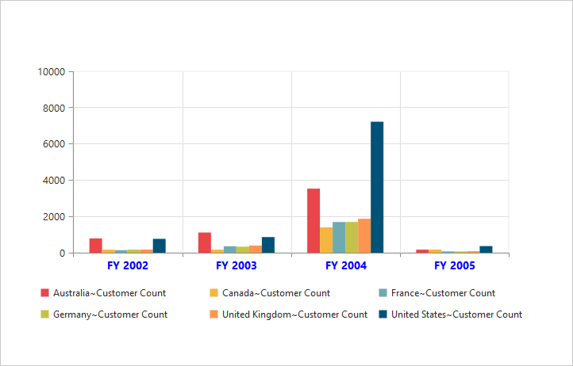
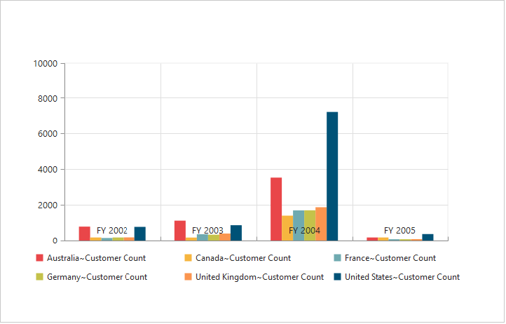
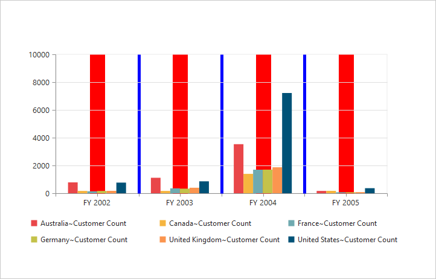
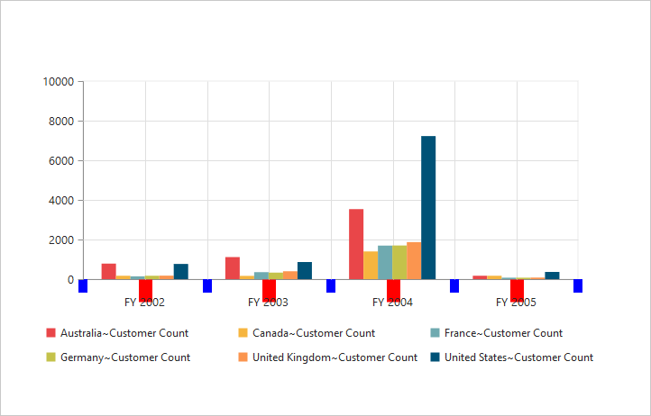
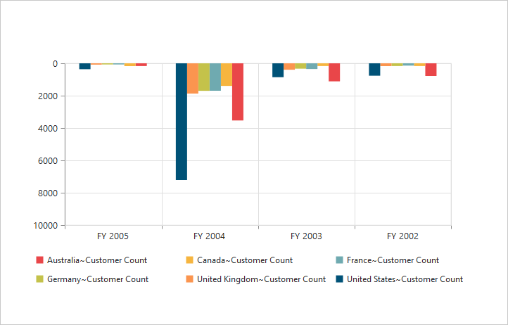
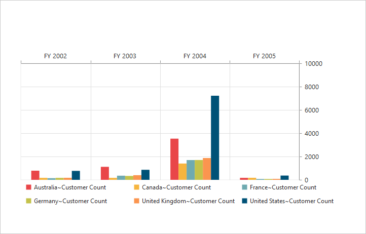
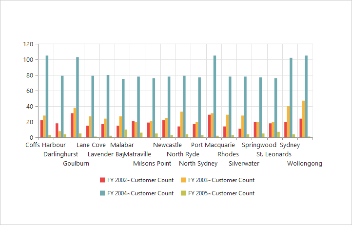

# Axes 

## Label Format

### Format Numeric labels

By using the `labelFormat` property, you can format the numeric labels. Numeric values can be formatted with n (number with decimal points), c (currency) and p (percentage) commands.





<ej-pivotchart [primaryYAxis]="primaryYAxis">
</ej-pivotchart>





//..

export class PivotChartComponent {
    public primaryYAxis;
    constructor() {
      //..
      this.primaryYAxis = { labelFormat: 'c' };
    }
}





Following table describes the result on applying some commonly used label formats on numeric values.

<table>
<tr>
<th>
Label Value</th><th>
Label Format Property Value</th><th>
Result</th><th>
Description</th>
</tr>
<tr><td>
1000</td><td>
n1</td><td>    
1000.0</td><td>
The Number is rounded to 1 decimal place</td>
</tr>
<tr><td>
1000</td><td>
n2</td><td>    
1000.00</td><td>
The Number is rounded to 2 decimal place</td>
</tr>
<tr><td>
1000</td><td>
n3</td><td>    
1000.000</td><td>
The Number is rounded to 3 decimal place</td>
</tr>
<tr><td>
0.01</td><td>
p1</td><td>    
1.0%</td><td>
The Number is converted to percentage with 1 decimal place</td>
</tr>
<tr><td>
0.01</td><td>
p2</td><td>    
1.00%</td><td>
The Number is converted to percentage with 2 decimal place</td>
</tr>
<tr><td>
0.01</td><td>
p3</td><td>    
1.000%</td><td>
The Number is converted to percentage with 3 decimal place</td>
</tr>
<tr><td>
1000</td><td>
c1</td><td>    
$1,000.0</td><td>
The Currency symbol is appended to number and number is rounded to 1 decimal place</td>
</tr>
<tr><td>
1000</td><td>
c2</td><td>    
$1,000.00</td><td>
The Currency symbol is appended to number and number is rounded to 2 decimal place</td>
</tr>
</table>

### Label Format Customization 

By using the `labelFormat` property of `primaryYAxis`, you can add the category labels with prefix and/or suffix. 





<ej-pivotchart [primaryYAxis]="primaryYAxis">
</ej-pivotchart>





//..

export class PivotChartComponent {
    public primaryYAxis;
    constructor() {
      //..
      this.primaryYAxis = { labelFormat: '${value} K' };
    }
}





## Common Axis Features

### Axis Visibility

Axis visibility can be set by using the `visible` property of the respective axis.

N> By default, the value of `visible` property is true in PivotChart.





<ej-pivotchart [primaryYAxis]="primaryYAxis">
</ej-pivotchart>





//..

export class PivotChartComponent {
    public primaryYAxis;
    constructor() {
      //..
      this.primaryYAxis = { visible: false };
    }
}





### Label Customization

By using the `font` property of the axis, we can customize the labels – font family, color, opacity, size and font-weight.





<ej-pivotchart [primaryXAxis]="primaryXAxis">
</ej-pivotchart>





//..

export class PivotChartComponent {
    public primaryXAxis;
    constructor() {
      //..
      this.primaryXAxis = { font:
            {
                fontFamily: 'Segoe UI',
                size: '14px',
                fontWeight: 'bold',
                color: 'blue'
            } 
        };
    }
}





### Label and Tick Positioning

Axis labels and ticks can be positioned inside or outside the Chart area by using the `AxislabelPosition` and `TickLinesPosition` properties. The labels and ticks are positioned outside the Chart area, by default.





<ej-pivotchart [primaryXAxis]="primaryXAxis">
</ej-pivotchart>





//..

export class PivotChartComponent {
    public primaryXAxis;
    constructor() {
      //..
      this.primaryXAxis = { 
            labelPosition: 'inside',
            tickLinesPosition: 'inside'
        };
    }
}





### Grid Lines Customization

By using the `MajorGridLines` and `MinorGridLines` properties of the axis, you can customize the width, color, visibility and opacity of the grid lines.

N> By default, the minor grid lines are not visible in PivotChart.





<ej-pivotchart [primaryXAxis]="primaryXAxis">
</ej-pivotchart>





//..

export class PivotChartComponent {
    public primaryXAxis;
    constructor() {
      //..
      this.primaryXAxis = { 
            //Customizing Grid Lines
            majorGridLines:
            {
                color: 'blue',
                visible: true,
                width: 5
            },
            minorTicksPerInterval: 1,
            minorGridLines:
            {
                color: 'red',
                visible: true,
                width: 5
            }
        };
    }
}





### Tick Line Customization

By using the `majorTickLines` and `minorTickLines` properties of the axis, you can customize the width, color, visibility, size and opacity of the tick lines.

N> By default, the minor tick lines are not visible in PivotChart.





<ej-pivotchart [primaryXAxis]="primaryXAxis">
</ej-pivotchart>





//..

export class PivotChartComponent {
    public primaryXAxis;
    constructor() {
      //..
      this.primaryXAxis = { 
            //Customizing Tick Lines
            majorTickLines:
            {
                color: 'blue',
                visible: true,
                width: 10,
                size: 15,
            },
            minorTicksPerInterval: 1,
            minorTickLines:
            {
                color: 'red',
                visible: true,
                width: 20,
                size: 15
            }
        };
    }
}





### Inversing Axis

Axis can be inversed by using the `IsInversed` property of the axis.

N> By default, the `IsInversed` property is false in PivotChart.





<ej-pivotchart [primaryXAxis]="primaryXAxis" [primaryYAxis]="primaryYAxis">
</ej-pivotchart>





//..

export class PivotChartComponent {
    public primaryYAxis;primaryXAxis;
    constructor() {
      //..
        this.primaryXAxis = {
            //Inversing the X-axis
            isInversed: true
        };
        this.primaryYAxis = { 
            //Inversing the Y-axis
            isInversed: true
        };
    }
}





### Placing Axes at Opposite Side

The `OpposedPosition` property of Chart axis can be used to place the axis at the opposite direction from its default position.

N> By default, the `OpposedPosition` property is false in PivotChart.





<ej-pivotchart [primaryXAxis]="primaryXAxis" [primaryYAxis]="primaryYAxis">
</ej-pivotchart>





//..

export class PivotChartComponent {
    public primaryYAxis;primaryXAxis;
    constructor() {
      //..
        this.primaryXAxis = {
            //Placing X-axis at the opposite side of its normal position
            opposedPosition: true
        };
        this.primaryYAxis = { 
            //Placing Y-axis at the opposite side of its normal position
            opposedPosition: true
        };
    }
}





## Smart Axis Labels

When the axis labels overlap with each other based on the Chart dimensions and label size, you can use `LabelIntersection` property of the axis to avoid overlapping.

N> By default, the `LabelIntersection` property is none in PivotChart.

The following options that are supported for `LabelIntersection` property are:
 
* Rotate45
* Rotate90
* Trim
* MultipleRows
* Wrap
* Hide. 





<ej-pivotchart [primaryXAxis]="primaryXAxis">
</ej-pivotchart>





//..

export class PivotChartComponent {
    public primaryXAxis;
    constructor() {
      //..
        this.primaryXAxis = {
            labelIntersectAction: 'multipleRows'
        };
    }
}





