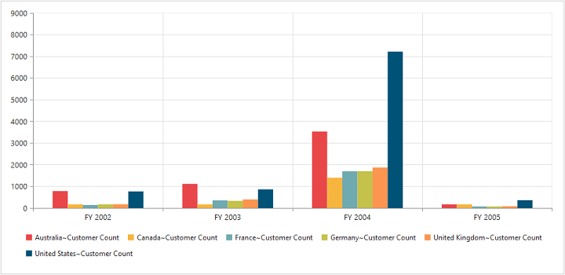

# Dimensions

## Set size in percentage

You can customize the PivotChart dimension by setting the width and height of the control in percentage.




<ej-pivotchart [size]="size">
    </ej-pivotchart>





//..

export class PivotChartComponent {
    public size; 
    constructor() {
      //..
      this.size = { height: "80%", width: "80%" }; //Set size to Chart container  
    }
}





ej-pivotchart {
    width:100%;
    height:450px;
}





## Set size in pixels

You can customize the PivotChart dimension by setting the width and height of the control in pixels.




<ej-pivotchart [size]="size">
    </ej-pivotchart>





//..

export class PivotChartComponent {
    public size; 
    constructor() {
      //..
      this.size = { height: "950px", width: "540px" }; //Set size to Chart container  
    }
}





ej-pivotchart {
    width:950px;
    height:450px;
}




 
 

## Responsive

PivotChart control supports responsive rendering based on the target device (desktop & tablet) resolution. It supports resolution upto 1024x600. You can enable responsiveness in PivotChart by setting `isResponsive` property to true.




<ej-pivotchart [isResponsive]="true" [size]="size">
    </ej-pivotchart>





//..

export class PivotChartComponent {
    public size; 
    constructor() {
      //..
      this.size = { height: "950px", width: "540px" }; //Set size to Chart container  
    }
}





ej-pivotchart {
    min-width:525px;
    min-height:460px;
    width: 100%;
    height:450px;
}





_Normal View_

_ResponsiveView_

