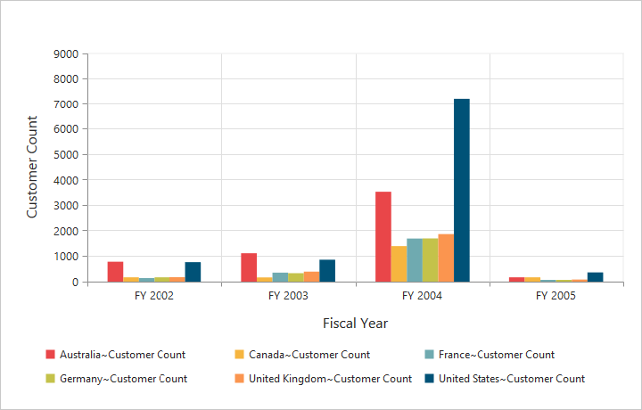

# Legend

## Legend Visibility

You can enable or disable legend using the `visible` property inside the `legend` object.

N> By default, the legend is visible in PivotChart.





<ej-pivotchart [legend]="legend">
</ej-pivotchart>





//..

export class PivotChartComponent {
    public legend;
    constructor() {
      //..
      this.legend = { visible: true };
    }
}





 

## Legend Shape

You can customize the legend `shape` in PivotChart control. Default value of legend shape is “rectangle”. Following legend shapes that are supported:

* rectangle
* circle
* cross
* diamond
* pentagon
* hexagon
* star
* ellipse
* triangle etc.



//..

export class PivotChartComponent {
    public legend;
    constructor() {
      //..
      this.legend = { visible: true, shape: "Star" };
    }
}



 

## Legend Position

By using the `Position` property, you can place the legend at top, bottom, left or right of the PivotChart. 

N> Default value of legend position is "bottom" in PivotChart.



//..

export class PivotChartComponent {
    public legend;
    constructor() {
      //..
      this.legend = { visible: true, shape: "Star", position: "top" };
    }
}



 

## Legend Title

To add the legend title, you have to specify the title text in `Title.text` property.



//..

export class PivotChartComponent {
    public legend;
    constructor() {
      //..
      this.legend = { visible: true, title:{ text: "Countries" } };
    }
}



 

## Legend Alignment

You can align the legend to center, far and near based on its position in the Chart area using the `Alignment` option.
 


//..

export class PivotChartComponent {
    public legend;
    constructor() {
      //..
      this.legend = { visible: true, alignment: "Near" };
    }
}



## Legend Items - Size and Border

By using the legend `ItemStyle.Width`, `ItemStyle.Height` and `ItemStyle.Border` properties, you can change the legend items - size and border.
 


//..

export class PivotChartComponent {
    public legend;
    constructor() {
      //..
      this.legend = { visible: true, itemStyle:
            {
                height: 12,
                width: 12,
                border:
                {
                    color: 'magenta',
                    width: 1.5
                }
            } 
        };
    }
}



 
## Legend Border

By using the `Border` option in legend, you can customize border color and width.
 


//..

export class PivotChartComponent {
    public legend;
    constructor() {
      //..
      this.legend = { visible: true, border:{
                color: "#FFC342",
                width: 2
            }
        };
    }
}



## Legend Text

By using the `Font` option, you can customize the font family, font style, font weight and size of the legend text. 
 


//..

export class PivotChartComponent {
    public legend;
    constructor() {
      //..
      this.legend = { visible: true, font:
            {
                fontFamily: 'Segoe UI',
                fontStyle: 'italic',
                fontWeight: 'bold',
                size: '13px'
            }
        };
    }
}



