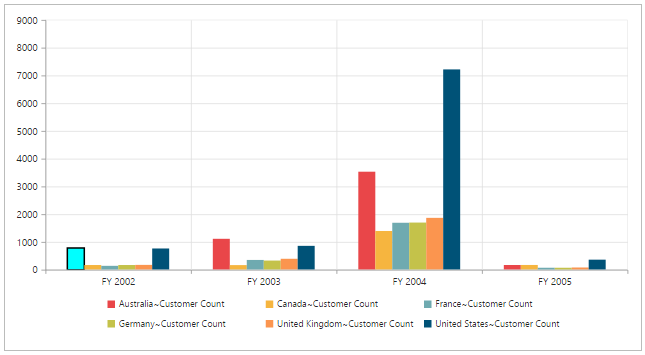

# Series

## Series Point customization

By using the `fill` and `border` properties of Chart series, you can customize the PivotChart series color, border color and border width.
 




<ej-pivotchart [commonSeriesOptions]="commonSeriesOptions" [size]="size" (load)="onLoad($event)">
</ej-pivotchart>





//..

export class PivotChartComponent {
    public size; commonSeriesOptions; 
    constructor() {
      //..
      this.size = { height: "460px", width: "950px" };
      this.commonSeriesOptions = { type: ej.PivotChart.ChartTypes.Column };
    }
    onLoad(args) {
        args.model.seriesRendering = function (evt) {
            this.model.series[0].points[0].fill = "aqua";
            this.model.series[0].points[0].border = {
                color: "black",
                width: 2
            };
        };
    };
}





