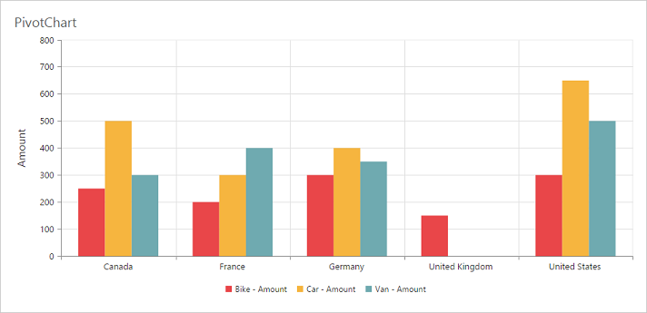

# Title

## Title Text
By using the `text` property, you can add the title text for PivotChart.
 
 


<ej-pivotchart [title]="title">
</ej-pivotchart>





//..

export class PivotChartComponent {
    public title;
    constructor() {
      //..
      this.title = { text: "PivotChart" };
    }
}



 

## Title Alignment

By using the `textAlignment` property, you can align the PivotChart controls title text to center, far or near.



<ej-pivotchart [title]="title">
</ej-pivotchart>





//..

export class PivotChartComponent {
    public title;
    constructor() {
      //..
      this.title = { 
            text: "PivotChart", 
            //Change title text alignment
            textAlignment: "near"
       };
    }
}



 

## Title Customization
By using the `title` property, you can add the title text for X-axis and Y-axis. Also title text can be customized by using the `text` and `font` properties. On setting `enableTrim` to true, title text could be trimmed based on its length.



<ej-pivotchart [primaryXAxis]="primaryXAxis">
</ej-pivotchart>





//..

export class PivotChartComponent {
    public primaryXAxis;
    constructor() {
      //..
      this.primaryXAxis = {
              //Customizing X-axis title
              title: {
                 text: "Country",
                 font: {
                    fontFamily: 'Segoe UI',
                    size: '16px',
                    fontWeight: 'bold',
                    color: 'grey',
                 },
                 enableTrim: true
              }
          }
    }
}



