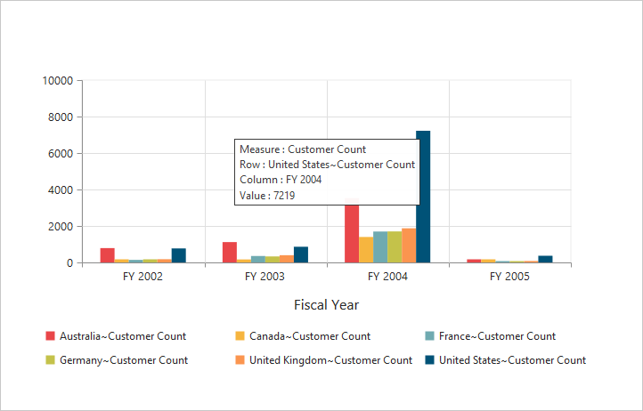
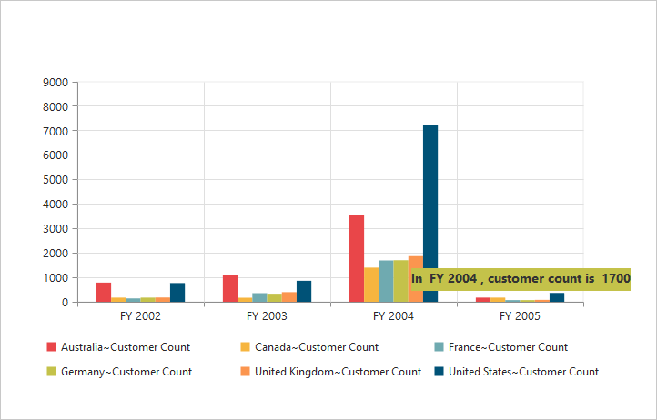
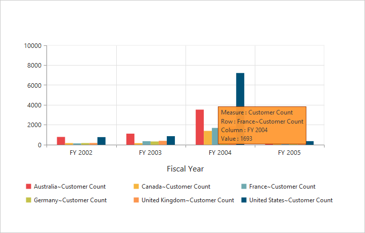
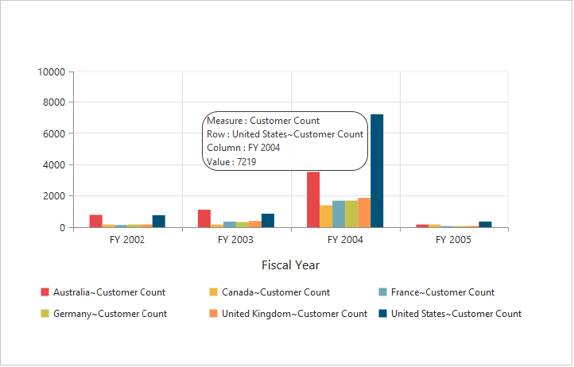
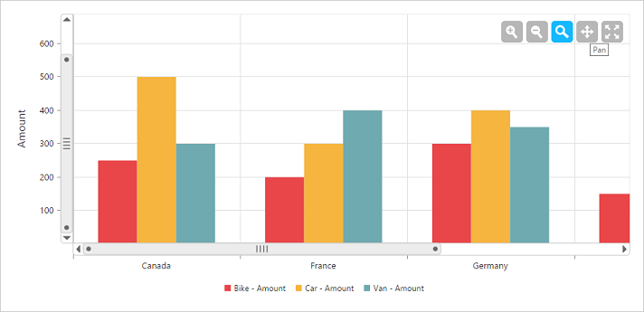
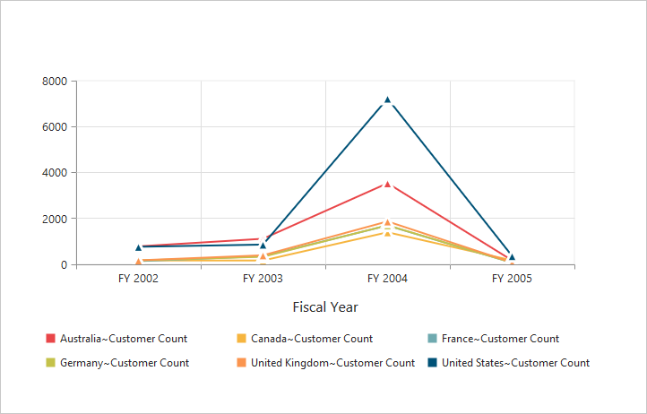
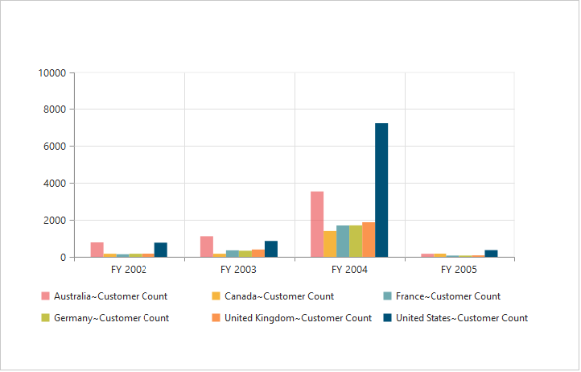
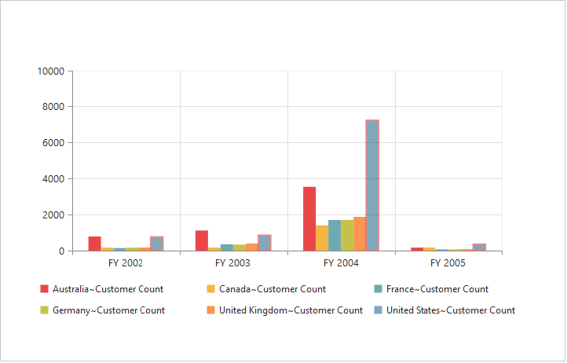
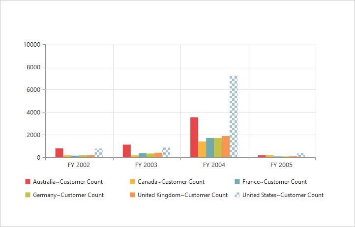
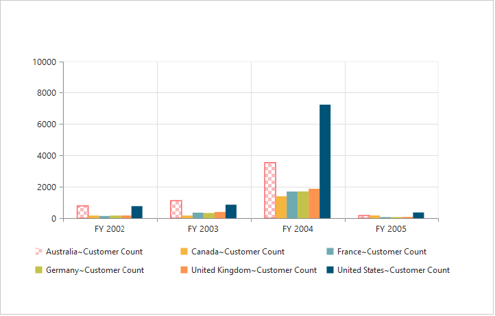

# User Interactions

## Tooltip

### Enable Tooltip for Data Points

Tooltip for the data points can be enabled using the **"Visible"** option of the `e-chart-tooltip` property under **"e-common-series-options"** of the PivotChart.





<ej-pivotchart [commonSeriesOptions]="commonSeriesOptions" [size]="size">
</ej-pivotchart>





//..

export class PivotChartComponent {
    public size; commonSeriesOptions; 
    constructor() {
      //..
      this.size = { height: "460px", width: "950px" };
      this.commonSeriesOptions = { 
            //..
            //Enabling tooltip for data points
            tooltip:
            {
                visible: true
            }
       };
    }
}





 

### Tooltip Template

HTML elements can be displayed inside the tooltip by using the `template` option. The template option takes the value of the "id" attribute from the HTML element. You can use the **#point.x#** and **#point.y#** as place holders in the HTML element to display the X and Y values of the corresponding data points.





    

        
 

    

    

        

            <label id="ccvalue">&nbsp;#point.y# </label>
            <label id="cc">Customer Count </label>
        

    

<ej-pivotchart [commonSeriesOptions]="commonSeriesOptions" [size]="size">
</ej-pivotchart>





//..

export class PivotChartComponent {
    public size; commonSeriesOptions; 
    constructor() {
      //..
      this.size = { height: "460px", width: "950px" };
      this.commonSeriesOptions = { 
            //..
            //Enabling tooltip of data points
            tooltip:
            {
                visible: true,
                template: 'Tooltip'
            }
       };
    }
}





 

### Tooltip Customization

By using `Fill` and `Border` properties of tooltip, you can customize its background color, border color and border width.





<ej-pivotchart [commonSeriesOptions]="commonSeriesOptions" [size]="size">
</ej-pivotchart>





//..

export class PivotChartComponent {
    public size; commonSeriesOptions; 
    constructor() {
      //..
      this.size = { height: "460px", width: "950px" };
      this.commonSeriesOptions = { 
            //..
            //Enabling tooltip of data points
            tooltip:
            {
                visible: true,
                //Customize tooltip background color and border
                fill: '#FF9933',
                border:
                {
                    width: 1,
                    color: "#993300"
                }
            }
       };
    }
}





 

### Tooltip with Rounded Corners

The tooltip properties, `Rx` and `Ry` are used to customize its corner radius.





<ej-pivotchart [commonSeriesOptions]="commonSeriesOptions" [size]="size">
</ej-pivotchart>





//..

export class PivotChartComponent {
    public size; commonSeriesOptions; 
    constructor() {
      //..
      this.size = { height: "460px", width: "950px" };
      this.commonSeriesOptions = { 
            //..
            //Enabling tooltip of data points
            tooltip:
            {
                visible: true,
                //Customize the corner radius of the tooltip rectangle
                rx: "20",
                ry: "20"
            }
       };
    }
}





 

## Zooming and Panning

### Enable Zooming

There are two ways to zoom the Chart:

* When [`zooming.enable`](/api/angular/ejchart#members:zooming-enable) option is set to true, you can zoom the Chart by using rubber band selection.
* When [`zooming.enableMouseWheel`](/api/angular/ejchart#members:zooming-enablemousewheel) option is set to true, you can zoom the Chart on mouse wheel scrolling.





<ej-pivotchart [zooming]="zooming">
</ej-pivotchart>





//..

export class PivotChartComponent {
    public zooming; 
    constructor() {
      //..
      //Enable zooming in Chart
      this.zooming = { enable: true };
    }
}





 

After zooming the Chart, a zooming toolbar will appear with options to *zoom, pan and reset*. Selecting the **“Pan”** option will allow to view the Chart and selecting the **“Reset”** option will reset the zoomed Chart.

 

### Types of Zooming
You can zoom the particular axis like horizontal axis or vertical axis or both axis using [`type`](/api/angular/ejchart#members:zooming-type) option in zooming. 

N> By default, the value for the `type` option in zooming is “x,y” (indicating both axis) in PivotChart.





<ej-pivotchart [zooming]="zooming">
</ej-pivotchart>





//..

export class PivotChartComponent {
    public zooming; 
    constructor() {
      //..
      //Enable zooming in Chart
      this.zooming = { 
            enable: true,
            //Enable horizontal zooming
            type: 'x'
       };
    }
}





### Enable Scrollbar

* When [`zooming.enableScrollbar`](/api/angular/ejpivotchart#members:zooming-enablescrollbar) option is set to true, the PivotChart is rendered along with the scroll bars for precise view of data. The data can be viewed by using scroll bar or by using mouse wheel scrolling.



<ej-pivotchart [zooming.enableScrollbar]="true">
</ej-pivotchart>



## Marker and Crosshair

### Marker Shape Customization

In PivotChart, you can customize the marker `Shape` with following symbols.

* Rectangle
* Circle
* Cross
* Diamond 
* Pentagon
* Hexagon
* Star
* Ellipse
* Triangle etc.





<ej-pivotchart [commonSeriesOptions]="commonSeriesOptions" [size]="size" (load)="onLoad($event)">
</ej-pivotchart>





//..

export class PivotChartComponent {
    public size; commonSeriesOptions; 
    constructor() {
      //..
      this.size = { height: "460px", width: "950px" };
      this.commonSeriesOptions = { type: ej.PivotChart.ChartTypes.Line };
    }
    onLoad(args) {
        args.model.seriesRendering = function (evt) {
            for (var seriescount = 0; seriescount < this.model.series.length; seriescount++) 
                this.model.series[seriescount].marker.shape = "Triangle";
        };
    };
}





 

## Highlight

PivotChart provides highlighting support for the series and data points on mouse hover. To enable highlighting, set the **“enable”** property to true in the `highlightSettings` option of the series.





<ej-pivotchart [commonSeriesOptions]="commonSeriesOptions" [size]="size" (load)="onLoad($event)">
</ej-pivotchart>





//..

export class PivotChartComponent {
    public size; commonSeriesOptions; 
    constructor() {
      //..
      this.size = { height: "460px", width: "950px" };
      this.commonSeriesOptions = { type: ej.PivotChart.ChartTypes.Column };
    }
    onLoad(args) {
        args.model.seriesRendering = function (evt) {
            for (var seriescount = 0; seriescount < this.model.series.length; seriescount++)
                {
                    this.model.series[seriescount].highlightSettings.enable = true;
                    this.model.series[seriescount].highlightSettings.mode = "series";
                }
        };
    };
}





### Highlight Mode

You can set three different modes for highlighting data points and series by using the `mode` property of the `highlightSettings`.
 
* series
* points
* cluster





<ej-pivotchart [commonSeriesOptions]="commonSeriesOptions" [size]="size" (load)="onLoad($event)">
</ej-pivotchart>





//..

export class PivotChartComponent {
    public size; commonSeriesOptions; 
    constructor() {
      //..
      this.size = { height: "460px", width: "950px" };
      this.commonSeriesOptions = { type: ej.PivotChart.ChartTypes.Column };
    }
    onLoad(args) {
        args.model.seriesRendering = function (evt) {
            for (var seriescount = 0; seriescount < this.model.series.length; seriescount++) {
                this.model.series[seriescount].highlightSettings.enable = true
                this.model.series[seriescount].highlightSettings.mode = "series";
            }
        };
    };
}





 

### Customize the Highlight Styles

To customize the highlighted series, use `border.color`, `border.width` and `opacity`
 options in the `highlightSettings` property.





<ej-pivotchart [commonSeriesOptions]="commonSeriesOptions" [size]="size" (load)="onLoad($event)">
</ej-pivotchart>





//..

export class PivotChartComponent {
    public size; commonSeriesOptions; 
    constructor() {
      //..
      this.size = { height: "460px", width: "950px" };
      this.commonSeriesOptions = { type: ej.PivotChart.ChartTypes.Column };
    }
    onLoad(args) {
        args.model.seriesRendering = function (evt) {
            for (var seriescount = 0; seriescount < this.model.series.length; seriescount++) {
                this.model.series[seriescount].highlightSettings.enable = true
                this.model.series[seriescount].highlightSettings.opacity = "0.5";
                this.model.series[seriescount].highlightSettings.border.width = "1.5";
                this.model.series[seriescount].highlightSettings.border.color = "red";
            }
        };
    };
}





 

### Patterns to Highlight

PivotChart provides pattern support for highlighting the data by setting an appropriate value to the `pattern` property of the `highlightSettings`. The different types of highlight patterns are as follows.

* chessboard
* crosshatch
* dots
* pacman
* grid
* turquoise
* star
* triangle
* circle
* tile
* horizontalDash
* verticalDash
* rectangle
* box
* verticalStripe
* horizontalStripe
* bubble
* diagonalBackward
* diagonalForward





<ej-pivotchart [commonSeriesOptions]="commonSeriesOptions" [size]="size" (load)="onLoad($event)">
</ej-pivotchart>





//..

export class PivotChartComponent {
    public size; commonSeriesOptions; 
    constructor() {
      //..
      this.size = { height: "460px", width: "950px" };
      this.commonSeriesOptions = { type: ej.PivotChart.ChartTypes.Column };
    }
    onLoad(args) {
        args.model.seriesRendering = function (evt) {
            for (var seriescount = 0; seriescount < this.model.series.length; seriescount++) {
                this.model.series[seriescount].highlightSettings.enable = true
                this.model.series[seriescount].highlightSettings.pattern = "chessboard";
            }
        };
    };
}





 

## Selection

PivotChart provides selection support for the series and data points on mouse click. To enable selection, set the **“enable”** property to true in the `selectionSettings` option of the series.





<ej-pivotchart [commonSeriesOptions]="commonSeriesOptions" [size]="size" (load)="onLoad($event)">
</ej-pivotchart>





//..

export class PivotChartComponent {
    public size; commonSeriesOptions; 
    constructor() {
      //..
      this.size = { height: "460px", width: "950px" };
      this.commonSeriesOptions = { type: ej.PivotChart.ChartTypes.Column };
    }
    onLoad(args) {
        args.model.seriesRendering = function (evt) {
            for (var seriescount = 0; seriescount < this.model.series.length; seriescount++) {
                this.model.series[seriescount].selectionSettings.enable = true;
            }
        };
    };
}





### Selection Mode

You can set three different selection mode for highlighting the data points and series by using the `mode` property of the `selectionSettings`.

* series
* points
* cluster





<ej-pivotchart [commonSeriesOptions]="commonSeriesOptions" [size]="size" (load)="onLoad($event)">
</ej-pivotchart>





//..

export class PivotChartComponent {
    public size; commonSeriesOptions; 
    constructor() {
      //..
      this.size = { height: "460px", width: "950px" };
      this.commonSeriesOptions = { type: ej.PivotChart.ChartTypes.Column };
    }
    onLoad(args) {
        args.model.seriesRendering = function (evt) {
            for (var seriescount = 0; seriescount < this.model.series.length; seriescount++) {
                this.model.series[seriescount].selectionSettings.enable = true;
                this.model.series[seriescount].selectionSettings.mode = "series";
            }
        };
    };
}





 

### Customize the Selection Styles

To customize the selection styles, use the `border.color`, `border.width` and `opacity` options in the `selectionSettings`.





<ej-pivotchart [commonSeriesOptions]="commonSeriesOptions" [size]="size" (load)="onLoad($event)">
</ej-pivotchart>





//..

export class PivotChartComponent {
    public size; commonSeriesOptions; 
    constructor() {
      //..
      this.size = { height: "460px", width: "950px" };
      this.commonSeriesOptions = { type: ej.PivotChart.ChartTypes.Column };
    }
    onLoad(args) {
        args.model.seriesRendering = function (evt) {
            for (var seriescount = 0; seriescount < this.model.series.length; seriescount++) {
                this.model.series[seriescount].selectionSettings.enable = true;
                this.model.series[seriescount].selectionSettings.border.width = "1.5";
                this.model.series[seriescount].selectionSettings.border.color = "red";
            }
        };
    };
}





 

### Patterns for Selection

PivotChart provides pattern support for the selecting the data by setting an appropriate value to the `pattern` property of the `selectionSettings` option. The different types of selection patterns are as follows.

* chessboard
* crosshatch
* dots
* pacman
* grid
* turquoise
* star
* triangle
* circle
* tile
* horizontalDash
* verticalDash
* rectangle
* box
* verticalStripe
* horizontalStripe
* bubble
* diagonalBackward
* diagonalForward





<ej-pivotchart [commonSeriesOptions]="commonSeriesOptions" [size]="size" (load)="onLoad($event)">
</ej-pivotchart>





//..

export class PivotChartComponent {
    public size; commonSeriesOptions; 
    constructor() {
      //..
      this.size = { height: "460px", width: "950px" };
      this.commonSeriesOptions = { type: ej.PivotChart.ChartTypes.Column };
    }
    onLoad(args) {
        args.model.seriesRendering = function (evt) {
            for (var seriescount = 0; seriescount < this.model.series.length; seriescount++) {
                this.model.series[seriescount].selectionSettings.enable = true
                this.model.series[seriescount].selectionSettings.pattern = "chessboard";
            }
        };
    };
}





 
