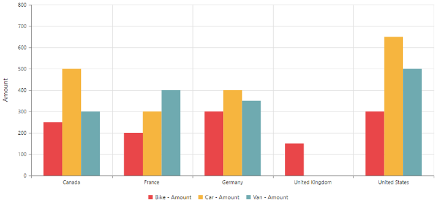

# Getting Started

This section explains briefly about how to create a **PivotChart** control in your application with **Angular**. This section covers only the minimal features that you need to know to get started with the PivotChart.

## Getting started with SystemJS

To quick start with Syncfusion JavaScript Angular components run the below commands to clone the repository for [SystemJS starter](https://github.com/syncfusion/angular2-seeds/tree/systemjs) and installing required dependency packages.


 > git clone https://github.com/syncfusion/angular2-seeds/ -b systemjs

 > cd angular2-seeds

 > npm install


The below steps describes to add component with above cloned seed application.

## Syncfusion JavaScript components source configuration and sample creation

* Copy required Syncfusion Angular source component(s) from the below build location and add it in `src/ej` folder (For ex., consider the `PivotChart` component).



(Installed Location)\Syncfusion\Essential Studio\{{ site.releaseversion }}\JavaScript\assets-src\angular2\



N> `core.ts` file is mandatory for all Syncfusion JavaScript Angular components. The repository having the source file from Essential Studio for JavaScript v{{ site.releaseversion }}.

* Create `PivotChart` folder inside `src` folder.

* Create `PivotChart.component.html` view file inside `src/PivotChart` folder and render ejPivotChart Angular component using the below code example. 



<ej-pivotchart></ej-pivotchart>



* Create `PivotChart.component.ts` model file inside the folder `src/PivotChart` and create sample component using the below code example.



import { Component } from '@angular/core';

@Component({
  selector: 'ej-app',
  templateUrl: 'src/PivotChart/PivotChart.component.html',
  styleUrls: ['src/PivotChart/PivotChart.component.css'],
})

export class PivotChartComponent {
    //..
}



## Configure the routes for the Router

Before adding router configuration for above created ejPivotChart component, we recommend you to go through the [Angular Routing](https://angular.io/docs/ts/latest/guide/router.html) configuration to get the deeper knowledge about Angular routing. 

* Now, we are going to configure the route navigation link for created PivotChart sample in `src/app.component.html` file.



    

        <ul class="nav navbar-nav">
            . . . .
            <li><a data-toggle="collapse" data-target="#skeleton-navigation-navbar-collapse.in" href="#PivotChart" [routerLink]="['/PivotChart']">PivotChart </a></li>
        </ul>
    

    <main>
        <router-outlet></router-outlet>
    </main>



* Import the ejPivotChart sample component and define the route in `src/app.routes.ts` file.


import { Routes } from '@angular/router';
. . . .
import { PivotChartComponent } from './PivotChart/PivotChart.component';

export const rootRouterConfig: Routes = [
    { path: '', redirectTo: 'home', pathMatch: 'full' },
    . . . . 
    { path: 'PivotChart', component: PivotChartComponent }
];


* Import and declare the Syncfusion source component and ejPivotChart sample component into `app.module.ts` like the below code snippet.



import { NgModule, enableProdMode, ErrorHandler } from '@angular/core';
. . . . .
import { PivotChartComponent } from './PivotChart/PivotChart.component';

import { rootRouterConfig } from './app.routes';
. . . .
@NgModule({
  imports: [BrowserModule, FormsModule, HttpModule, RouterModule.forRoot(rootRouterConfig, { useHash: true })],
  declarations: [. . . . , EJ_PIVOTCHART_COMPONENTS,PivotChartComponent],
  bootstrap: [AppComponent]
})
export class AppModule { }



## Relational

This section covers the information that you need to know to populate a simple PivotChart with Relational data source.

### Control Initialization

Add necessary HTML elements in `PivotChart.component.html` to render PivotChart



<ej-pivotchart [dataSource.data]="data" [dataSource.rows]="rows" [dataSource.columns]="columns" [dataSource.values]="values" [commonSeriesOptions]="commonSeriesOptions" [size]="size" [primaryYAxis]="primaryYAxis" [legend]="legend">
</ej-pivotchart>



Create a **CSS** page and add necessary CSS elements for PivotChart



ej-pivotchart {
    display: block;
    height: 500px;
    width: 100%;
}
.e-pivotchart{
    position: inherit !important;
}



### Populate PivotChart with data

Let us now see how to populate the PivotChart control using a sample JSON data as shown below.





<ej-pivotchart [dataSource.data]="data" [dataSource.rows]="rows" [dataSource.columns]="columns" [dataSource.values]="values" [commonSeriesOptions]="commonSeriesOptions" [size]="size" [primaryYAxis]="primaryYAxis" [legend]="legend" >
</ej-pivotchart>





//..

export class PivotChartComponent {
    public data; rows; columns;values; size; legend; load; primaryYAxis; commonSeriesOptions;
    constructor() {
      this.data = [
          { Amount: 100, Country: "Canada", Date: "FY 2005", Product: "Bike", Quantity: 2, State: "Alberta" },
          { Amount: 200, Country: "Canada", Date: "FY 2006", Product: "Van", Quantity: 3, State: "British Columbia" },
          { Amount: 300, Country: "Canada", Date: "FY 2007", Product: "Car", Quantity: 4, State: "Brunswick" },
          { Amount: 150, Country: "Canada", Date: "FY 2008", Product: "Bike", Quantity: 3, State: "Manitoba" },
          { Amount: 200, Country: "Canada", Date: "FY 2006", Product: "Car", Quantity: 4, State: "Ontario" },
          { Amount: 100, Country: "Canada", Date: "FY 2007", Product: "Van", Quantity: 1, State: "Quebec" },
          { Amount: 200, Country: "France", Date: "FY 2005", Product: "Bike", Quantity: 2, State: "Charente-Maritime" },
          { Amount: 250, Country: "France", Date: "FY 2006", Product: "Van", Quantity: 4, State: "Essonne" },
          { Amount: 300, Country: "France", Date: "FY 2007", Product: "Car", Quantity: 3, State: "Garonne (Haute)" },
          { Amount: 150, Country: "France", Date: "FY 2008", Product: "Van", Quantity: 2, State: "Gers" },
          { Amount: 200, Country: "Germany", Date: "FY 2006", Product: "Van", Quantity: 3, State: "Bayern" },
          { Amount: 250, Country: "Germany", Date: "FY 2007", Product: "Car", Quantity: 3, State: "Brandenburg" },
          { Amount: 150, Country: "Germany", Date: "FY 2008", Product: "Car", Quantity: 4, State: "Hamburg" },
          { Amount: 200, Country: "Germany", Date: "FY 2008", Product: "Bike", Quantity: 4, State: "Hessen" },
          { Amount: 150, Country: "Germany", Date: "FY 2007", Product: "Van", Quantity: 3, State: "Nordrhein-Westfalen" },
          { Amount: 100, Country: "Germany", Date: "FY 2005", Product: "Bike", Quantity: 2, State: "Saarland" },
          { Amount: 150, Country: "United Kingdom", Date: "FY 2008", Product: "Bike", Quantity: 5, State: "England" },
          { Amount: 250, Country: "United States", Date: "FY 2007", Product: "Car", Quantity: 4, State: "Alabama" },
          { Amount: 200, Country: "United States", Date: "FY 2005", Product: "Van", Quantity: 4, State: "California" },
          { Amount: 100, Country: "United States", Date: "FY 2006", Product: "Bike", Quantity: 2, State: "Colorado" },
          { Amount: 150, Country: "United States", Date: "FY 2008", Product: "Car", Quantity: 3, State: "New Mexico" },
          { Amount: 200, Country: "United States", Date: "FY 2005", Product: "Bike", Quantity: 4, State: "New York" },
          { Amount: 250, Country: "United States", Date: "FY 2008", Product: "Car", Quantity: 3, State: "North Carolina" },
          { Amount: 300, Country: "United States", Date: "FY 2007", Product: "Van", Quantity: 4, State: "South Carolina" }
      ];
      this.rows = [{ fieldName: "Country", fieldCaption: "Country" }, { fieldName: "State", fieldCaption: "State" }];
      this.columns = [{ fieldName: "Product", fieldCaption: "Product" }];
      this.values = [{ fieldName: "Amount", fieldCaption: "Amount" }];
      this.size = { height: "460px", width: "950px" };
      this.legend = { visible: true };
      this.load = "loadTheme";
      this.commonSeriesOptions = { enableAnimation: true, type: ej.PivotChart.ChartTypes.Column, tooltip: { visible: true } };
      this.primaryYAxis = { title: { text: "Amount" } };
    }
}





The above code will generate a simple PivotChart displaying Amount over products across different regions.

## OLAP

This section covers the information that you need to know to populate a simple PivotChart with OLAP data source.

### Control Initialization

Add necessary HTML elements in `PivotChart.component.html` to render PivotChart





<ej-pivotchart dataSource.data="http://bi.syncfusion.com/olap/msmdpump.dll" dataSource.catalog="Adventure Works DW 2008 SE" dataSource.cube="Adventure Works" [dataSource.rows]="rows" [dataSource.columns]="columns" [dataSource.values]="values"  [commonSeriesOptions]="commonSeriesOptions" [size]="size" [primaryXAxis]="primaryXAxis" [primaryYAxis]="primaryYAxis" [legend]="legend" >
</ej-pivotchart>





//..

export class PivotChartComponent {
}





Create a **CSS** page and add necessary CSS elements for PivotChart



ej-pivotchart {
    display: block;
    height: 500px;
    width: 100%; 
}
.e-pivotchart{
    position: inherit !important;
}



### Populate PivotChart with data

Let us now see how to populate the PivotChart control using a sample JSON data as shown below.





<ej-pivotchart [dataSource.data]="data" [dataSource.catalog]="catalog" [dataSource.cube]="cube" [dataSource.rows]="rows" [dataSource.columns]="columns" [dataSource.values]="values"  [commonSeriesOptions]="commonSeriesOptions" [size]="size" [primaryXAxis]="primaryXAxis" [primaryYAxis]="primaryYAxis" [legend]="legend" >
</ej-pivotchart>





import {Component, ViewEncapsulation} from '@angular/core';

@Component({
  selector: 'ej-app',
  templateUrl: 'src/PivotChart/PivotChart.component.html', //give the path file for PivotChart component html file.
  styleUrls: ['src/PivotChart/PivotChart.component.css'],  //give the path file for PivotChart component css file.
})
export class PivotChartComponent {
    public data; cube; catalog; rows; columns;values;size; legend; load; primaryXAxis; primaryYAxis; type; commonSeriesOptions;
    constructor() {
      this.data = "http://bi.syncfusion.com/olap/msmdpump.dll";
      this.cube = "Adventure Works";
      this.catalog = "Adventure Works DW 2008 SE";
      this.rows = [{ fieldName: "[Date].[Fiscal]" }];
      this.columns = [{ fieldName: "[Customer].[Customer Geography]" }];
      this.values = [{ measures: [{ fieldName: "[Measures].[Internet Sales Amount]", }], axis: "columns" }];
      this.size = { height: "460px", width: "950px" };
      this.legend = { visible: true };
      this.load = "loadTheme";
      this.commonSeriesOptions = { enableAnimation: true, type: ej.PivotChart.ChartTypes.Column, tooltip: { visible: true } };
      this.primaryYAxis = { title: { text: "Customer Count" } };
      this.primaryXAxis = { title: { text: "Fiscal Year" }, labelRotation: 0 };
      this.type = "column";
    }
}





The above code will generate a simple PivotChart with internet sales amount over a period of fiscal years across different customer geographic locations.

