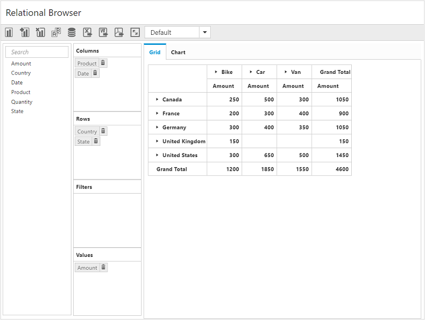
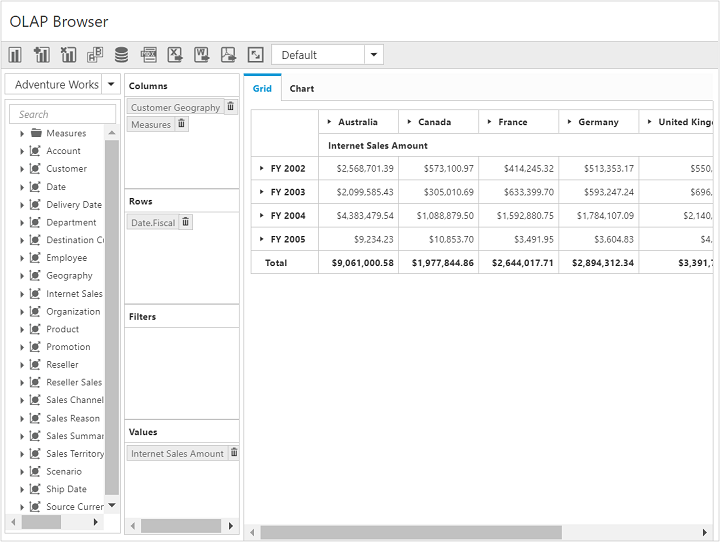

# Getting Started

This section explains briefly about how to create a **PivotClient** control in your application with **Angular**. This section covers only the minimal features that you need to know to get started with the PivotClient.

## Getting started with SystemJS

To quick start with Syncfusion JavaScript Angular components, run the below commands to clone the repository for [SystemJS starter](https://github.com/syncfusion/angular2-seeds/tree/systemjs) and installing required dependency packages.



    > git clone https://github.com/syncfusion/angular2-seeds/ -b systemjs

    > cd angular2-seeds

    > npm install



The following steps describe how to add component with above cloned seed application:

## Syncfusion JavaScript components source configuration and sample creation

* Copy required Syncfusion Angular source component(s) from the build location specified below and add it in `src/ej` folder (For ex., consider the `PivotClient` component).



(Installed Location)\Syncfusion\Essential Studio\{{ site.releaseversion }}\JavaScript\assets-src\angular2\



N> `core.ts` file is mandatory for all Syncfusion JavaScript Angular components. The repository having the source file from Essential Studio for JavaScript v{{ site.releaseversion }}.

* Create `PivotClient` folder inside `src` folder.

* Create `PivotClient.component.html` view file inside `src/PivotClient` folder and render ejPivotClient Angular component using the below code snippet.



    <ej-pivotclient></ej-pivotclient>



* Create `PivotClient.component.ts` model file inside the folder `src/PivotClient` and create sample component using the below code snippet.



import { Component } from '@angular/core';

@Component({
  selector: 'ej-app',
  templateUrl: 'src/PivotClient/PivotClient.component.html',
  styleUrls: ['src/PivotClient/PivotClient.component.css'],
})

export class PivotClientComponent {
    //..
}



## Configuring the routes for the router

Before adding router configuration for above created ejPivotClient component, we recommend you to go through the [Angular Routing](https://angular.io/docs/ts/latest/guide/router.html) configuration to get the deeper knowledge about Angular routing.

* Now, we are going to configure the route navigation link for created PivotClient sample in `src/app.component.html` file.



    

        <ul class="nav navbar-nav">
            . . . .
            <li><a data-toggle="collapse" data-target="#skeleton-navigation-navbar-collapse.in" href="#PivotClient" [routerLink]="['/PivotClient']">PivotClient </a></li>
        </ul>
    

    <main>
        <router-outlet></router-outlet>
    </main>



* Import the ejPivotClient sample component and define the route in `src/app.routes.ts` file.



import { Routes } from '@angular/router';
. . . .
import { PivotClientComponent } from './PivotClient/PivotClient.component';

export const rootRouterConfig: Routes = [
    { path: '', redirectTo: 'home', pathMatch: 'full' },
    . . . .
    { path: 'PivotClient', component: PivotClientComponent }
];



* Import and declare the Syncfusion source component and ejPivotClient sample component into `app.module.ts` as shown in the below code snippet.



import { NgModule, enableProdMode, ErrorHandler } from '@angular/core';
. . . . .
import { PivotClientComponent } from './PivotClient/PivotClient.component';

import { rootRouterConfig } from './app.routes';
. . . .
@NgModule({
  imports: [BrowserModule, FormsModule, HttpModule, RouterModule.forRoot(rootRouterConfig, { useHash: true })],
  declarations: [. . . . , EJ_PIVOTCLIENT_COMPONENTS,PivotClientComponent],
  bootstrap: [AppComponent]
})
export class AppModule { }



## Control initialization

Add necessary HTML elements in `PivotClient.component.html` to render PivotClient



    <ej-pivotclient>
    </ej-pivotclient>



Create a **CSS** page and add necessary CSS elements for PivotClient



    ej-pivotclient {
        height: 650px;
        width: 100%;
    }



## Populating PivotClient with data

### Populating PivotClient with relational data source

This section covers the information that you need to know to populate a simple PivotClient with relational data source.

The following code snippet shows how to populate the PivotClient control using a sample JSON data:





    <ej-pivotclient [dataSource.data]="data" [dataSource.rows]="rows" [dataSource.columns]="columns" [dataSource.values]="values" [dataSource.filters]="filters">
    </ej-pivotclient>





    //..

    export class PivotClientComponent {
        public data; rows; columns;values;filters;
        constructor() {
          this.data = [
              { Amount: 100, Country: "Canada", Date: "FY 2005", Product: "Bike", Quantity: 2, State: "Alberta" },
              { Amount: 200, Country: "Canada", Date: "FY 2006", Product: "Van", Quantity: 3, State: "British Columbia" },
              { Amount: 300, Country: "Canada", Date: "FY 2007", Product: "Car", Quantity: 4, State: "Brunswick" },
              { Amount: 150, Country: "Canada", Date: "FY 2008", Product: "Bike", Quantity: 3, State: "Manitoba" },
              { Amount: 200, Country: "Canada", Date: "FY 2006", Product: "Car", Quantity: 4, State: "Ontario" },
              { Amount: 100, Country: "Canada", Date: "FY 2007", Product: "Van", Quantity: 1, State: "Quebec" },
              { Amount: 200, Country: "France", Date: "FY 2005", Product: "Bike", Quantity: 2, State: "Charente-Maritime" },
              { Amount: 250, Country: "France", Date: "FY 2006", Product: "Van", Quantity: 4, State: "Essonne" },
              { Amount: 300, Country: "France", Date: "FY 2007", Product: "Car", Quantity: 3, State: "Garonne (Haute)" },
              { Amount: 150, Country: "France", Date: "FY 2008", Product: "Van", Quantity: 2, State: "Gers" },
              { Amount: 200, Country: "Germany", Date: "FY 2006", Product: "Van", Quantity: 3, State: "Bayern" },
              { Amount: 250, Country: "Germany", Date: "FY 2007", Product: "Car", Quantity: 3, State: "Brandenburg" },
              { Amount: 150, Country: "Germany", Date: "FY 2008", Product: "Car", Quantity: 4, State: "Hamburg" },
              { Amount: 200, Country: "Germany", Date: "FY 2008", Product: "Bike", Quantity: 4, State: "Hessen" },
              { Amount: 150, Country: "Germany", Date: "FY 2007", Product: "Van", Quantity: 3, State: "Nordrhein-Westfalen" },
              { Amount: 100, Country: "Germany", Date: "FY 2005", Product: "Bike", Quantity: 2, State: "Saarland" },
              { Amount: 150, Country: "United Kingdom", Date: "FY 2008", Product: "Bike", Quantity: 5, State: "England" },
              { Amount: 250, Country: "United States", Date: "FY 2007", Product: "Car", Quantity: 4, State: "Alabama" },
              { Amount: 200, Country: "United States", Date: "FY 2005", Product: "Van", Quantity: 4, State: "California" },
              { Amount: 100, Country: "United States", Date: "FY 2006", Product: "Bike", Quantity: 2, State: "Colorado" },
              { Amount: 150, Country: "United States", Date: "FY 2008", Product: "Car", Quantity: 3, State: "New Mexico" },
              { Amount: 200, Country: "United States", Date: "FY 2005", Product: "Bike", Quantity: 4, State: "New York" },
              { Amount: 250, Country: "United States", Date: "FY 2008", Product: "Car", Quantity: 3, State: "North Carolina" },
              { Amount: 300, Country: "United States", Date: "FY 2007", Product: "Van", Quantity: 4, State: "South Carolina" }
            ];
            this.rows= [{ fieldName: "Country", fieldCaption: "Country" }],
            this.columns= [{ fieldName: "Product", fieldCaption: "Product" }],
            this.values= [{ fieldName: "Amount", fieldCaption: "Amount" }],
            this.filters= []
        }
    }





* To run the application, execute the below command.



npm start



* Browse to [http://localhost:3000](http://localhost:3000) to see the application.

The above code will generate a simple PivotClient with “Country” field in Row, “Product” field in Column and “Amount” field in Value section.

### Populating PivotClient with OLAP data source

This section covers the information that you need to know to populate a simple PivotClient with OLAP data source.

The following code snippet shows how to populate the PivotClient control using OLAP data:



    <ej-pivotclient [dataSource.data]="data" [dataSource.catalog]="catalog" [dataSource.cube]="cube" [dataSource.rows]="rows" [dataSource.columns]="columns" [dataSource.values]="values" [dataSource.filters]="filters">
    </ej-pivotclient>





//..

export class PivotClientComponent {
    public data; rows; columns;values;filters;
    constructor() {
        this.data = "http://bi.syncfusion.com/olap/msmdpump.dll",
        this.catalog: "Adventure Works DW 2008 SE",
        this.cube: "Adventure Works";
        this.rows= [{fieldName: "[Date].[Fiscal]"}],
        this.columns= [{ fieldName: "[Customer].[Customer Geography]" }],
        this.values= [{measures: [{fieldName: "[Measures].[Internet Sales Amount]",}], axis: "columns"}],
        this.filters= []
    }
}



* To run the application, execute the below command.



npm start



* Browse to [http://localhost:3000](http://localhost:3000) to see the application.

The above code will generate a simple PivotClient with PivotChart and PivotGrid with “Customer Geography” in Column, “Fiscal” in Row and “Internet Sales Amount” measure in Value section.

