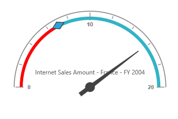

# Frame Type

## Full Circle

Full Circle frame lets the PivotGauge display in circular shape. Frame type can be set using the frameType.  By default, the frame type is "fullcircle".



<ej-pivotgauge [frame]="frame" >
</ej-pivotgauge>





//..

export class PivotGaugeComponent {
public scales;
    constructor() {
        //..
        this.frame = { frameType: "fullcircle" }
    }
}



 

## Half Circle

Half Circle frame lets the PivotGauge to display in semi-circular shape. For this, frame type needs to be set as "halfcircle" within the frameType property and need to set `startAngle` and `sweepAngle` for the PivotGauge in the  scales property.



<ej-pivotgauge [frame]="frame"  [scales]="scales">
</ej-pivotgauge>





//..

export class PivotGaugeComponent {
public scales;
    constructor() {
        //..
        this.frame = { 
            frameType: 'halfcircle',
            halfCircleFrameStartAngle: 180, 
            halfCircleFrameEndAngle: 360
        };
        this.scales: [{
            //..
            startAngle: 180, 
            sweepAngle: 180
            //..
        }];
    }
}



 

