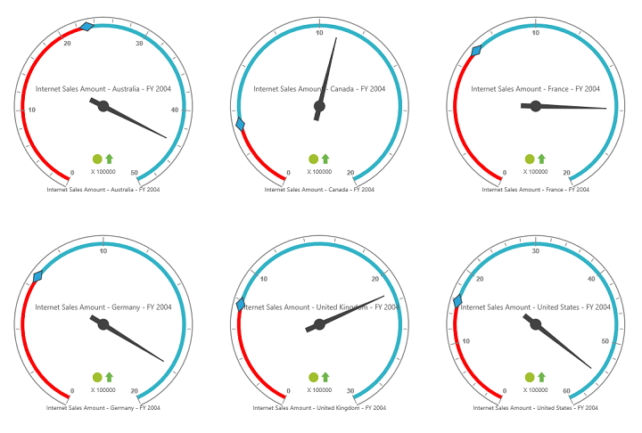

# Layout

## Row-wise Layout 

Gauges can be arranged in specified number of rows by using the [`rowsCount`](/api/angular/ejpivotgauge#members:rowscount) property.



<ej-pivotgauge [rowsCount]=2 >
</ej-pivotgauge>



 

## Column-wise Layout

Gauges can be arranged in specified number of columns by using the [`columnsCount`](/api/angular/ejpivotgauge#members:columnscount) property.



<ej-pivotgauge [columnsCount]=2 >
</ej-pivotgauge>



