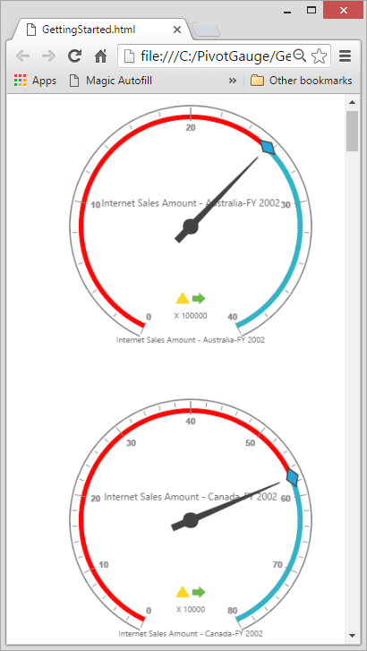

# Responsive Layout

PivotGauge widget supports responsive rendering based on the target device (desktop & tablet) resolution. It supports resolution upto 1024x600. You can enable responsiveness in PivotGauge by setting [`isResponsive`](/api/angular/ejpivotgauge#members:isresponsive) property to true.



 <ej-pivotgauge [isResponsive]="true">
</ej-pivotgauge>



_Normal View_

_Responsive View_

