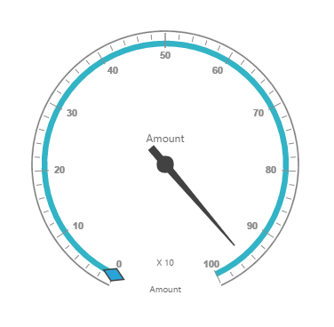

# Getting Started

This section explains briefly about how to create a **PivotGauge** control in your application with **Angular**. This section covers only the minimal features that you need to know to get started with the PivotGauge.

## Getting started with SystemJS

To quick start with Syncfusion JavaScript Angular components run the below commands to clone the repository for [SystemJS starter](https://github.com/syncfusion/angular2-seeds/tree/systemjs) and installing required dependency packages.


 > git clone https://github.com/syncfusion/angular2-seeds/ -b systemjs

 > cd angular2-seeds

 > npm install

 
The below steps describes to add component with above cloned seed application.

## Syncfusion JavaScript components source configuration and sample creation

* Copy required Syncfusion Angular source component(s) from the below build location and add it in `src/ej` folder (For ex., consider the `pivotgauge` component).


(Installed Location)\Syncfusion\Essential Studio\{{ site.releaseversion }}\JavaScript\assets-src\angular2\ 


N> `core.ts` file is mandatory for all Syncfusion JavaScript Angular components. The repository having the source file from Essential Studio for JavaScript v{{ site.releaseversion }}.

* Create `pivotgauge` folder inside `src` folder.

* Create `pivotgauge.component.html` view file inside `src/pivotgauge` folder and render ejPivotGauge Angular component using the below code example. 



<ej-pivotgauge></ej-pivotgauge>



* Create `pivotgauge.component.ts` model file inside the folder `src/pivotgauge` and create sample component using the below code example.



import { Component } from '@angular/core';

@Component({
  selector: 'ej-app',
  templateUrl: 'app/components/pivotgauge/pivotgauge.component.html',
  styleUrls: ['app/components/pivotgauge/pivotgauge.component.css'], 
})

export class PivotGaugeComponent {
    //..
}



## Configure the routes for the Router

Before adding router configuration for above created ejPivotGauge component, we recommend you to go through the [Angular Routing](https://angular.io/docs/ts/latest/guide/router.html) configuration to get the deeper knowledge about Angular routing. 

* Now, we are going to configure the route navigation link for created PivotGauge sample in `src/app.component.html` file.



	<ul class="nav navbar-nav">
		. . . .
		<li><a data-toggle="collapse" data-target="#skeleton-navigation-navbar-collapse.in" href="#pivotgauge" [routerLink]="['/pivotgauge']">PivotGauge </a></li>
	</ul>

<main>
	<router-outlet></router-outlet>
</main>


* Import the ejPivotGauge sample component and define the route in `src/app.routes.ts` file.


import { Routes } from '@angular/router';
. . . . 
import { PivotGaugeComponent } from './pivotgauge/pivotgauge.component';

export const rootRouterConfig: Routes = [
    { path: '', redirectTo: 'home', pathMatch: 'full' },
    . . . . 
    { path: 'pivotgauge', component: PivotGaugeComponent }
];


* Import and declare the Syncfusion source component and ejPivotGauge sample component into `app.module.ts` like the below code snippet.



import { NgModule, enableProdMode, ErrorHandler } from '@angular/core';
. . . . . 
import { EJ_PIVOTGAUGE_COMPONENTS } from './ej/pivotgauge.component';
import { PivotGaugeComponent } from './pivotgauge/pivotgauge.component';

import { rootRouterConfig } from './app.routes';
. . . . 
@NgModule({
  imports: [BrowserModule, FormsModule, HttpModule, RouterModule.forRoot(rootRouterConfig, { useHash: true })],
  declarations: [. . . . , EJ_PIVOTGAUGE_COMPONENTS,PivotGaugeComponent],
  bootstrap: [AppComponent]
})
export class AppModule { }


## Relational

This section covers the information that you need to know to populate a simple PivotGauge with Relational data source.

### Control Initialization

Add necessary HTML elements in `pivotgauge.component.html` to render PivotGauge



<ej-pivotgauge [dataSource.data]="data" [dataSource.rows]="rows" [dataSource.columns]="columns" [dataSource.values]="values" [isResponsive]="true" [enableTooltip]="true" [backgroundColor]="transparent" [scales]="scales" >
</ej-pivotgauge>



Create a **CSS** page and add necessary CSS elements for PivotGauge



ej-pivotgauge{
    height: 340px; 
    width: 100%; 
    overflow: auto; 
    float: left; 
    position:relative
}



### Populate PivotGauge with data

Let us now see how to populate the PivotGauge control using a sample JSON data as shown below.





<ej-pivotgauge [dataSource.data]="data" [dataSource.rows]="rows" [dataSource.columns]="columns" [dataSource.values]="values" [isResponsive]="true" [enableTooltip]="true" [backgroundColor]="transparent" [scales]="scales" >
</ej-pivotgauge>





//..

export class PivotGaugeComponent {
    public data; rows; columns;values; 
    constructor() {
    this.data = [
            { Amount: 100, Country: "Canada", Date: "FY 2005", Product: "Bike", Quantity: 2, State: "Alberta" },
            { Amount: 200, Country: "Canada", Date: "FY 2006", Product: "Van", Quantity: 3, State: "British Columbia" },
            { Amount: 300, Country: "Canada", Date: "FY 2007", Product: "Car", Quantity: 4, State: "Brunswick" },
            { Amount: 150, Country: "Canada", Date: "FY 2008", Product: "Bike", Quantity: 3, State: "Manitoba" },
            { Amount: 200, Country: "Canada", Date: "FY 2006", Product: "Car", Quantity: 4, State: "Ontario" },
            { Amount: 100, Country: "Canada", Date: "FY 2007", Product: "Van", Quantity: 1, State: "Quebec" },
            { Amount: 200, Country: "France", Date: "FY 2005", Product: "Bike", Quantity: 2, State: "Charente-Maritime" },
            { Amount: 250, Country: "France", Date: "FY 2006", Product: "Van", Quantity: 4, State: "Essonne" },
            { Amount: 300, Country: "France", Date: "FY 2007", Product: "Car", Quantity: 3, State: "Garonne (Haute)" },
            { Amount: 150, Country: "France", Date: "FY 2008", Product: "Van", Quantity: 2, State: "Gers" },
            { Amount: 200, Country: "Germany", Date: "FY 2006", Product: "Van", Quantity: 3, State: "Bayern" },
            { Amount: 250, Country: "Germany", Date: "FY 2007", Product: "Car", Quantity: 3, State: "Brandenburg" },
            { Amount: 150, Country: "Germany", Date: "FY 2008", Product: "Car", Quantity: 4, State: "Hamburg" },
            { Amount: 200, Country: "Germany", Date: "FY 2008", Product: "Bike", Quantity: 4, State: "Hessen" },
            { Amount: 150, Country: "Germany", Date: "FY 2007", Product: "Van", Quantity: 3, State: "Nordrhein-Westfalen" },
            { Amount: 100, Country: "Germany", Date: "FY 2005", Product: "Bike", Quantity: 2, State: "Saarland" },
            { Amount: 150, Country: "United Kingdom", Date: "FY 2008", Product: "Bike", Quantity: 5, State: "England" },
            { Amount: 250, Country: "United States", Date: "FY 2007", Product: "Car", Quantity: 4, State: "Alabama" },
            { Amount: 200, Country: "United States", Date: "FY 2005", Product: "Van", Quantity: 4, State: "California" },
            { Amount: 100, Country: "United States", Date: "FY 2006", Product: "Bike", Quantity: 2, State: "Colorado" },
            { Amount: 150, Country: "United States", Date: "FY 2008", Product: "Car", Quantity: 3, State: "New Mexico" },
            { Amount: 200, Country: "United States", Date: "FY 2005", Product: "Bike", Quantity: 4, State: "New York" },
            { Amount: 250, Country: "United States", Date: "FY 2008", Product: "Car", Quantity: 3, State: "North Carolina" },
            { Amount: 300, Country: "United States", Date: "FY 2007", Product: "Van", Quantity: 4, State: "South Carolina" }
        ];
        this.rows = [{ fieldName: "Country", fieldCaption: "Country" }, { fieldName: "State", fieldCaption: "State" }];
        this.columns = [{ fieldName: "Product", fieldCaption: "Product" }];
        this.values = [{ fieldName: "Amount", fieldCaption: "Amount" }, { fieldName: "Quantity", fieldCaption: "Quantity" }];
        this.scales = [{
                        showRanges: true,
                        radius: 150, showScaleBar: true, size: 1,
                        border: {
                            width: 0.5
                        },
                        showIndicators: true, showLabels: true,
                        pointers: [{
                                showBackNeedle: true,
                                backNeedleLength: 20,
                                length: 120,
                                width: 7
                            },
                            {
                                type: "marker",
                                markerType: "diamond",
                                distanceFromScale: 5,
                                placement: "center",
                                backgroundColor: "#29A4D9",
                                length: 25,
                                width: 15
                            }],
                        ticks: [{
                                type: "major",
                                distanceFromScale: 2,
                                height: 16,
                                width: 1, color: "#8c8c8c"
                            },
                            {
                                type: "minor",
                                height: 6,
                                width: 1,
                                distanceFromScale: 2,
                                color: "#8c8c8c"
                            }],
                        labels: [{
                                color: "#8c8c8c"
                            }],
                        ranges: [{
                                distanceFromScale: -5,
                                backgroundColor: "#fc0606",
                                border: { color: "#fc0606" }
                            }, {
                                distanceFromScale: -5
                            }],
                        customLabels: [{
                                position: { x: 180, y: 290 },
                                font: { size: "10px", fontFamily: "Segoe UI", fontStyle: "Normal" }, color: "#666666"
                            }, {
                                position: { x: 180, y: 320 },
                                font: { size: "10px", fontFamily: "Segoe UI", fontStyle: "Normal" }, color: "#666666"
                            }, {
                                position: { x: 180, y: 150 },
                                font: { size: "12px", fontFamily: "Segoe UI", fontStyle: "Normal" }, color: "#666666"
                            }]
                    }];
    }
}





The above code will generate a simple PivotGauge as shown in below figure.

## OLAP

This section covers the information that you need to know to populate a simple PivotGauge with OLAP data source.

### Control Initialization

Add necessary HTML elements in `pivotgauge.component.html` to render PivotGauge



<ej-pivotgauge [dataSource.data]="data" [dataSource.catalog]="catalog" [dataSource.cube]="cube" [dataSource.rows]="rows" [dataSource.columns]="columns" [dataSource.values]="values" [isResponsive]="true" [enableTooltip]="true" [backgroundColor]="transparent" [scales]="scales" >
</ej-pivotgauge>



Create a **CSS** page and add necessary CSS elements for PivotGauge



ej-pivotgauge{
    height: 340px; 
    width: 100%; 
    overflow: auto; 
    float: left; 
    position:relative
}



### Populate PivotGauge with data

Let us now see how to populate the PivotGauge control using a sample JSON data as shown below.





<ej-pivotgauge dataSource.data="http://bi.syncfusion.com/olap/msmdpump.dll" dataSource.catalog="Adventure Works DW 2008 SE" dataSource.cube="Adventure Works" [dataSource.rows]="rows" [dataSource.columns]="columns" [dataSource.values]="values" [isResponsive]="true" [enableTooltip]="true" [backgroundColor]="transparent" [scales]="scales" >
</ej-pivotgauge>





//..

export class PivotGaugeComponent {
public rows; columns;values;scales;
    constructor() {
        this.rows = [{ fieldName: "[Date].[Fiscal]", filterItems: { filterType: "include", values: ["[Date].[Fiscal].[Fiscal Year].&amp;[2004]"] } }];
        this.columns = [{ fieldName: "[Customer].[Customer Geography]" }];
        this.values = [{ measures: [{ fieldName: "[Measures].[Internet Sales Amount]", }, { fieldName: "[Measures].[Internet Revenue Status]" }, { fieldName: "[Measures].[Internet Revenue Trend]" }, { fieldName: "[Measures].[Internet Revenue Goal]" },], axis: "columns" }];
        this.scales = [{
                            showRanges: true,
                            radius: 150, showScaleBar: true, size: 1,
                            border: {
                                width: 0.5
                            },
                            showIndicators: true, showLabels: true,
                            pointers: [{
                                    showBackNeedle: true,
                                    backNeedleLength: 20,
                                    length: 120,
                                    width: 7
                                },
                                {
                                    type: "marker",
                                    markerType: "diamond",
                                    distanceFromScale: 5,
                                    placement: "center",
                                    backgroundColor: "#29A4D9",
                                    length: 25,
                                    width: 15
                                }],
                            ticks: [{
                                    type: "major",
                                    distanceFromScale: 2,
                                    height: 16,
                                    width: 1, color: "#8c8c8c"
                                },
                                {
                                    type: "minor",
                                    height: 6,
                                    width: 1,
                                    distanceFromScale: 2,
                                    color: "#8c8c8c"
                                }],
                            labels: [{
                                    color: "#8c8c8c"
                                }],
                            ranges: [{
                                    distanceFromScale: -5,
                                    backgroundColor: "#fc0606",
                                    border: { color: "#fc0606" }
                                }, {
                                    distanceFromScale: -5
                                }],
                            customLabels: [{
                                    position: { x: 180, y: 290 },
                                    font: { size: "10px", fontFamily: "Segoe UI", fontStyle: "Normal" }, color: "#666666"
                                }, {
                                    position: { x: 180, y: 320 },
                                    font: { size: "10px", fontFamily: "Segoe UI", fontStyle: "Normal" }, color: "#666666"
                                }, {
                                    position: { x: 180, y: 150 },
                                    font: { size: "12px", fontFamily: "Segoe UI", fontStyle: "Normal" }, color: "#666666"
                                }]
                        }];
    }
}





The above code will generate a simple PivotGauge as shown in below figure.

