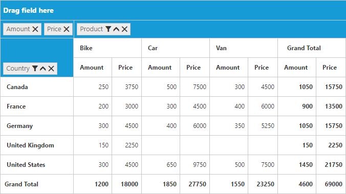

# Calculated Field

N> This feature is applicable only for Relational data source.

PivotGrid provides support to insert a new calculated field based on the existing Pivot Fields either through Calculated Field dialog or code behind.

### Through UI
To insert a new calculated Field, open the Calculated Field dialog using the Grouping Bar context menu. We can define "Name" for the new Calculated Field and "Formula" can be entered by inserting required fields through Fields section. For inserting numbers and operators, you can use formula pop-up as shown in the below screen-shot.

Click **Add** for adding the respective Calculated Field and **OK** to populate the PivotGrid control.

### Through Code-behind

For client mode, Calculated Field can be created at code-behind by defining formula based on the existing Pivot Fields in the PivotGrid. To indicate a field as a calculated field we need to set [`isCalculatedField`](/api/angular/ejpivotgrid#members:isCalculatedField) property to true and [`formula`](/api/angular/ejpivotgrid#members:formula) property to set the expression.




<ej-pivotgrid [dataSource.values]="values" [enableGroupingBar]="true">
</ej-pivotgrid>





    //..

    export class PivotGridComponent {
        //..
        constructor() {
            //..
            this.values= [{ fieldName: "Amount", fieldCaption: "Amount" }, 
                {
                    fieldName: "Price",
                    fieldCaption: "Price",
                    isCalculatedField: true,
                    formula: "Amount*15"
            }],
            this.filters= []
        }
    }





