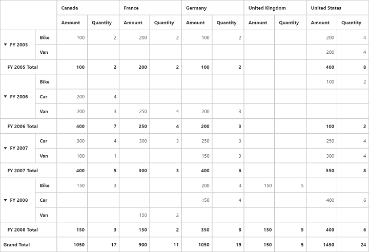

# Grand Total Hiding

Grand Total Hiding can be classified into three categories.

* Row Grand Total Hiding
* Column Grand Total Hiding
* Both

## Row Grand Total Hiding

You can hide the **Grand Total** in row alone by setting the property [`enableRowGrandTotal`](/api/angular/ejpivotgrid#members:enablerowgrandtotal) to `false`



<ej-pivotgrid [enableRowGrandTotal]="false">
</ej-pivotgrid>



## Column Grand Total Hiding

You can hide the **Grand Total** in column alone by setting the property [`enableColumnGrandTotal`](/api/angular/ejpivotgrid#members:enablecolumngrandtotal) to `false`



<ej-pivotgrid [enableColumnGrandTotal]="false">
</ej-pivotgrid>



## Both

You can hide the **Grand Total** in both row and column by setting the property [`enableGrandTotal`](/api/angular/ejpivotgrid#members:enablegrandtotal) to `false`



<ej-pivotgrid [enableGrandTotal]="false">
</ej-pivotgrid>



