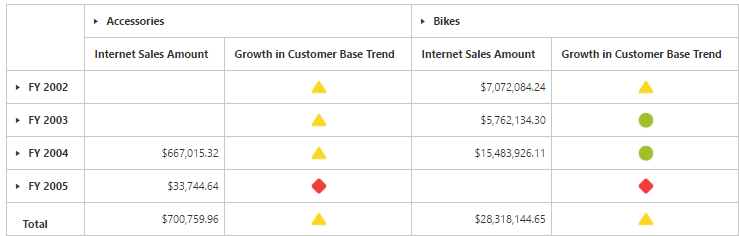

# KPI

Key Performance Indicators (KPIs) are business metric that help to figure out the progress of an enterprise in meeting its business goals.

The different indicators available in KPI are:

* KPI Value: A physical measure or a calculated measure.
* KPI Goal: Defines the target for the measure.
* KPI Status: Evaluates the current status of the value compared to the goal.
* KPI Trend: Evaluate the current trend of the value compared to the goal.

The **“KpiElements”** class in OLAP Base library holds the KPI name and when its object is added to an OlapReport, you can view the resultant information in PivotGrid.





<ej-pivotgrid [enableToolTip]="false" dataSource.data="http://bi.syncfusion.com/olap/msmdpump.dll" dataSource.catalog="Adventure Works DW 2008 SE" dataSource.cube="Adventure Works" [dataSource.rows]="rows" [dataSource.columns]="columns" [dataSource.values]="values" [dataSource.filters]="filters">
</ej-pivotgrid>




    //..
    export class PivotGridComponent {
        public rows; columns; values; filters;
        constructor() {
          this.data = "http://bi.syncfusion.com/olap/msmdpump.dll";
          this.cube = "Adventure Works";
          this.catalog = "Adventure Works DW 2008 SE";
          this.rows = [{ fieldName: "[Date].[Fiscal]" }];
          this.columns = [{ fieldName: ""[Product].[Product Categories]" }];
          this.values = [{ fieldName: "[Measures].[Internet Sales Amount]" },{ fieldName: "[Measures].[Growth in Customer Base Trend]" }], axis: "columns" }];
          this.filters = [];
        }
    }





