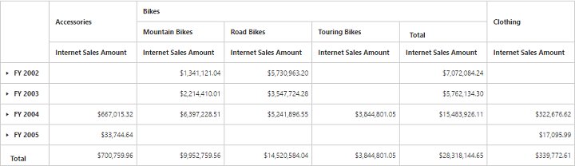

# Named Sets

Named sets is a multidimensional expression (MDX) that returns a set of dimension members, which can be created by combining cube data, arithmetic operators, numbers and functions.

You can bind the Named Sets in PivotGrid by setting it's unique name in the [`fieldName`](/api/angular/ejpivotgrid#members:datasource-columns-fieldname) property either in row or column axis and [`isNamedSets`](/api/angular/ejpivotgrid#members:datasource-columns-isnamedsets) boolean property to "true".





<ej-pivotgrid [enableToolTip]="false" dataSource.data="http://bi.syncfusion.com/olap/msmdpump.dll" dataSource.catalog="Adventure Works DW 2008 SE" dataSource.cube="Adventure Works" [dataSource.rows]="rows" [dataSource.columns]="columns" [dataSource.values]="values" [dataSource.filters]="filters">
</ej-pivotgrid>




    //..
    export class PivotGridComponent {
        public rows; columns; values; filters;
        constructor() {
          this.data = "http://bi.syncfusion.com/olap/msmdpump.dll";
          this.cube = "Adventure Works";
          this.catalog = "Adventure Works DW 2008 SE";
          this.rows = [{ fieldName: "[Date].[Fiscal]" }];
          this.columns = [{ fieldName: "[Core Product Group]", isNamedSets: true }];
          this.values = [{ fieldName: "[Measures].[Internet Sales Amount]" }], axis: "columns" }];
          this.filters = [];
        }
    }





