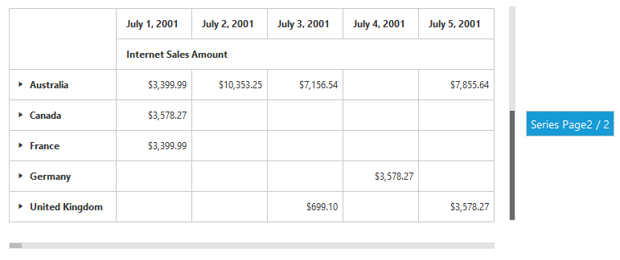

# Paging

## Pager 

Paging helps to improve the rendering performance of the PivotGrid control by dividing large amount of data into sections and displaying one section at a time. You can enable Paging option in PivotGrid by setting the [`enablePaging`](/api/angular/ejpivotgrid#members:enablePaging) property to true. You can provide the page size and current page details for each axis in [`pagerOptions`](/api/angular/ejpivotgrid#members:pagerOptions) property.

In-order to initialize a **Pager**, first you need to define a **div** tag with an appropriate **id** attribute which acts as a container for the widget. Then you need to initialize the widget using **ejPivotPager** method.

Inside the **ejPivotPager** method, the enumeration property mode needs to be set to **ej.PivotPager.Mode.Both** in-order to display both categorical pager and series pager. The other enumerations such as **ej.PivotPager.Mode.Categorical** and **ej.PivotPager.Mode.Series** will display only categorical pager and series pager respectively.





<!--Create a tag which acts as a container for PivotGrid-->
<ej-pivotgrid id="PivotGrid1" [dataSource.pagerOptions]="pagerOptions" [enablePaging]="true">
</ej-pivotgrid>
<!--Create a tag which acts as a container for Pager. -->
<ej-pivotpager id="PivotPager1" targetControlID="PivotGrid1"></ej-pivotpager>





export class PivotGridComponent {
   
    public  pagerOptions;

        constructor()
        {
          this.pagerOptions = {
                categoricalPageSize: 3,
                seriesPageSize: 3,
                categoricalCurrentPage: 1,
                seriesCurrentPage: 1
            }; 
        }
 }





Following are the navigation options available in Pager.

* Move First - Navigates to the first page.
* Move Last - Navigates to the last page. 
* Move Previous - Navigates to the previous page from the current page.
* Move Next - Navigates to the next page from the current page.
* Numeric Box - Navigates to the desired page by entering an appropriate page number in numeric value.

## Virtual Scrolling

Virtual Scrolling is a technique that allows user to view the PivotGrid information page by page with the use of vertical and horizontal scrollbar. You can enable Virtual Scrolling option in PivotGrid by setting the [`enableVirtualScrolling`](/api/angular/ejpivotgrid#members:enablevirtualscrolling) property to true. You can provide the page size and current page details for each axis in [`pagerOptions`](/api/angular/ejpivotgrid#members:pagerOptions) property. 





<!--Create a tag which acts as a container for PivotGrid-->
<ej-pivotgrid id="PivotGrid1" [dataSource.pagerOptions]="pagerOptions" [enableVirtualScrolling]="true">
</ej-pivotgrid>





export class PivotGridComponent {
   
    public  pagerOptions;

        constructor()
        {
          this.pagerOptions = {
                categoricalPageSize: 3,
                seriesPageSize: 3,
                categoricalCurrentPage: 1,
                seriesCurrentPage: 1
            }; 
        }
 }





## Page Settings

The properties associated to paging are:

* EnablePaging – This property is used to enable/disable paging in PivotClient control.
* PagerOptions.CategoricalPageSize - Specifies the number of categorical columns to be displayed within a page of the PivotClient control.
* PagerOptions.SeriesPageSize - Specifies the number of series rows to be displayed within a page of the PivotClient control.
* PagerOptions.CategoricalCurrentPage - Sets the current page of the categorical axis in PivotClient control.
* PagerOptions.SeriesCurrentPage - Sets the current page of the series axis in PivotClient control.

For client mode, page setting for categorical and series axes are mandatorily needed to be set in data source property by using the following properties.





<!--Create a tag which acts as a container for PivotGrid-->
<ej-pivotgrid id="PivotGrid1" [dataSource.pagerOptions]="pagerOptions" [enablePaging]="true">
</ej-pivotgrid>





//..
export class PivotGridComponent {
   
    public  pagerOptions;

        constructor()
        {
          this.pagerOptions = {
                categoricalPageSize: 3,
                seriesPageSize: 3,
                categoricalCurrentPage: 1,
                seriesCurrentPage: 1
            }; 
        }
 }




